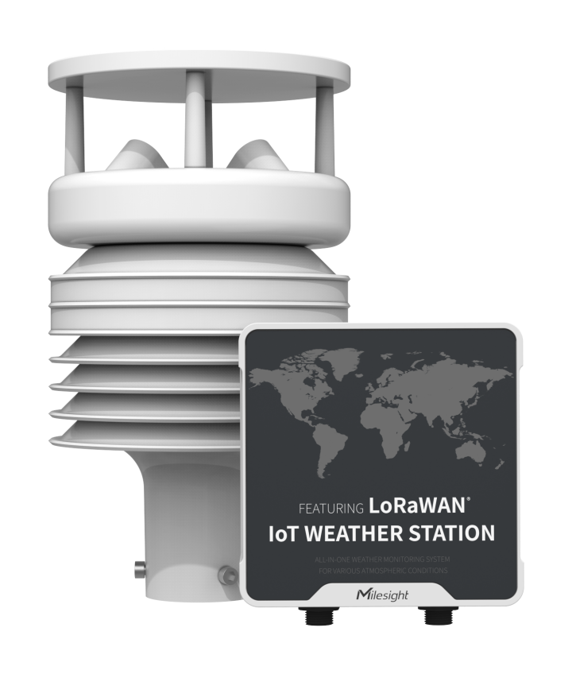
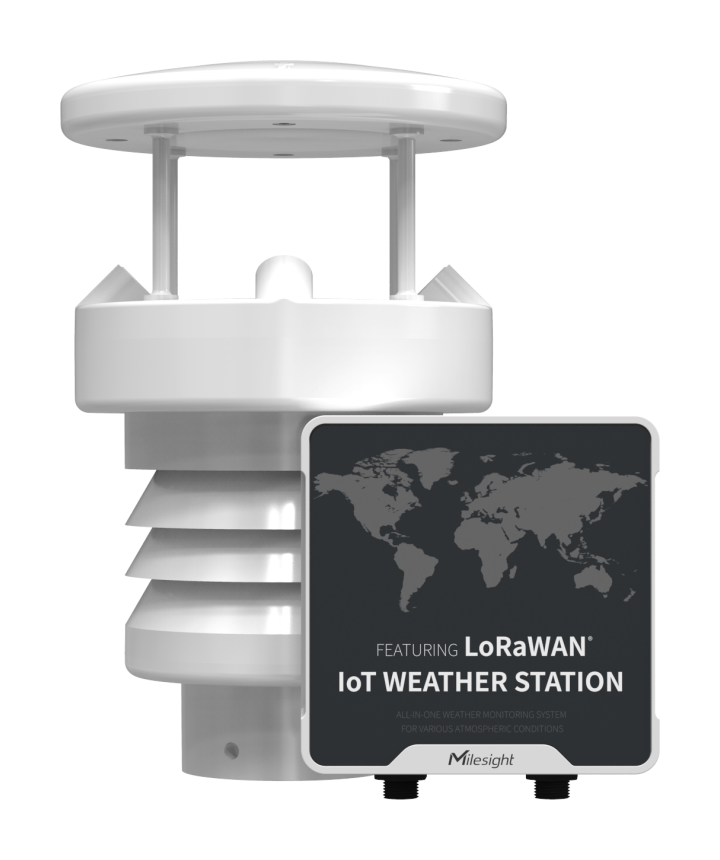

# Weather Station - Milesight IoT

The payload decoder function is applicable to WTS305 / WTS505.

For more detailed information, please visit [milesight official website](https://www.milesight-iot.com).

|        WTS305         |        WTS505         |
| :-------------------: | :-------------------: |
|  |  |
