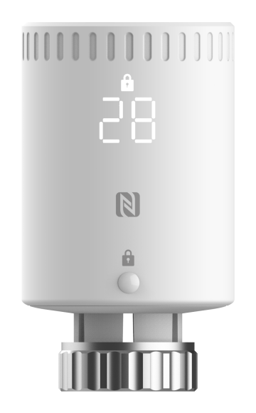

# Smart Radiator Thermostat - Milesight IoT

The payload decoder function applies to WT101.

For more detailed information, please visit Milesight's [official website](https://www.milesight.com/iot/product/lorawan-sensor/wt101).



## Payload Definition

### Attribute

|      CHANNEL       |  ID  | TYPE | LENGTH | DESCRIPTION          |
| :----------------: | :--: | :--: | :----: | -------------------- |
|  Protocol Version  | 0xFF | 0x01 |   1    | protocol_version(1B) |
|    Power Status    | 0xFF | 0x0B |   1    | power_status(1B)     |
|   Serial Number    | 0xFF | 0x16 |   8    | sn(8B)               |
|  Hardware Version  | 0xFF | 0x09 |   2    | hardware_version(2B) |
|  Firmware Version  | 0xFF | 0x0A |   2    | firmware_version(2B) |
| LoRaWAN Class Type | 0xFF | 0x0F |   1    | lorawan_class(1B)    |
|    TSL Version     | 0xFF | 0xFF |   2    | tsl_version(2B)      |

### Telemetry

| CHANNEL                         |  ID  | TYPE | LENGTH | DESCRIPTION                                                                                                                                                                                         |
| :------------------------------ | :--: | :--: | :----: | :-------------------------------------------------------------------------------------------------------------------------------------------------------------------------------------------------- |
| Battery                         | 0x01 | 0x75 |   1    | battery(1B)<br />battery, read: uint8, unit：%                                                                                                                                                      |
| Ambient Temperature             | 0x03 | 0x67 |   2    | temperature(2B)<br />temperature, read: int16/10, unit: ℃                                                                                                                                           |
| Target Temperature              | 0x04 | 0x67 |   2    | temperature_target(2B)<br />temperature_target, read: int16/10, unit: ℃                                                                                                                             |
| Valve Opening                   | 0x05 | 0x92 |   1    | valve_opening(1B)<br />valve_opening, read: uint8, unit: %                                                                                                                                          |
| Installation Status             | 0x06 | 0x00 |   1    | tamper_status(1B)<br />tamper_status, read: uint8, values: (0: installed, 1: uninstalled)                                                                                                           |
| Open Window Detection           | 0x07 | 0x00 |   1    | window_detection(1B)<br />window_detection, read: uint8, values: (0: normal, 1: open)                                                                                                               |
| Motor Stroke Calibration Status | 0x08 | 0xE5 |   1    | motor_calibration_result(1B)<br />motor_calibration_result, read: uint8, values: (0: success, 1: fail: out of range, 2: fail: uninstalled, 3: calibration cleared, 4: temperature control disabled) |
| Motor Stroke                    | 0x09 | 0x90 |   2    | motor_stroke(2B)<br />motor_stroke, read: uint16                                                                                                                                                    |
| Freeze Protection               | 0x0A | 0x00 |   1    | freeze_protection(1B)<br />freeze_protection, read: uint8, values: (0: normal, 1: triggered)                                                                                                        |
| Motor Position                  | 0x0B | 0x90 |   2    | motor_position(2B)<br />motor_position, read: uint16                                                                                                                                                |

## Sample

```json
// 017561 04672C01 03670A01 059264 09900000 0B900000
{
    "battery": 97,
    "temperature": 26.6,
    "temperature_target": 30,
    "valve_opening": 100,
    "motor_position": 0,
    "motor_stroke": 0
}

// 08E50009900802
{
    "motor_stroke": 520,
    "motor_calibration_result": "success"
}

// 060000
{
    "install_status": "installed"
}

// 070001
{
    "window_detection": "open"
}

// 08E501
{
    "motor_calibration_result": "fail: out of range"
}

// 0A0001
{
    "freeze_protection": "triggered"
}
```
