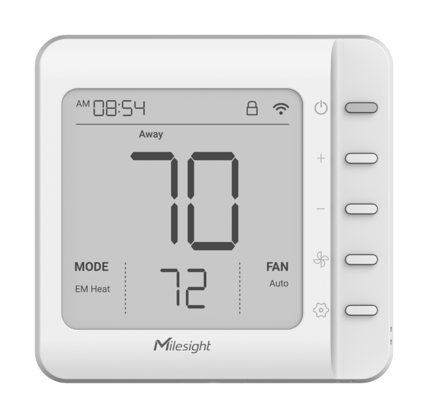

# Smart Thermostat - Milesight IoT

The payload decoder function is applicable to WT201.

For more detailed information, please visit Milesight official website(https://www.milesight-iot.com).



## Payload Definition

| CHANNEL                  |  ID  | TYPE | LENGTH | DESCRIPTION                                                                                                                                                                                                                                                                                                                                                                                                           |
| :----------------------- | :--: | :--: | :----: | :-------------------------------------------------------------------------------------------------------------------------------------------------------------------------------------------------------------------------------------------------------------------------------------------------------------------------------------------------------------------------------------------------------------------- |
| Protocol Version         | 0xFF | 0x01 |   1    | protocol_version(1B)                                                                                                                                                                                                                                                                                                                                                                                                  |
| Device Status            | 0xFF | 0x0B |   1    | device_status(1B)                                                                                                                                                                                                                                                                                                                                                                                                     |
| Serial Number            | 0xFF | 0x16 |   8    | sn(8B)                                                                                                                                                                                                                                                                                                                                                                                                                |
| Hardware Version         | 0xFF | 0x09 |   2    | hardware_version(2B)                                                                                                                                                                                                                                                                                                                                                                                                  |
| Firmware Version         | 0xFF | 0x0A |   2    | firmware_version(2B)                                                                                                                                                                                                                                                                                                                                                                                                  |
| LoRaWAN Class Type       | 0xFF | 0x0F |   1    | lorawan_class(1B)<br />lorawan_class, values: (0: classA, 1: classB, 2: classC, 3: classCtoB)                                                                                                                                                                                                                                                                                                                         |
| TSL Version              | 0xFF | 0xFF |   2    | tsl_version(2B)                                                                                                                                                                                                                                                                                                                                                                                                       |
| Ambient Temperature      | 0x03 | 0x67 |   2    | temperature(2B)<br />temperature, unit: ℃, read: int16/10                                                                                                                                                                                                                                                                                                                                                             |
| Target Temperature       | 0x04 | 0x67 |   2    | temperature_target(2B)<br />temperature_target, unit: ℃, read: int16/10                                                                                                                                                                                                                                                                                                                                               |
| Temperature Control      | 0x05 | 0xE7 |   1    | temperature_ctl_mode(0..1) + temperature_ctl_status(4..7)<br />temperature_ctl_mode, values: (0: heat, 1: em heat, 2: cool, 3: auto)<br />temperature_ctl_status: (0: standby, 1: stage-1 heat, 2: stage-2 heat, 3: stage-3 heat, 4: stage-4 heat, 5: em heat, 6: stage-1 cool, 7: stage-2 cool)                                                                                                                      |
| Fan Control              | 0x06 | 0xE8 |   1    | fan_mode(0..1) + fan_status(2..3)<br />fan_mode, values: (0: auto, 1: on, 2: circulate, 3: disable)<br />fan_status, values: (0: standby, 1: high speed, 2: low speed, 3: on)                                                                                                                                                                                                                                         |
| Plan Event               | 0x07 | 0xBC |   1    | plan_event(0..3)<br />plan_event, values: (0: not executed, 1: wake, 2: away, 3: home, 4: sleep)                                                                                                                                                                                                                                                                                                                      |
| System Status            | 0x08 | 0x8E |   1    | system_status(1B)<br />system_status, values: (0: off, 1: on)                                                                                                                                                                                                                                                                                                                                                         |
| Humidity                 | 0x09 | 0x68 |   1    | humidity(1B)<br />humidity, unit: %RH, read: int8/2                                                                                                                                                                                                                                                                                                                                                                   |
| Wires Relay Status       | 0x0A | 0x6E |   1    | wire_relay_status(1B)                                                                                                                                                                                                                                                                                                                                                                                                 |
| Plan                     | 0xFF | 0xC9 |   6    | type(1B) + index(1B) + plan_enable(1B) + week_recycle(1B) + time(1B)<br />type, values: (0: wake, 1: away, 2: home, 3: sleep)<br />index, range: [0, 15]<br />week_recycle, read: bits, (bit1: mon, bit2: tues, bit3: wed, bit4: thur, bit5: fri, bit6: sat, bit7: sun)<br />time, unit: mins                                                                                                                         |
| Wires                    | 0xFF | 0xCA |   3    | value1(1B) + value2(1B) + value3(1B)<br />value1, bit0-bit1: y1, bit2-bit3: gh, bit4-bit5: o/b, bit6-bit7: w1<br />value2, bit0-bit1: e, bit2-bit3: di, bit4-bit5: pek, bit6-bit7: (1: w2, 2: aux)<br />value3, bit0-bit1: (1: y2, 2: gl), bit2-bit3: (0: cool, 1: heat)                                                                                                                                              |
| Temperature Mode Support | 0xFF | 0xCB |   3    | mode_enable(1B) + heat_level_enable(1B) + cool_level_enable(1B)<br />mode_enable, read: bits, (bit0: heat, bit1: em heat, bit2: cool, bit3: auto)<br />heat_level_enable, read: bits, (bit0: stage-1 heat, bit1: stage-2 heat, bit2: stage-3 heat, bit3: stage-4 heat, bit4: aux heat)<br />cool_level_enable: read: bits, (bit0: stage-1 cool, bit1: stage-2 cool)                                                   |
| Control Permissions      | 0xFF | 0xF6 |   1    | control_permissions(1B)<br />control_permissions, values: (0: thermostat, 1: remote control)                                                                                                                                                                                                                                                                                                                          |
| Temperature Alarm        | 0x83 | 0x67 |   3    | temperature(2B) + temperature_alarm(1B)<br />temperature, unit: ℃, read: int16/10<br />temperature_alarm, values: (1: emergency heating timeout, 2: auxiliary heating timeout, 3: persistent low temperature, 4: persistent low temperature release, 5: persistent high temperature, 6: persistent high temperature release, 7: freeze protection, 8: freeze protection release, 9: threshold, 10: threshold release) |
| Temperature Exception    | 0xB3 | 0x67 |   1    | temperature_exception(1B)<br />temperature_exception, values: (1: read failed, 2: out of range)                                                                                                                                                                                                                                                                                                                       |
| Humidity Exception       | 0xB9 | 0x68 |   1    | humidity_exception(1B)<br />humidity_exception, values: (1: read failed, 2: out of range)                                                                                                                                                                                                                                                                                                                             |
| Historical Data          | 0x20 | 0xCE |   8    | timestamp(4B) + value_1(2B) + value_2(2B)<br />timestamp, unit: s, read: uint32<br />value_1, fan_mode(0..1) + fan_status(2..3) + system_status(4) + temperature(5..15)<br />value_2, temperature_ctl_mode(0..1) + temperature_ctl_status(2..4) + temperature_target(5..15)<br />temperature, unit: ℃, read: unit16 / 10 - 100                                                                                        |

### WIRES(3B)

#### WIRES-BYTE1

| BITS | 7..6 | 5..4 | 3..2 | 1..0 |
| :--: | :--: | :--: | :--: | :--: |
| LINE |  W1  | O/B  |  GH  |  Y1  |

#### WIRES-BYTE2

| BITS |   7..6    | 5..4 | 3..2 | 1..0 |
| :--: | :-------: | :--: | :--: | :--: |
| LINE | W2 or AUX | PEK  |  DI  |  E   |

#### WIRES-BYTE3

| BITS | 7..4 |       3..2        | 1..0  |
| :--: | :--: | :---------------: | :---: |
| LINE | RFU  | O/B: COOL or HEAT | Y2/GL |

### WIRE RELAY(2B)

```
+-------+--------+--------+--------+--------+--------+--------+--------+
|   7   |    6   |    5   |    4   |    3   |    2   |    1   |    0   |
+-------+--------+--------+--------+--------+--------+--------+--------+
|  RFU  |   O/B  |    G   |    E   | W2/AUX |   W1   |  Y1/GL |   Y1   |

```

# Sample

```json
// 03670201 0467A600 05E700 06E800 07BC00
{
    "fan_mode": "auto",
    "fan_status": "standby",
    "plan_event": "not executed",
    "temperature": 25.8,
    "temperature_ctl_mode": "heat",
    "temperature_ctl_status": "standby",
    "temperature_target": 16.6
}

// 8367FB0009
{
    "temperature": 25.1,
    "temperature_alarm": "threshold alarm"
}

// 20CE5C470A65D09EC091
{
    "history": [
        {
            "fan_mode": "auto",
            "fan_status": "standby",
            "system_status": "on",
            "temperature": 27,
            "temperature_ctl_mode": "heat",
            "temperature_ctl_status": "standby",
            "temperature_target": 16.6,
            "timestamp": 1695172444
        }
    ]
}

// FFCB0D1101 FFCA158004
{
    "ob_mode": "heat",
    "temperature_ctl_mode_enable": ["heat", "cool", "auto"],
    "temperature_ctl_status_enable": ["stage-1 heat", "aux heat", "stage-1 cool"],
    "wires": ["y1", "gh", "ob", "aux"]
}

// FFC900000000B302 FFC9020101280000
{
    "plan_schedule": [
        {
            "index": 1,
            "plan_enable": "disable",
            "time": "11:31",
            "type": "wake",
            "week_recycle": []
        },
        {
            "index": 2,
            "plan_enable": "enable",
            "time": "0:00",
            "type": "home",
            "week_recycle": [
                "Wed.",
                "Fri."
            ]
        }
    ]
}

// FFC80303014E36
{
    "plan_settings": [
        {
            "fan_mode": "on",
            "temperature_ctl_mode": "auto",
            "temperature_error": 5.4,
            "temperature_target": 78,
            "type": "sleep"
        }
    ]
}
```
