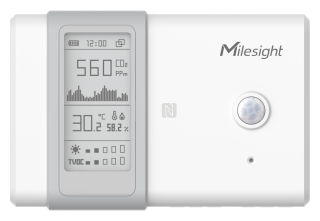

# Ambience Monitoring Sensor - AM107



For more detailed information, please visit [Milesight Official Website](https://www.milesight.com/iot/product/lorawan-sensor/am107)

## Payload

```
+-------------------------------------------------------+
|           DEVICE UPLINK / DOWNLINK PAYLOAD            |
+---------------------------+---------------------------+
|          DATA 1           |          DATA 2           |
+--------+--------+---------+--------+--------+---------+
|   ID   |  TYPE  |  DATA   |   ID   |  TYPE  |  DATA   |
+--------+--------+---------+--------+--------+---------+
| 1 Byte | 1 Byte | N Bytes | 1 Byte | 1 Byte | N Bytes |
|--------+--------+---------+--------+--------+---------+
```

### Attribute

|    CHANNEL    |  ID  | TYPE | LENGTH | DESCRIPTION                                                                                      |
| :-----------: | :--: | :--: | :----: | ------------------------------------------------------------------------------------------------ |
|     IPSO      | 0xFF | 0x01 |   1    | ipso_version(1B)                                                                                 |
|   Hardware    | 0xFF | 0x09 |   2    | hardware_version(2B)<br/>hardware_version, e.g. 0110 -> v1.1                                     |
|   Firmware    | 0xFF | 0x0A |   2    | firmware_version(2B)<br/>firmware_version, e.g. 0110 -> v1.10                                    |
|      TSL      | 0xFF | 0xFF |   2    | tsl_version(2B)                                                                                  |
| Serial Number | 0xFF | 0x08 |   6    | sn(6B)                                                                                           |
| LoRaWAN Class | 0xFF | 0x0F |   1    | lorawan_class(1B)<br/>lorawan_class, values: (0: Class A, 1: Class B, 2: Class C, 3: Class CtoB) |
|  Reset Event  | 0xFF | 0xFE |   1    | reset_event(1B)                                                                                  |
| Device Status | 0xFF | 0x0B |   1    | device_status(1B)                                                                                |

### Telemetry

|   CHANNEL    |  ID  | TYPE | LENGTH | DESCRIPTION                                                                           |
| :----------: | :--: | :--: | :----: | ------------------------------------------------------------------------------------- |
|   Battery    | 0x01 | 0x75 |   1    | battery(1B)<br/>battery, unit: %, read: uint8                                         |
| Temperature  | 0x03 | 0x67 |   2    | temperature(2B)<br/>temperature, unit: °C, read: int16/10                             |
|   Humidity   | 0x04 | 0x68 |   1    | humidity(1B)<br/>humidity, unit: %r.h., read: uint8/2                                 |
|   Activity   | 0x05 | 0x6A |   2    | activity(2B)                                                                          |
| Illumination | 0x06 | 0x65 |   6    | illumination(2B) + infrared_and_visible(2B) + infrared(2B)<br/>illumination, unit: lx |
|     CO2      | 0x07 | 0x7D |   2    | co2(2B)<br/>co2, unit: ppm, read: uint16                                              |
|     tVoC     | 0x08 | 0x7D |   2    | tvoc(2B)<br/>tvoc, unit: ppb, read: uint16                                            |
|   Pressure   | 0x09 | 0x73 |   2    | pressure(2B)<br/>pressure, unit: hPa, read: uint16/10                                 |

## Example

```json
// 01755C 03673401 046865 056A4900 06651C0079001400 077DE704 087D0700 09733F27
{
    "battery": 92,
    "temperature": 30.8,
    "humidity": 50.5,
    "activity": 73,
    "illumination": 28,
    "infrared": 20,
    "infrared_and_visible": 121,
    "co2": 1255,
    "tvoc": 7,
    "pressure": 1004.7
}
```
