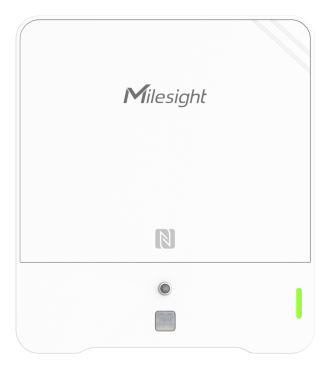

# Ambience Monitoring Sensor - AM319L-O3



For more detailed information, please visit [Milesight Official Website](https://www.milesight.com/iot/product/lorawan-sensor/am319)

## Payload

```
+-------------------------------------------------------+
|           DEVICE UPLINK / DOWNLINK PAYLOAD            |
+---------------------------+---------------------------+
|          DATA 1           |          DATA 2           |
+--------+--------+---------+--------+--------+---------+
|   ID   |  TYPE  |  DATA   |   ID   |  TYPE  |  DATA   |
+--------+--------+---------+--------+--------+---------+
| 1 Byte | 1 Byte | N Bytes | 1 Byte | 1 Byte | N Bytes |
|--------+--------+---------+--------+--------+---------+
```

### Attribute

|    CHANNEL    |  ID  | TYPE | LENGTH | DESCRIPTION                                                                                       |
| :-----------: | :--: | :--: | :----: | ------------------------------------------------------------------------------------------------ |
|     IPSO      | 0xFF | 0x01 |   1    | ipso_version(1B)                                                                                 |
|   Hardware    | 0xFF | 0x09 |   2    | hardware_version(2B)<br/>hardware_version, e.g. 0110 -> v1.1                                     |
|   Firmware    | 0xFF | 0x0A |   2    | firmware_version(2B)<br/>firmware_version, e.g. 0110 -> v1.10                                    |
|      TSL      | 0xFF | 0xFF |   2    | tsl_version(2B)                                                                                  |
| Serial Number | 0xFF | 0x16 |   8    | sn(8B)                                                                                           |
| LoRaWAN Class | 0xFF | 0x0F |   1    | lorawan_class(1B)<br/>lorawan_class, values: (0: Class A, 1: Class B, 2: Class C, 3: Class CtoB) |
|  Reset Event  | 0xFF | 0xFE |   1    | reset_event(1B)                                                                                  |
| Device Status | 0xFF | 0x0B |   1    | device_status(1B)                                                                                |

### Telemetry

|   CHANNEL    |  ID  | TYPE | LENGTH | DESCRIPTION                                                                                                                                                                                                                |
| :----------: | :--: | :--: | :----: | ------------------------------------------------------------------------------------------------------------------------------------------------------------------------------------------------------------------------- |
|   Battery    | 0x01 | 0x75 |   1    | battery(1B)<br/>battery, unit: %, read: uint8                                                                                                                                                                             |
| Temperature  | 0x03 | 0x67 |   2    | temperature(2B)<br/>temperature, unit: °C, read: int16/10                                                                                                                                                                 |
|   Humidity   | 0x04 | 0x68 |   1    | humidity(1B)<br/>humidity, unit: %r.h., read: uint8/2                                                                                                                                                                     |
|     PIR      | 0x05 | 0x00 |   1    | pir(1B)<br/>pir, values: (0: idle, 1: trigger)                                                                                                                                                                            |
|    Light     | 0x06 | 0xCB |   1    | light_level(1B)<br/>light_level, read: uint8                                                                                                                                                                              |
|     CO2      | 0x07 | 0x7D |   2    | co2(2B)<br/>co2, unit: ppm, read: uint16                                                                                                                                                                                  |
|     tVoC     | 0x08 | 0x7D |   2    | tvoc(2B)<br/>tvoc, uint: iaq, read: uit16/100                                                                                                                                                                             |
|     tVoC     | 0x08 | 0xE6 |   2    | tvoc(2B)<br/>tvoc, unit: µg/m³, read: uint16                                                                                                                                                                              |
|   Pressure   | 0x09 | 0x73 |   2    | pressure(2B)<br/>pressure, unit: hPa, read: uint16/10                                                                                                                                                                     |
|    PM2.5     | 0x0B | 0x7D |   2    | pm2_5(2B)<br/>pm2_5, unit: µg/m³, read: uint16                                                                                                                                                                            |
|     PM10     | 0x0C | 0x7D |   2    | pm10(2B)<br/>pm10, unit: µg/m³, read: uint16                                                                                                                                                                              |
|      O3      | 0x0D | 0x7D |   2    | o3(2B)<br />o3, unit: ppm, read: uint16/100                                                                                                                                                                               |
|    Buzzer    | 0x0E | 0x01 |   1    | buzzer_status(1B)<br/>buzzer_status, values: (0: off, 1: on)                                                                                                                                                              |
| History Data | 0x20 | 0xCE |   22   | timestamp(4B) + temperature(2B) + humidity(2B) + pir(1B) + light_level(1B) + co2(2B) + tvoc(2B) + pressure(2B) + pm2.5(2B) + pm10(2B) + o3(2B)<br/>timestamp, unit: s, read: uint32<br/>tvoc, unit: iaq, read: uint16/100 |
| History Data | 0x21 | 0xCE |   22   | timestamp(4B) + temperature(2B) + humidity(2B) + pir(1B) + light_level(1B) + co2(2B) + tvoc(2B) + pressure(2B) + + pm2.5(2B) + pm10(2B) + o3(2B)<br/>timestamp, unit: s, read: uint32<br/>tvoc, unit: µg/m³, read: uint16 |

## Example

```json
// 0367EE00 04687C 050001 06CB02 077DA803 087D2500 09736627 0B7D2000 0C7D3000
{
    "temperature": 23.8,
    "humidity": 62,
    "pir": "trigger",
    "light_level": 2,
    "co2": 936,
    "tvoc": 0.37,
    "pressure": 1008.6,
    "pm2_5": 32,
    "pm10": 48
}
```
