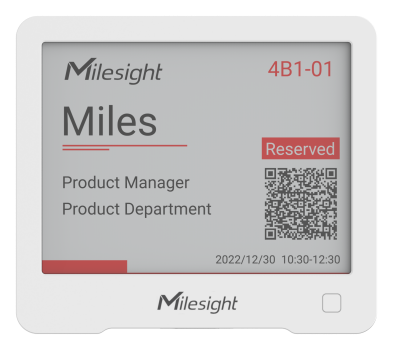

# Smart E-Ink Display - DS3604



For more detailed information, please visit [Milesight Official Website](https://www.milesight.com/iot/product/iot-display/ds3604)

## Payload

```
+-------------------------------------------------------+
|           DEVICE UPLINK / DOWNLINK PAYLOAD            |
+---------------------------+---------------------------+
|          DATA 1           |          DATA 2           |
+--------+--------+---------+--------+--------+---------+
|   ID   |  TYPE  |  DATA   |   ID   |  TYPE  |  DATA   |
+--------+--------+---------+--------+--------+---------+
| 1 Byte | 1 Byte | N Bytes | 1 Byte | 1 Byte | N Bytes |
|--------+--------+---------+--------+--------+---------+
```

### Attribute

|    CHANNEL    |  ID  | TYPE | LENGTH | DESCRIPTION                                                                                       |
| :-----------: | :--: | :--: | :----: | ------------------------------------------------------------------------------------------------ |
|     IPSO      | 0xFF | 0x01 |   1    | ipso_version(1B)                                                                                 |
|   Hardware    | 0xFF | 0x09 |   2    | hardware_version(2B)<br/>hardware_version, e.g. 0110 -> v1.1                                     |
|   Firmware    | 0xFF | 0x0A |   2    | firmware_version(2B)<br/>firmware_version, e.g. 0110 -> v1.10                                    |
|      TSL      | 0xFF | 0xFF |   2    | tsl_version(2B)                                                                                  |
| Serial Number | 0xFF | 0x16 |   2    | sn(8B)                                                                                           |
| LoRaWAN Class | 0xFF | 0x0F |   1    | lorawan_class(1B)<br/>lorawan_class, values: (0: Class A, 1: Class B, 2: Class C, 3: Class CtoB) |
|  Reset Event  | 0xFF | 0xFE |   1    | reset_event(1B)                                                                                  |
| Device Status | 0xFF | 0x0B |   1    | device_status(1B)                                                                                |

### Telemetry

|     CHANNEL      |  ID  | TYPE | LENGTH | DESCRIPTION                                                                                                    |
| :--------------: | :--: | :--: | :----: | -------------------------------------------------------------------------------------------------------------- |
|     Battery      | 0x01 | 0x75 |   1    | battery(1B)<br/>battery, unit: %                                                                               |
|  Button Status   | 0xFF | 0x2E |   1    | button_status(1B)<br/>button_status, values: (0: single click, 1: double_click, 2: short_press, 3: long_press) |
| Current Template | 0xFF | 0x73 |   1    | current_template_id(1B)<br/>current_template_id, values: (0: template_1, 1: template_2)                        |
| Text/QRCode Data | 0xFB | 0x01 |   N    | id(1B) + data_length(1B) + data(MB)<br/>id, block_id(0..5) + template_id(6..7)<br/>data, read: utf8            |
|    Image Data    | 0xFB | 0x02 |   N    | id(1B) + seq_num(1B) + block_unit_size(1B) + data_length(1B) + data(MB)                                        |
| Template Config  | 0xFB | 0x03 |   N    | id(1B) + data_length(1B) + data(MB)<br/>id, block_id(0..5) + template_id(6..7)<br/>data, read: utf8            |

### Text/QR Data Frame Definition

| ID(1Byte) |  Type(1Byte)  | Template ID(Bit 6-7) | Block ID(Bit 0-6) | Data Length(1B) | Data(N Bytes) |
| :-------: | :-----------: | :------------------: | :---------------: | :-------------: | :-----------: |
|   0xFB    |     0x01      |          00          |      000000       |      0x05       |  4d696c6573   |
| Template  | Text/QR Frame |     Template ID      |     Block ID      |   Data Length   | UTF-8 Unicode |
|           |               |          1           |      text 1       |     5 Bytes     |     Miles     |

-   Id
    -   Template id range `0 - 1`
    -   Text block id range `0 - 9`
    -   QRcode block id `10`

### Image Frame Definition

| ID(1Byte) | Type(1Byte) | Template ID(Bit 6-7) | Block ID(Bit 0-6) | Sequence Number(1B) | Block Unit Size(1B) | Data Length(1B) | Image Data(N Bytes) |
| :-------: | :---------: | :------------------: | :---------------: | :-----------------: | :-----------------: | :-------------: | :-----------------: |
|   0xFB    |    0x02     |          00          |      000000       |        0x05         |        0x30         |      0x30       |                     |
| Template  | Image Frame |     Template ID      |     Block ID      |       seq_num       |   Block Unit Size   |   Data Length   |    Data(N Bytes)    |
|           |             |          1           |       image       |          5          |         48          |       48        |                     |

-   Id
    -   Background id `0`
    -   Logo id `1`

#### Image Data Format

| VERSION(1B) | CRC32(4B) | WIDTH(2B) | HIGH(2B) | SIZE(2B) | DATA(N Bytes) |
| :---------: | :-------: | :-------: | :------: | :------: | :-----------: |
|    0x01     |   crc32   |  0x0000   |  0x0000  |  0x0000  |    0x0000     |

### Template Config Frame Definition

| ID(1B) | Type(1B) | Template ID(Bit 6-7) | Block ID(Bit 0-6) | Data Length(1B) | Data(N Bytes) |
| :----: | :------: | :------------------: | :---------------: | :-------------: | :-----------: |
|  0xFB  |   0x03   |          00          |      000000       |      0x05       |  4d696c6573   |

-   Id

    -   Template id range `0 - 1`
    -   Text block id range `0 - 9`
    -   QRcode block id `10`
    -   Image block id `11`, `12`
    -   Battery Status block id `13`
    -   Connect Status block id `14`

-   Data
    -   Text Block Template Definition: enable(1B) + type(1B) + start_x(2B) + start_y(2B) + end_x(2B) + end_y(2B) + border(1B) + horizontal(1B) + vertical(1B) + background(1B) + foreground(1B) + reserved(1B) + layer(1B) + reserved(4B) + font_type(1B) + font_size(1B) + line_wrap(1B) + font_style(1B)
        -   enable, values: (0: disable, 1: enable)
        -   type, values: (0: text, 1: qrcode, 2: image, 3: battery, 4: connect)
        -   start_x, values: (0 - 400)
        -   start_y, values: (0 - 300)
        -   end_x, values: (0 - 400)
        -   end_y, values: (0 - 300)
        -   border, values: (0: no, 1: yes)
        -   horizontal, values: (0: left, 1: center, 2: right)
        -   vertical, values: (0: top, 1: center, 2: bottom)
        -   background, values: (0: white, 1: black, 2: red)
        -   foreground, values: (0: white, 1: black, 2: red)
        -   layer, values: (0-255)
        -   font_type, values: (1: SONG, 2: FANG, 3: BLACK, 4: KAI, 5: FT_ASCII, 6: DZ_ASCII, 7: CH_ASCII, 8: BX_ASCII, 9: BZ_ASCII, 10: FX_ASCII, 11: GD_ASCII, 12: HZ_ASCII, 13: MS_ASCII, 14: SX_ASCII, 15: ZY_ASCII, 16: TM_ASCII, 17: YJ_LATIN, 18: CYRILLIC, 19: KSC5601, 20: JIS0208_HT, 21: ARABIC, 22: THAI, 23: GREEK, 24: HEBREW)
        -   line_wrap, values: (0: disable, 1: enable)
        -   font_style, values: (0: normal, 1: bold)
    -   QRCode Block Template Definition: enable(1B) + type(1B) + start_x(2B) + start_y(2B) + end_x(2B) + end_y(2B) + border(1B) + horizontal(1B) + vertical(1B) + background(1B) + foreground(1B) + reserved(1B) + layer(1B) + reserved(4B) + codec(1B)
        -   codec, unused
    -   Image Block Template Definition: enable(1B) + type(1B) + start_x(2B) + start_y(2B) + end_x(2B) + end_y(2B) + border(1B) + horizontal(1B) + vertical(1B) + background(1B) + foreground(1B) + reserved(1B) + layer(1B) + reserved(4B) + algorithm(1B)
        -   compress_algorithm, values: (0: lzss)

## Example

```json
// 017564 FB0100054D696C6573 FB010A1968747470733A2F2F7777772E6D696C6573696768742E636F6D
{
    "battery": 100,
    "template_1": {
        "qrcode": "https://www.milesight.com",
        "text_1": "Miles"
    }
}
```
