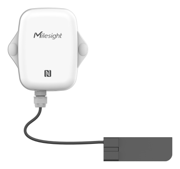

# Capacitive Level Sensor - EM300-CL



For more detailed information, please visit [Milesight Official Website](https://www.milesight.com/iot/product/lorawan-sensor/em300-cl)

## Payload

```
+-------------------------------------------------------+
|           DEVICE UPLINK / DOWNLINK PAYLOAD            |
+---------------------------+---------------------------+
|          DATA 1           |          DATA 2           |
+--------+--------+---------+--------+--------+---------+
|   ID   |  TYPE  |  DATA   |   ID   |  TYPE  |  DATA   |
+--------+--------+---------+--------+--------+---------+
| 1 Byte | 1 Byte | N Bytes | 1 Byte | 1 Byte | N Bytes |
|--------+--------+---------+--------+--------+---------+
```

### Attribute

|    CHANNEL    |  ID  | TYPE | LENGTH | DESCRIPTION                                                                                       |
| :-----------: | :--: | :--: | :----: | ------------------------------------------------------------------------------------------------ |
|     IPSO      | 0xFF | 0x01 |   1    | ipso_version(1B)                                                                                 |
|   Hardware    | 0xFF | 0x09 |   2    | hardware_version(2B)<br/>hardware_version, e.g. 0110 -> v1.1                                     |
|   Firmware    | 0xFF | 0x0A |   2    | firmware_version(2B)<br/>firmware_version, e.g. 0110 -> v1.10                                    |
|      TSL      | 0xFF | 0xFF |   2    | tsl_version(2B)                                                                                  |
| Serial Number | 0xFF | 0x16 |   2    | sn(8B)                                                                                           |
| LoRaWAN Class | 0xFF | 0x0F |   1    | lorawan_class(1B)<br/>lorawan_class, values: (0: Class A, 1: Class B, 2: Class C, 3: Class CtoB) |
|  Reset Event  | 0xFF | 0xFE |   1    | reset_event(1B)                                                                                  |
| Device Status | 0xFF | 0x0B |   1    | device_status(1B)                                                                                |

### Telemetry

|     CHANNEL      |  ID  | TYPE | LENGTH | DESCRIPTION                                                                                                                                                                                                                   |
| :--------------: | :--: | :--: | :----: | ----------------------------------------------------------------------------------------------------------------------------------------------------------------------------------------------------------------------------- |
|     Battery      | 0x01 | 0x75 |   1    | battery(1B)<br/>battery, unit: %, read: uint8                                                                                                                                                                                 |
|  Liquid Status   | 0x03 | 0xED |   1    | liquid(1B)<br/>liquid, values: (0: uncalibrated, 1: full, 2: critical liquid level alert, 0xff: error)                                                                                                                        |
| Calibrate Result | 0x04 | 0xEE |   1    | calibrate_result(1B)<br/>calibrate_result, values: (0: failed, 1: success)                                                                                                                                                    |
|   Liquid Alarm   | 0x83 | 0xED |   2    | liquid(1B) + liquid_alarm(1B)<br/>liquid, values: (0: uncalibrated, 1: full, 2: critical liquid level alert, 0xff: error)<br/>liquid_alarm, values: (0: critical liquid level alarm release, 1: critical liquid level alarm ) |

## Example

```json
// 017564 03ED00
{
    "battery": 100,
    "liquid": "uncalibrated"
}

// 03ED01
{
    "liquid": "full"
}

// 03ED02
{
    "liquid": "critical liquid level alert"
}

// 03EDFF
{
    "liquid": "error"
}

// 83ED0100
{
    "liquid": "full",
    "liquid_alarm": "critical liquid level alarm release"
}

// 83ED0201
{
    "liquid": "critical liquid level alert",
    "liquid_alarm": "critical liquid level alarm"
}

// 04EE01
{
    "calibration_result": "success"
}

// 04EE00
{
    "calibration_result": "failed"
}
```
