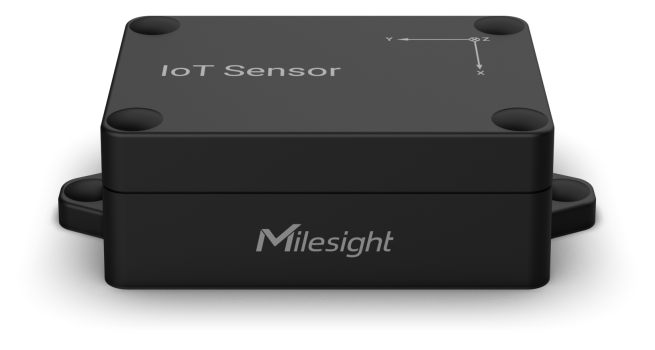

# Tilt Sensor - EM310-TILT



For more detailed information, please visit [Milesight Official Website](https://www.milesight.com/iot/product/lorawan-sensor/em310-tilt)

## Payload

```
+-------------------------------------------------------+
|           DEVICE UPLINK / DOWNLINK PAYLOAD            |
+---------------------------+---------------------------+
|          DATA 1           |          DATA 2           |
+--------+--------+---------+--------+--------+---------+
|   ID   |  TYPE  |  DATA   |   ID   |  TYPE  |  DATA   |
+--------+--------+---------+--------+--------+---------+
| 1 Byte | 1 Byte | N Bytes | 1 Byte | 1 Byte | N Bytes |
|--------+--------+---------+--------+--------+---------+
```

### Attribute

|    CHANNEL    |  ID  | TYPE | LENGTH | DESCRIPTION                                                                                       |
| :-----------: | :--: | :--: | :----: | ------------------------------------------------------------------------------------------------ |
|     IPSO      | 0xFF | 0x01 |   1    | ipso_version(1B)                                                                                 |
|   Hardware    | 0xFF | 0x09 |   2    | hardware_version(2B)<br/>hardware_version, e.g. 0110 -> v1.1                                     |
|   Firmware    | 0xFF | 0x0A |   2    | firmware_version(2B)<br/>firmware_version, e.g. 0110 -> v1.10                                    |
|      TSL      | 0xFF | 0xFF |   2    | tsl_version(2B)                                                                                  |
| Serial Number | 0xFF | 0x16 |   2    | sn(8B)                                                                                           |
| LoRaWAN Class | 0xFF | 0x0F |   1    | lorawan_class(1B)<br/>lorawan_class, values: (0: Class A, 1: Class B, 2: Class C, 3: Class CtoB) |
|  Reset Event  | 0xFF | 0xFE |   1    | reset_event(1B)                                                                                  |
| Device Status | 0xFF | 0x0B |   1    | device_status(1B)                                                                                |

### Telemetry

|   CHANNEL   |  ID  | TYPE | LENGTH | DESCRIPTION                                                                                                                                                                                                                                                                               |
| :---------: | :--: | :--: | :----: | ----------------------------------------------------------------------------------------------------------------------------------------------------------------------------------------------------------------------------------------------------------------------------------------- |
|   Battery   | 0x01 | 0x75 |   1    | battery(1B)<br/>battery, unit: %                                                                                                                                                                                                                                                          |
| Angle X/Y/Z | 0x03 | 0xCF |   7    | angle_x(2B) + angle_y(2B) + angle_z(2B) + status(1B)<br/>angle_x, read: int16/100, unit: °<br/>angle_y, read: int16/100, unit: °<br/>angle_z, read: int16/100, unit: ° <br/>status, values: (bit0: angle_x threshold alarm, bit1: angle_y threshold alarm, bit2: angle_z threshold alarm) |

## Example

```json
// 03CF00000000282307
{
    "angle_x": 0,
    "angle_y": 0,
    "angle_z": 90,
    "threshold_x": "trigger",
    "threshold_y": "trigger",
    "threshold_z": "trigger"
}
```
