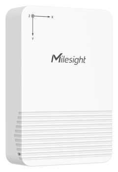

# Tilt Sensor - EM320-TILT



For more detailed information, please visit [Milesight Official Website](https://www.milesight.com/iot/product/lorawan-sensor/em320-tilt)

## Payload

```
+-------------------------------------------------------+
|           DEVICE UPLINK / DOWNLINK PAYLOAD            |
+---------------------------+---------------------------+
|          DATA 1           |          DATA 2           |
+--------+--------+---------+--------+--------+---------+
|   ID   |  TYPE  |  DATA   |   ID   |  TYPE  |  DATA   |
+--------+--------+---------+--------+--------+---------+
| 1 Byte | 1 Byte | N Bytes | 1 Byte | 1 Byte | N Bytes |
|--------+--------+---------+--------+--------+---------+
```

### Attribute

|    CHANNEL    |  ID  | TYPE | LENGTH | DESCRIPTION                                                                                       |
| :-----------: | :--: | :--: | :----: | ------------------------------------------------------------------------------------------------ |
|     IPSO      | 0xFF | 0x01 |   1    | ipso_version(1B)                                                                                 |
|   Hardware    | 0xFF | 0x09 |   2    | hardware_version(2B)<br/>hardware_version, e.g. 0110 -> v1.1                                     |
|   Firmware    | 0xFF | 0x0A |   2    | firmware_version(2B)<br/>firmware_version, e.g. 0110 -> v1.10                                    |
|      TSL      | 0xFF | 0xFF |   2    | tsl_version(2B)                                                                                  |
| Serial Number | 0xFF | 0x16 |   2    | sn(8B)                                                                                           |
| LoRaWAN Class | 0xFF | 0x0F |   1    | lorawan_class(1B)<br/>lorawan_class, values: (0: Class A, 1: Class B, 2: Class C, 3: Class CtoB) |
|  Reset Event  | 0xFF | 0xFE |   1    | reset_event(1B)                                                                                  |
| Device Status | 0xFF | 0x0B |   1    | device_status(1B)                                                                                |

### Telemetry

|   CHANNEL   |  ID  | TYPE | LENGTH | DESCRIPTION                                                                                                                                                                                           |
| :---------: | :--: | :--: | :----: | ----------------------------------------------------------------------------------------------------------------------------------------------------------------------------------------------------- |
|   Battery   | 0x01 | 0x75 |   1    | battery(1B)<br/>battery, unit: %                                                                                                                                                                      |
| Angle X/Y/Z | 0x03 | 0xD4 |   6    | angle_x(2B) + angle_y(2B) + angle_z(2B)<br/>angle_x, angle_x(15..1) + angle_x_threshold(0)<br/>angle_y, angle_y(15..1) + angle_y_threshold(0)<br/>angle_z, angle_z(15..1) + angle_z_threshold(0)<br/> |

### Angle X/Y/Z Definition (bits)

```
+--------------------------------------------------------+
|  15  |  14  |  13  |  12  |  11  |  10  |  09  |   08  |
+--------------------------------------------------------+
|                     ANGLE DATA(1)                      |
+--------------------------------------------------------+
|  07  |  06  |  05  |  04  |  03  |  02  |  01  |   00  |
+------------------------------------------------+-------+
|                 ANGLE DATA(0)                  |  FLAG |
+------------------------------------------------+-------+

NOTE: (FLAG: normal, 1: trigger)
```

## Example

```json
// 017564 03D4000001005046
{
    "battery": 100,
    "angle_x": 0,
    "angle_y": 0,
    "angle_z": 90,
    "threshold_x": "normal",
    "threshold_y": "trigger",
    "threshold_z": "normal"
}
```
