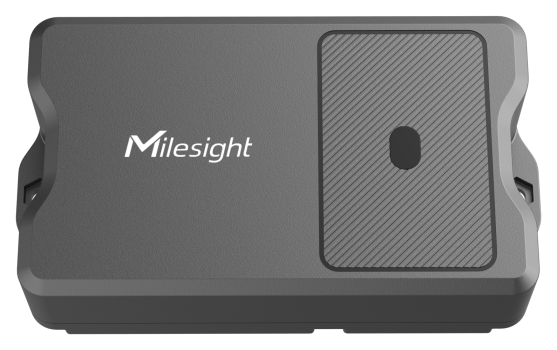

# ToF Laser Distance Sensor - EM400-TLD (NB-IoT)



For more detailed information, please visit [Milesight Official Website](https://www.milesight.com/iot/product/lorawan-sensor/em400-tld)

## NB-IoT Frame

| FIELD | LENGTH | DESCRIPTION |
| :-- | :--: | :-- |
| `start_flag` | 1 | Fixed `0x02` |
| `id` | 2 | Big-endian device id |
| `length` | 2 | Big-endian payload length |
| `flag` | 1 | Frame flag |
| `frame_count` | 2 | Big-endian frame count |
| `protocol_version` | 1 | Protocol version |
| `firmware_version` | 4 | 4-byte ASCII in frame, decoded as `vX.Y` |
| `hardware_version` | 4 | 4-byte ASCII in frame, decoded as `vX.Y` |
| `sn` | 16 | ASCII |
| `imei` | 15 | ASCII |
| `imsi` | 15 | ASCII |
| `iccid` | 20 | ASCII |
| `csq` | 1 | Signal quality |
| `data_length` | 2 | Big-endian sensor payload length |
| `data` | N | Sensor payload records |

## Uplink Channels

| CHANNEL | ID | TYPE | LENGTH | OUTPUT |
| :-- | :--: | :--: | :--: | :-- |
| Battery | `0x01` | `0x75` | 1 | `battery` |
| Temperature | `0x03` | `0x67` | 2 | `temperature` |
| Distances | `0x04` | `0x82` | 32 | `distances[16]` |
| Position | `0x05` | `0x00` | 1 | `position` |
| GNSS | `0x06` | `0x88` | 9 | `latitude`, `longitude`, `motion_status`, `geofence_status` |
| Timestamp | `0x08` | `0xEF` | 4 | `timestamp` |
| MNC | `0x09` | `0xA1` | 4 | `mnc` |
| MCC | `0x0A` | `0xA2` | 4 | `mcc` |
| CELL ID | `0x0B` | `0xA3` | 8 | `cell_id` |
| LAC | `0x0C` | `0xA4` | 8 | `lac` |
| Package Status | `0x0D` | `0xA5` | 1 | `package_status` |

## Alarm Channels

| CHANNEL | ID | TYPE | LENGTH | OUTPUT |
| :-- | :--: | :--: | :--: | :-- |
| Temperature Alarm | `0x83` | `0x67` | 3 | `temperature`, `temperature_alarm` |
| Distance Alarm | `0x84` | `0x82` | 33 | `distances[16]`, `distance_alarm` |
| Position Alarm | `0x85` | `0x00` | 1 | `position_alarm` |
| Disassembly Alarm | `0x88` | `0x00` | 1 | `disassembly_alarm` |

## Downlink Commands

| FIELD | CHANNEL | DESCRIPTION |
| :-- | :--: | :-- |
| `reboot` | `ff10` | `"yes"` sends reboot |
| `report_interval` | `ff03` | 4-byte LE seconds |
| `collection_interval` | `ff02` | 4-byte LE seconds |
| `existing_height` | `ff70` | 2-byte LE mm |
| `install_height` | `ff77` | 2-byte LE mm |
| `working_mode` | `ff71` | `"standard"` or `"bin"` |
| `tilt_linkage_enable` | `ff3e` | `"disable"` or `"enable"` |
| `tof_enable` | `ff56` | `"disable"` or `"enable"` |
| `threshold_alarm_config` | `ff06` | `condition`, `id`, `renew_alert`, `min`, `max`, `lock_time`, `continue_time` |
| `recollection_time` | `ff1c` | 1-byte second |
| `bin_install_height_enable` | `ff13` | `"disable"` or `"enable"` |
| `motion_report_config` | `ff8e` | `enable` + `period` |
| `motion_detect_condition` | `ff58` | `move_holding_time` + `stop_holding_time` |
| `accumulated_packet_config` | `ff9e` | `enable` + `count` |
| `query_device_status` | `ff9c` | `"yes"` sends query |
| `query_device_position` | `ff9d` | `"yes"` sends query |
| `galaxy_type` | `ff9b` | `beidou`, `glonass_galileo`, `glonass_qzss`, `glonass`, `auto_base_mcc` |
| `ack_enable` | `ff9f` | `"disable"` or `"enable"` |
| `gps_enable` | `ffa0` | `"disable"` or `"enable"` |
| `tilt_report_enable` | `ffa1` | `"disable"` or `"enable"` |
| `disassembly_alarm_config` | `ffa2` | `enable` + `duration(1-60)` |
| `sim_card_priority` | `ffa3` | `esim_first` or `physical_sim_first` |
| `background_convergence_interval` | `ffa4` | 1-byte hour |
| `tilt_calibration` | `ffa5` | `"yes"` sends action |
| `sensor_convergence` | `ffa6` | `"yes"` sends action |

## Decoder Example

```json
// 020001007d00000001303130313031313036373439443139303534363930303331383638353038303634383037333530343630303433323234323133313130383938363034313231303232373030363238353709002c01756403670b0104823b013c013d013e013f0140014101420143014401450146014701480149014a01050001
{
  "start_flag": 2,
  "id": 1,
  "length": 125,
  "flag": 0,
  "frame_count": 0,
  "protocol_version": 1,
  "firmware_version": "v1.1",
  "hardware_version": "v1.10",
  "sn": "6749D19054690031",
  "imei": "868508064807350",
  "imsi": "460043224213110",
  "iccid": "89860412102270062857",
  "csq": 9,
  "data_length": 44,
  "data": [
    {
      "battery": 100,
      "temperature": 26.7,
      "distances": [315, 316, 317, 318, 319, 320, 321, 322, 323, 324, 325, 326, 327, 328, 329, 330],
      "position": "tilt"
    }
  ]
}
```

## Alarm Example

```json
// 020001007f00000001303130313031313036373439443139303534363930303331383638353038303634383037333530343630303433323234323133313130383938363034313231303232373030363238353709002e8367e8000184826400650066006700680069006a006b006c006d006e006f00700071007200730001850001880001
{
  "data": [
    {
      "temperature": 23.2,
      "temperature_alarm": "threshold_alarm",
      "distances": [100, 101, 102, 103, 104, 105, 106, 107, 108, 109, 110, 111, 112, 113, 114, 115],
      "distance_alarm": "threshold_alarm",
      "position_alarm": "tilt",
      "disassembly_alarm": "device_abnormal_movement"
    }
  ]
}
```

## GNSS Example

```json
// 02000100810000000130313031303131303637343944313930353436393030333138363835303830363438303733353034363030343332323432313331313038393836303431323130323237303036323835370900300688386e5801089aca060108ef0066ee5f09a134120aa2cc000ba311223344556677880ca499aabbccddeeff000da501
{
  "data": [
    {
      "latitude": 22.5726,
      "longitude": 113.941,
      "motion_status": "start",
      "geofence_status": "inside",
      "timestamp": 1609459200,
      "mnc": "4600",
      "mcc": "0086",
      "cell_id": "12345678",
      "lac": "abcdefgh",
      "package_status": "package_inserted"
    }
  ]
}
```

`data` remains an array, but current NB-IoT payloads are aggregated into a single snapshot item by default.

## Encoder Examples

```json
{ "report_interval": 120 }                       // ff0378000000
{ "collection_interval": 5 }                    // ff0205000000
{ "tilt_report_enable": "enable" }              // ffa101
{ "disassembly_alarm_config": { "enable": "enable", "duration": 10 } } // ffa2010a
{ "sim_card_priority": "physical_sim_first" }   // ffa301
{ "background_convergence_interval": 24 }       // ffa418
{ "tilt_calibration": "yes" }                   // ffa5
{ "sensor_convergence": "yes" }                 // ffa6
```
