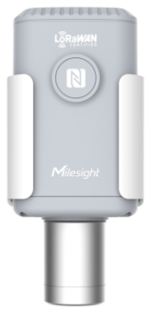

# CO2 Sensor - EM500-CO2



For more detailed information, please visit [Milesight Official Website](https://www.milesight.com/iot/product/lorawan-sensor/em500-co2)

## Payload

```
+-------------------------------------------------------+
|           DEVICE UPLINK / DOWNLINK PAYLOAD            |
+---------------------------+---------------------------+
|          DATA 1           |          DATA 2           |
+--------+--------+---------+--------+--------+---------+
|   ID   |  TYPE  |  DATA   |   ID   |  TYPE  |  DATA   |
+--------+--------+---------+--------+--------+---------+
| 1 Byte | 1 Byte | N Bytes | 1 Byte | 1 Byte | N Bytes |
|--------+--------+---------+--------+--------+---------+
```

### Attribute

|    CHANNEL    |  ID  | TYPE | LENGTH | DESCRIPTION                                                                                       |
| :-----------: | :--: | :--: | :----: | ------------------------------------------------------------------------------------------------ |
|     IPSO      | 0xFF | 0x01 |   1    | ipso_version(1B)                                                                                 |
|   Hardware    | 0xFF | 0x09 |   2    | hardware_version(2B)<br/>hardware_version, e.g. 0110 -> v1.1                                     |
|   Firmware    | 0xFF | 0x0A |   2    | firmware_version(2B)<br/>firmware_version, e.g. 0110 -> v1.10                                    |
|      TSL      | 0xFF | 0xFF |   2    | tsl_version(2B)                                                                                  |
| Serial Number | 0xFF | 0x16 |   2    | sn(8B)                                                                                           |
| LoRaWAN Class | 0xFF | 0x0F |   1    | lorawan_class(1B)<br/>lorawan_class, values: (0: Class A, 1: Class B, 2: Class C, 3: Class CtoB) |
|  Reset Event  | 0xFF | 0xFE |   1    | reset_event(1B)                                                                                  |
| Device Status | 0xFF | 0x0B |   1    | device_status(1B)                                                                                |

### Telemetry

|      CHANNEL      |  ID  | TYPE | LENGTH | DESCRIPTION                                                                                |
| :---------------: | :--: | :--: | :----: | ------------------------------------------------------------------------------------------ |
|      Battery      | 0x01 | 0x75 |   1    | battery(1B)<br/>battery, unit: %                                                           |
|        O2         | 0x01 | 0x7D |   2    | o2(2B)<br/>o2, unit: vol%                                                                 |
|     Pressure      | 0x06 | 0x73 |   2    | pressure(2B)<br/>pressure, unit: hPa                                                       |
| Temperature Alarm | 0x83 | 0xD7 |   5    | temperature(2B) + temperature_change(2B) + temperature_alarm(1B)<br/>temperature, unit: °C |
|  Historical Data  | 0x20 | 0XCE |   11   | timestamp(4B) + co2(2B) + pressure(2B) + temperature(2B) + humidity(1B)                    |

## Example

```json
// 017564 017D6704 06736827
{
    "battery": 100,
    "o2": 11.27,
    "pressure": 1008.8
}
```
