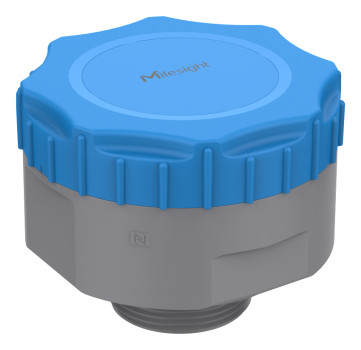

# Radar Distance/Level Sensor - EM410-RDL



For more detailed information, please visit [Milesight Official Website](https://www.milesight.com/iot/product/lorawan-sensor/em410-rdl)

## Payload

```
+-------------------------------------------------------+
|           DEVICE UPLINK / DOWNLINK PAYLOAD            |
+---------------------------+---------------------------+
|          DATA 1           |          DATA 2           |
+--------+--------+---------+--------+--------+---------+
|   ID   |  TYPE  |  DATA   |   ID   |  TYPE  |  DATA   |
+--------+--------+---------+--------+--------+---------+
| 1 Byte | 1 Byte | N Bytes | 1 Byte | 1 Byte | N Bytes |
|--------+--------+---------+--------+--------+---------+
```

### Attribute

|    CHANNEL    |  ID  | TYPE | LENGTH | DESCRIPTION                                                                                       |
| :-----------: | :--: | :--: | :----: | ------------------------------------------------------------------------------------------------ |
|     IPSO      | 0xFF | 0x01 |   1    | ipso_version(1B)                                                                                 |
|   Hardware    | 0xFF | 0x09 |   2    | hardware_version(2B)<br/>hardware_version, e.g. 0110 -> v1.1                                     |
|   Firmware    | 0xFF | 0x0A |   2    | firmware_version(2B)<br/>firmware_version, e.g. 0110 -> v1.10                                    |
|      TSL      | 0xFF | 0xFF |   2    | tsl_version(2B)                                                                                  |
| Serial Number | 0xFF | 0x16 |   2    | sn(8B)                                                                                           |
| LoRaWAN Class | 0xFF | 0x0F |   1    | lorawan_class(1B)<br/>lorawan_class, values: (0: Class A, 1: Class B, 2: Class C, 3: Class CtoB) |
|  Reset Event  | 0xFF | 0xFE |   1    | reset_event(1B)                                                                                  |
| Device Status | 0xFF | 0x0B |   1    | device_status(1B)                                                                                |

### Telemetry

### Attribute

| CHANNEL          |  ID  | TYPE | LENGTH | DESCRIPTION                                                                                  |
| :--------------- | :--: | :--: | :----: | :------------------------------------------------------------------------------------------- |
| Protocol Version | 0xFF | 0x01 |   1    | ipso_version(1B)                                                                             |
| Device Status    | 0xFF | 0x0B |   1    | device_status(1B)                                                                            |
| Serial Number    | 0xFF | 0x16 |   8    | sn(8B)                                                                                       |
| Hardware Version | 0xFF | 0x09 |   2    | hardware_version(2B)                                                                         |
| Firmware Version | 0xFF | 0x0A |   2    | firmware_version(2B)                                                                         |
| TSL Version      | 0xFF | 0xFF |   2    | tsl_version(2B)                                                                              |
| LoRaWAN Class    | 0xFF | 0x0F |   1    | lorawan_class(1B)<br/>lorawan_class, values: (0: classA, 1: classB, 2: classC, 3: classCtoB) |

### Telemetry

| CHANNEL                 |  ID  | TYPE | LENGTH | DESCRIPTION                                                                                                                                         |
| :---------------------- | :--: | :--: | :----: | :-------------------------------------------------------------------------------------------------------------------------------------------------- |
| Battery                 | 0x01 | 0x75 |   1    | battery(1B)<br/>battery, unit: %                                                                                                                    |
| Reset Event             | 0xFF | 0xFE |   1    | reset_event(1B)                                                                                                                                     |
| Temperature             | 0x03 | 0x67 |   2    | temperature(2B)<br/>temperature, read: int16/10, unit: °C                                                                                           |
| Distance                | 0x04 | 0x82 |   2    | distance(2B)<br/>distance, read: int16, unit: mm                                                                                                    |
| Position                | 0x05 | 0x00 |   1    | position(1B)<br/>position, values: (0: normal, 1: tilt)                                                                                             |
| Distance Alarm          | 0x84 | 0x82 |   3    | distance(2B) + distance_alarm(1B)<br/>distance_alarm, values: (0: threshold alarm release, 1: threshold alarm, 2: mutation alarm)                   |
| Distance Mutation Alarm | 0x94 | 0x82 |   5    | distance(2B) + distance_mutation(2B) + distance_alarm(1B)                                                                                           |
| Distance Exception      | 0XB4 | 0x82 |   3    | distance(2B) + distance_exception(1B)<br/>distance_exception, values: (0: blind alarm release, 1: blind alarm, 2: no target, 3: sensor exception)   |
| Historical Data         | 0x20 | 0xCE |   11   | timestamp(4B) + distance(2B) + temperature(2B) + distance_mutation(2B) + event(1B)<br/>event: see [HISTORICAL DATA (EVENT)](#historical-data-event) |

### HISTORICAL DATA (EVENT)

```
+-----------+----------+-------------------------+---------------------+-------------+--------------------------+-----------------+
|  7  |  6  |      5   |           4             |        3            |        2    |             1            |        0        |
+-----------+----------+-------------------------+---------------------+-------------+--------------------------+-----------------+
| reserved  | position | distance mutation alarm | blind alarm release | blind alarm |  threshold alarm release | threshold alarm |
```

# Sample

```json

```
