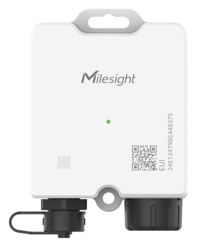

# Temperature Sensor - TS201



For more detailed information, please visit [Milesight Official Website](https://www.milesight.com)

## Payload

```
+-------------------------------------------------------+
|           DEVICE UPLINK / DOWNLINK PAYLOAD            |
+---------------------------+---------------------------+
|          DATA 1           |          DATA 2           |
+--------+--------+---------+--------+--------+---------+
|   ID   |  TYPE  |  DATA   |   ID   |  TYPE  |  DATA   |
+--------+--------+---------+--------+--------+---------+
| 1 Byte | 1 Byte | N Bytes | 1 Byte | 1 Byte | N Bytes |
|--------+--------+---------+--------+--------+---------+
```

### Attribute

|    CHANNEL    |  ID  | TYPE | LENGTH | DESCRIPTION                                                                                       |
| :-----------: | :--: | :--: | :----: | ------------------------------------------------------------------------------------------------ |
|     IPSO      | 0xFF | 0x01 |   1    | ipso_version(1B)                                                                                 |
|   Hardware    | 0xFF | 0x09 |   2    | hardware_version(2B)<br/>hardware_version, e.g. 0110 -> v1.1                                     |
|   Firmware    | 0xFF | 0x0A |   2    | firmware_version(2B)<br/>firmware_version, e.g. 0110 -> v1.10                                    |
|      TSL      | 0xFF | 0xFF |   2    | tsl_version(2B)                                                                                  |
| Serial Number | 0xFF | 0x16 |   2    | sn(8B)                                                                                           |
| LoRaWAN Class | 0xFF | 0x0F |   1    | lorawan_class(1B)<br/>lorawan_class, values: (0: Class A, 1: Class B, 2: Class C, 3: Class CtoB) |
|  Reset Event  | 0xFF | 0xFE |   1    | reset_event(1B)                                                                                  |
| Device Status | 0xFF | 0x0B |   1    | device_status(1B)                                                                                |

### Telemetry

|           CHANNEL           |  ID  | TYPE | LENGTH | DESCRIPTION                                                                                                         |
| :-------------------------: | :--: | :--: | :----: | ------------------------------------------------------------------------------------------------------------------- |
|        IPSO Version         | 0xFF | 0x01 |   1    | ipso_version(1B)                                                                                                    |
|        Device Status        | 0xFF | 0x0B |   1    | device_status(1B)                                                                                                   |
|        Serial Number        | 0xFF | 0x16 |   8    | sn(8B)                                                                                                              |
|      Hardware Version       | 0xFF | 0x09 |   2    | hardware_version(2B)                                                                                                |
|      Firmware Version       | 0xFF | 0x0A |   2    | firmware_version(2B)                                                                                                |
|         TSL Version         | 0xFF | 0xFF |   2    | tsl_version(2B)                                                                                                     |
|         Reset Event         | 0xFF | 0xFE |   1    | reset_event(1B)                                                                                                     |
|           Battery           | 0x01 | 0x75 |   1    | battery(1B)<br/>battery, unit: %                                                                                    |
|         Temperature         | 0x03 | 0x67 |   2    | temperature(2B)<br/>temperature, unit: °C                                                                           |
| Temperature Threshold Alarm | 0x83 | 0x67 |   3    | temperature(2B) + temperature_alarm(1B)<br/>temperature, unit: °C                                                   |
| Temperature Mutation Alarm  | 0x93 | 0x67 |   5    | temperature(2B) + temperature_mutation(2B) + temperature_alarm(1B)<br/>temperature, unit: °C                        |
| Temperature Exception Alarm | 0xB3 | 0x67 |   1    | temperature_exception(1B)                                                                                           |
|          Sensor Id          | 0xFF | 0xA0 |   9    | channel_id(4b) + sensor_type(4b) + sensor_id(8B)                                                                    |
|        History Data         | 0x20 | 0xCE |   7    | timestamp(4B) + type(1B) + temperature(2B)<br/>type, event_type(0..3) + read_status(4..7)<br/>temperature, unit: °C |

```
History Data
+-------------------------------+
|         type definition       |
+---------------+---------------+
| 7 | 6 | 5 | 4 | 3 | 2 | 1 | 0 |
+---------------+---------------+
|  read_status  |  event_type   |
+---------------+---------------+

read_status:
- 0: Read Success
- 1: Read Error
- 2: Overload

event_type:
- 0: Reserved
- 1: Periodic Event
- 2: Alarm Event (Threshold or Mutation)
- 3: Alarm Release Event
```

## Example

```json
// Sample(Hex): 03673401
{
    "temperature": 30.8
}

// Sample(Hex): 8367340101
{
    "temperature": 30.8,
    "event": [
        {
            "temperature": 30.8,
            "temperature_alarm": "Threshold Alarm"
        }
    ]
}

// Sample(Hex): 93673401640002
{
    "temperature": 30.8,
    "event": [
        {
            "temperature": 30.8,
            "temperature_alarm": "Mutation Alarm",
            "temperature_mutation": 10
        }
    ]
}

// Sample(Hex): B36700
{
    "event": [
        {
            "temperature_exception": "Read Error"
        }
    ]
}

// Sample(Hex): 20CEC79AFA6402BDFF
{
    "history": [
        {
            "event_type": "Alarm(Threshold or Mutation)",
            "read_status": "Success",
            "temperature": -6.7,
            "timestamp": 1694145223
        }
    ]
}
```
