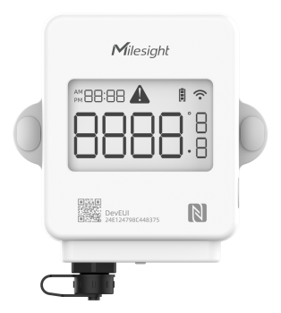

# Temperature Sensor - TS301



For more detailed information, please visit [Milesight Official Website](https://www.milesight.com/iot/product/lorawan-sensor/ts30x)

## Payload

```
+-------------------------------------------------------+
|           DEVICE UPLINK / DOWNLINK PAYLOAD            |
+---------------------------+---------------------------+
|          DATA 1           |          DATA 2           |
+--------+--------+---------+--------+--------+---------+
|   ID   |  TYPE  |  DATA   |   ID   |  TYPE  |  DATA   |
+--------+--------+---------+--------+--------+---------+
| 1 Byte | 1 Byte | N Bytes | 1 Byte | 1 Byte | N Bytes |
|--------+--------+---------+--------+--------+---------+
```

### Attribute

|    CHANNEL    |  ID  | TYPE | LENGTH | DESCRIPTION                                                                                       |
| :-----------: | :--: | :--: | :----: | ------------------------------------------------------------------------------------------------ |
|     IPSO      | 0xFF | 0x01 |   1    | ipso_version(1B)                                                                                 |
|   Hardware    | 0xFF | 0x09 |   2    | hardware_version(2B)<br/>hardware_version, e.g. 0110 -> v1.1                                     |
|   Firmware    | 0xFF | 0x0A |   2    | firmware_version(2B)<br/>firmware_version, e.g. 0110 -> v1.10                                    |
|      TSL      | 0xFF | 0xFF |   2    | tsl_version(2B)                                                                                  |
| Serial Number | 0xFF | 0x16 |   2    | sn(8B)                                                                                           |
| LoRaWAN Class | 0xFF | 0x0F |   1    | lorawan_class(1B)<br/>lorawan_class, values: (0: Class A, 1: Class B, 2: Class C, 3: Class CtoB) |
|  Reset Event  | 0xFF | 0xFE |   1    | reset_event(1B)                                                                                  |
| Device Status | 0xFF | 0x0B |   1    | device_status(1B)                                                                                |

### Telemetry

|               CHANNEL                |  ID  | TYPE | LENGTH | DESCRIPTION                                                                                                                              |
| :----------------------------------: | :--: | :--: | :----: | ---------------------------------------------------------------------------------------------------------------------------------------- |
|               Battery                | 0x01 | 0x75 |   1    | battery(1B)<br/>battery, unit: %                                                                                                         |
|       Temperature (Channel 1)        | 0x03 | 0x67 |   2    | temperature_chn1(2B)<br/>temperature_chn1, unit: °C                                                                                      |
|      Magnet Status (Channel 1)       | 0x03 | 0x00 |   1    | magnet_chn1(1B)                                                                                                                          |
|       Temperature (Channel 2)        | 0x04 | 0x67 |   2    | temperature_chn2(2B)<br/>temperature_chn2, unit: °C                                                                                      |
|      Magnet Status (Channel 2)       | 0x04 | 0x00 |   1    | magnet_chn2(1B)                                                                                                                          |
|    Temperature (Channel 1) Alarm     | 0x83 | 0x67 |   3    | temperature_chn1(2B) + temperature_chn1_alarm(1B)<br/>temperature_chn1_alarm, values: (0: threshold release, 1: threshold alarm)         |
|    Temperature (Channel 2) Alarm     | 0x84 | 0x67 |   3    | temperature_chn2(2B) + temperature_chn2_alarm(1B)<br/>temperature_chn2_alarm, values: (0: threshold release, 1: threshold alarm)         |
| Temperature (Channel 1) Change Alarm | 0x93 | 0xD7 |   5    | temperature_chn1(2B) + temperature_chn1_change(2B) + temperature_c hn1_alarm(1B)<br/>temperature_chn1_alarm, values: (2: mutation alarm) |
| Temperature (Channel 2) Change Alarm | 0x94 | 0xD7 |   5    | temperature_chn2(2B) + temperature_chn2_change(2B) + temperature_chn2_alarm(1B)<br/>temperature_chn2_alarm, values: (2: mutation alarm)  |
|           Historical Data            | 0x20 | 0xCE |   N    | timestamp(4B) + chn_mask(1B) + data(MB)                                                                                                  |

### Historical Data Channel Mask

| CHANNEL 1(MSB)                         | CHANNEL 2(LSB)                         |
| :------------------------------------- | :------------------------------------- |
| 0: -                                   | 0: -                                   |
| 1: temperature threshold alarm         | 1: temperature threshold alarm         |
| 2: temperature threshold alarm release | 2: temperature threshold alarm release |
| 3: temperature mutation alarm          | 3: temperature mutation alarm          |
| 4: temperature period report           | 4: temperature period report           |
| 5: magnet alarm                        | 5: magnet alarm                        |
| 6: magnet period report                | 6: magnet period report                |

## Example

```json
// 017564 0367F100 040001
{
    "battery": 100,
    "temperature_chn1": 24.1,
    "magnet_chn2": "opened"
}

// 017564 0367FB00 04670101
{
    "battery": 100,
    "temperature_chn1": 25.1,
    "temperature_chn2": 25.7
}

// 017514 030001 040001
{
    "battery": 20,
    "magnet_chn1": "opened",
    "magnet_chn2": "opened"
}

// 017564 03672701 8367270100 04670801
{
    "battery": 100,
    "temperature_chn1": 29.5,
    "temperature_chn1_alarm": "threshold release",
    "temperature_chn2": 26.4
}

// 017564 0367F100 0467F700 8467F70001
{
    "battery": 100,
    "temperature_chn1": 24.1,
    "temperature_chn2": 24.7,
    "temperature_chn2_alarm": "threshold"
}

// 94D70401820002
{
    "temperature_chn2": 26,
    "temperature_chn2_change": 1.3,
    "temperature_chn2_alarm": "mutation"
}

// 20CEC79AFA6444BDFFF600
{
    "history": [
        {
            "timestamp": 1694145223,
            "temperature_chn1": -6.7,
            "temperature_chn2": 24.6
        }
    ]
}
```
