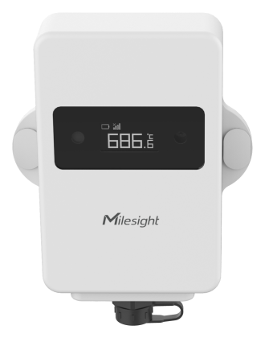

# TS602 Sensor

For more detailed information, please visit [Milesight Official Website](https://www.milesight.com/iot/product/lorawan-sensor/ts602)

## Payload Definition

### Attribute

| CHANNEL |  ID  | LENGTH | READ/WRITE | DEFAULT | RANGE | ENUM |
| :------ | :--: | :----: | :--------: | :-----: | :---: | :--: |
| TSL Version | 0xDF | 3 | r |  |  |  |
| Product Name | 0xDE | 33 | rw |  |  |  |
| PN | 0xDD | 33 | rw |  |  |  |
| SN | 0xDB | 9 | r |  |  |  |
| Product Version | 0xDA | 9 | r |  |  |  |
| Hardware Version | 0xDA | 3 | r |  |  |  |
| Firmware Version | 0xDA | 7 | r |  |  |  |
| OEM ID | 0xD9 | 3 | rw |  |  |  |
| Random key | 0xC9 | 2 | rw | 0 |  | 0：disable 1：enable |
| Device Status | 0xC8 | 2 | rw | 1 |  | 0：Off 1：On |
| Product Region | 0xD8 | 17 | r |  |  |  |
| Device Information | 0xD7 | M | r |  |  |  |
| Model | 0xD7 | 9 | r |  |  |  |
| Sub-model 1 | 0xD7 | 9 | r |  |  |  |
| Sub-model 2 | 0xD7 | 9 | r |  |  |  |
| Sub-model 3 | 0xD7 | 9 | r |  |  |  |
| Sub-model 4 | 0xD7 | 9 | r |  |  |  |
| PN1 | 0xD7 | 9 | r |  |  |  |
| PN2 | 0xD7 | 9 | r |  |  |  |
| PN3 | 0xD7 | 9 | r |  |  |  |
| PN4 | 0xD7 | 9 | r |  |  |  |
| Battery | 0x01 | 2 | r |  | 0 - 100 |  |
| Sensor ID | 0x03 | 10 | r |  |  |  |
| Sensor Type | 0x03 | 2 | r | 0 |  | 0：none 1:PT100 2: SHT41 3: DS18B20 |
| Sensor ID | 0x03 | 9 | r |  |  |  |
| Temperature | 0x04 | 5 | r |  | -35 - 70 |  |
| Temperature | 0x04 | 5 | r |  | -200 - 800 |  |
| Humidity | 0x05 | 3 | r |  | 0 - 100 |  |
| Base station positioning | 0x06 | 9 | r |  |  |  |
| Latitude | 0x06 | 5 | r |  | -90 - 90 |  |
| Longitude | 0x06 | 5 | r |  | -180 - 180 |  |
| Airplane Mode State | 0x07 | 2 | r | 0 |  | 0: enter airplane mode 1: exit airplane mode |
| Probe Connect Status Alarm | 0x0C | 2 | r |  |  | 0：disconnect 1：connect |
| Get The Relative Initial Surface Angle Value | 0x0D | 7 | r |  |  |  |
| Angle X Value | 0x0D | 3 | r |  | -90 - 90 |  |
| Angle X Value | 0x0D | 3 | r |  | -90 - 90 |  |
| Angle Z Value | 0x0D | 3 | r |  | -90 - 90 |  |
| Report package type | 0x0E | 2 | r |  |  | 0：Normal cycle package 1：Key cycle package |
| AutoP Enable | 0xC4 | 2 | rw | 1 |  | 0：disable 1：enable |
| Reporting Interval | 0x60 | 1 | rw |  |  |  |
| Reporting Interval Unit | 0x60 | 2 | rw | 0 |  | 0：second 1：min |
| Reporting Interval | 0x60 | 3 | rw | 1800 |  |  |
| Reporting Interval | 0x60 | 3 | rw | 30 |  |  |
| Cumulative Numbers | 0x61 | 2 | rw | 4 | 1 - 20 |  |
| Collecting Interval | 0x62 | 1 | rw |  |  |  |
| Collecting Interval Unit | 0x62 | 2 | rw | 1 |  | 0：second 1：min |
| Collecting Interval | 0x62 | 3 | rw | 600 | 10 - 64800 |  |
| Collecting Interval | 0x62 | 3 | rw | 10 | 1 - 1440 |  |
| Alarm Max Count | 0x63 | 3 | rw | 1 | 1 - 1000 |  |
| Light Collecting Interval | 0x64 | 1 | rw |  |  |  |
| Light Collecting Interval Unit | 0x64 | 2 | rw | 1 |  | 0：second 1：min |
| Light  Collecting Interval | 0x64 | 3 | rw | 60 | 10 - 64800 |  |
| Light  Collecting Interval | 0x64 | 3 | rw | 1 | 1 - 1440 |  |
| Temperature Unit | 0x65 | 2 | rw | 0 |  | 0：℃ 1：℉ |
| Airplane Mode  | 0x70 | 2 | rw | 0 |  | 0：disable 1：enable |
| Time Zone | 0xC7 | 3 | rw | 0 |  | -720：UTC-12(IDLW) -660：UTC-11(SST) -600：UTC-10(HST) -570：UTC-9:30(MIT) -540：UTC-9(AKST) -480：UTC-8(PST) -420：UTC-7(MST) -360：UTC-6(CST) -300：UTC-5(EST) -240：UTC-4(AST) -210：UTC-3:30(NST) -180：UTC-3(BRT) -120：UTC-2(FNT) -60：UTC-1(CVT) 0：UTC(WET) 60：UTC+1(CET) 120：UTC+2(EET) 180：UTC+3(MSK) 210：UTC+3:30(IRST) 240：UTC+4(GST) 270：UTC+4:30(AFT) 300：UTC+5(PKT) 330：UTC+5:30(IST) 345：UTC+5:45(NPT) 360：UTC+6(BHT) 390：UTC+6:30(MMT) 420：UTC+7(ICT) 480：UTC+8(CT/CST) 540：UTC+9(JST) 570：UTC+9:30(ACST) 600：UTC+10(AEST) 630：UTC+10:30(LHST) 660：UTC+11(VUT) 720：UTC+12(NZST) 765：UTC+12:45(CHAST) 780：UTC+13(PHOT) 840：UTC+14(LINT) |
| Daylight Saving Time | 0xC6 | M | rw |  |  |  |
| Daylight Saving Time | 0xC6 | 2 | rw | 0 |  | 0：disable 1：enable |
| DST Bias | 0xC6 | 2 | rw | 60 | 0 - 120 |  |
|  Month | 0xC6 | 2 | rw | 3 |  | 1:Jan. 2:Feb. 3:Mar. 4:Apr. 5:May 6:Jun. 7:Jul. 8:Aug. 9:Sep. 10:Oct. 11:Nov. 12:Dec. |
|  Number of Week | 0xC6 | 2 | rw | 2 |  | 1:1st 2: 2nd 3: 3rd 4: 4th 5: last |
| Week | 0xC6 | 2 | rw | 7 |  | 1：Mon. 2：Tues. 3：Wed. 4：Thurs. 5：Fri. 6：Sat. 7：Sun. |
| Time | 0xC6 | 3 | rw | 0 |  | 0：00:00 60：01:00 120：02:00 180：03:00 240：04:00 300：05:00 360：06:00 420：07:00 480：08:00 540：09:00 600：10:00 660：11:00 720：12:00 780：13:00 840：14:00 900：15:00 960：16:00 1020：17:00 1080：18:00 1140：19:00 1200：20:00 1260：21:00 1320：22:00 1380：23:00 |
|  Month | 0xC6 | 2 | rw | 11 |  | 1:Jan. 2:Feb. 3:Mar. 4:Apr. 5:May 6:Jun. 7:Jul. 8:Aug. 9:Sep. 10:Oct. 11:Nov. 12:Dec. |
|  Number of Week | 0xC6 | 2 | rw | 1 |  | 1:1st 2: 2nd 3: 3rd 4: 4th 5: last |
| Week | 0xC6 | 2 | rw | 1 |  | 1：Mon. 2：Tues. 3：Wed. 4：Thurs. 5：Fri. 6：Sat. 7：Sun. |
| Time | 0xC6 | 3 | rw | 0 |  | 0：00:00 60：01:00 120：02:00 180：03:00 240：04:00 300：05:00 360：06:00 420：07:00 480：08:00 540：09:00 600：10:00 660：11:00 720：12:00 780：13:00 840：14:00 900：15:00 960：16:00 1020：17:00 1080：18:00 1140：19:00 1200：20:00 1260：21:00 1320：22:00 1380：23:00 |
| Data Storage Settings | 0xC5 | 1 | rw |  |  |  |
| Sub-command | 0xC5 | 2 | rw | 0 |  |  |
| Data Storage Enable | 0xC5 | 2 | rw | 0 |  | 0：disable 1：enable |
| Data Retransmission Enable | 0xC5 | 2 | rw | 0 |  | 0：disable 1：enable |
| Retransmission Interval | 0xC5 | 3 | rw | 600 | 30 - 1200 |  |
| Retrieval Interval | 0xC5 | 3 | rw | 60 | 30 - 1200 |  |
| Base Station Positioning | 0x71 | 2 | rw | 0 |  | 0：disable 1：enable |
| Base Station Positioning Authentication Token | 0x72 | 17 | rw |  |  |  |
| Airplane Mode Time Period | 0x73 | 1 | rw |  |  |  |
| Data Type | 0x73 | 2 | rw |  |  |  |
| Start Time value | 0x73 | 7 | rw |  |  |  |
| Start Time Year | 0x73 | 2 | rw | 0 | 0 - 255 |  |
| Start Time Month | 0x73 | 2 | rw | 1 | 1 - 12 |  |
| Start Time Day | 0x73 | 2 | rw | 1 | 1 - 31 |  |
| Start Time Hour | 0x73 | 2 | rw | 0 | 0 - 23 |  |
| Start Time Minute | 0x73 | 2 | rw | 0 | 0 - 59 |  |
| Start Time Second | 0x73 | 2 | rw | 0 | 0 - 59 |  |
| End Time value | 0x73 | 7 | rw |  |  |  |
| End Time Year | 0x73 | 2 | rw | 0 | 0 - 255 |  |
| End Time Month | 0x73 | 2 | rw | 1 | 1 - 12 |  |
| End Time Day | 0x73 | 2 | rw | 1 | 1 - 31 |  |
| End Time Hour | 0x73 | 2 | rw | 0 | 0 - 23 |  |
| End Time Minute | 0x73 | 2 | rw | 0 | 0 - 59 |  |
| End Time Second | 0x73 | 2 | rw | 0 | 0 - 59 |  |
| Temperature And Humidity Display Switch | 0x74 | 2 | rw | 0 |  | 0： temperature 1: humidity |
| Alarm Threshold Release | 0x75 | 2 | rw | 0 |  | 0: disable 1:enable |
| Button
Lock | 0x76 | 3 | rw |  |  |  |
| Button
Lock Enable | 0x76 | 2 | rw | 0 |  | 0: disable 1:enable |
| Turn off | 0x76 | 2 | rw | 0 |  | 0:  disable lock power off 1:enable lock collect |
| Collect And Report | 0x76 | 2 | rw | 0 |  | 0: enablecollect 1:disable lock collect |
| reserve | 0x76 | 2 | rw | 0 |  | 0: enablecollect 1:disable lock collect |
| Temperature Threshold Alarm Config | 0x77 | M | rw |  |  |  |
| Temperature Threshold Alarm | 0x77 | 2 | rw | 0 |  | 0: disable 1:enable |
| Threshold Condition | 0x77 | 2 | rw | 0 |  | 0:disable 1:condition: x<A 2:condition: x>B 3:condition: A<x<B 4:condition: x<A or x>B |
| Value A | 0x77 | 5 | rw | 0 | -200 - 800 |  |
| Value B | 0x77 | 5 | rw | 0 | -35 - 70 |  |
| Temperature Threshold Alarm Config | 0x77 | M | rw |  |  |  |
| Temperature Threshold Alarm | 0x77 | 2 | rw | 0 |  | 0: disable 1:enable |
| Threshold Condition | 0x77 | 2 | rw | 0 |  | 0:disable 1:condition: x<A 2:condition: x>B 3:condition: A<x<B 4:condition: x<A or x>B |
| Value A | 0x77 | 5 | rw | 0 | -200 - 800 |  |
| Value B | 0x77 | 5 | rw | 0 | -200 - 800 |  |
| Temperature Shift Threshold | 0x78 | 6 | rw |  |  |  |
| Temperature Shift Threshold | 0x78 | 2 | rw | 0 |  | 0: disable 1:enable |
| Temperature change greater than | 0x78 | 5 | rw | 10 | 0.1 - 60 |  |
| Humidity Threshold Alarm | 0x79 | 7 | rw |  |  |  |
| Humidity Threshold Alarm | 0x79 | 2 | rw | 0 |  | 0: disable 1:enable |
| Threshold Condition | 0x79 | 2 | rw | 0 |  | 0:disable 1:condition: x<A 2:condition: x>B 3:condition: A<x<B 4:condition: x<A or x>B |
| Value A | 0x79 | 3 | rw | 10 | 0.1 - 100 |  |
| Value B | 0x79 | 3 | rw | 20 | 0.1 - 100 |  |
| Humidity Mutation Alarm Config | 0x7A | 4 | rw |  |  |  |
|  Mutation Alarm Config Enable | 0x7A | 2 | rw | 0 |  | 0: disable 1:enable |
|  Mutation Alarm Max Value | 0x7A | 3 | rw | 10 | 0.1 - 100 |  |
| Temperature Calibration | 0x7B | 6 | rw |  |  |  |
| Calibration Enable | 0x7B | 2 | rw | 0 |  | 0: disable 1:enable |
| Calibration Value | 0x7B | 5 | rw | 0 | -100000 - 100000 |  |
| Humidity Calibration | 0x7C | 4 | rw |  |  |  |
| Calibration Enable | 0x7C | 2 | rw | 0 |  | 0: disable 1:enable |
| Calibration Value | 0x7C | 3 | rw | 0 | -100 - 100 |  |
| Light  Threshold Alarm Config | 0x7D | 5 | rw |  |  |  |
|  Threshold Alarm Config Enable | 0x7D | 2 | rw | 1 |  | 0: disable 1:enable |
| Threshold Condition | 0x7D | 2 | rw | 2 |  | 0:disable 1:condition: x<A 2:condition: x>B 3:condition: A<x<B 4:condition: x<A or x>B |
| Threshold Value | 0x7D | 3 | rw | 50 | 0 - 600 |  |
| Light Tolerance Value | 0x7E | 2 | rw | 50 | 0 - 100 |  |
| Tilt Threshold Alarm Config | 0x7F | 5 | rw |  |  |  |
|  Threshold Alarm Config Enable | 0x7F | 2 | rw | 0 |  | 0: disable 1:enable |
| Threshold Condition | 0x7F | 2 | rw | 0 |  | 0:disable 1:condition: x<A 2:condition: x>B 3:condition: A<x<B 4:condition: x<A or x>B |
| Threshold Value | 0x7F | 2 | rw | 10 | 1 - 90 |  |
| Duration | 0x7F | 2 | rw | 2 | 1 - 60 |  |
| Falling Alarm Config | 0x80 | 2 | rw |  |  |  |
| Falling Alarm Enable | 0x80 | 2 | rw | 0 |  | 0: disable 1:enable |
| Falling Alarm Threshold Config | 0x81 | 3 | rw |  |  |  |
| Free Fall Level | 0x81 | 2 | rw | 7 |  | 0: FREE_FALL_LEVEL_156 1: FREE_FALL_LEVEL_219 2: FREE_FALL_LEVEL_250 3: FREE_FALL_LEVEL_312 4: FREE_FALL_LEVEL_344 5: FREE_FALL_LEVEL_406 6: FREE_FALL_LEVEL_469 7: FREE_FALL_LEVEL_500 |
| Continue Level | 0x81 | 2 | rw | 32 | 1 - 32 |  |
| Probe Id Retransmit Count | 0x82 | 2 | rw | 1 | 1 - 10 |  |
| Cellular Status | 0xBE | 1 | r |  |  |  |
| Cellular Status | 0xBE | 2 | r |  |  |  |
| Register Status | 0xBE | 2 | r |  |  | 0:Register Failed 1:Register Success |
| SIM State | 0xBE | 2 | r |  |  | 0:Card Status Reservation 1:SIM Card Recognition Successful 2:SIM Card Not Recognized 3:PIN Code Required 4:PIN Incorrect 5:Need PUK Code 6:SIM Card Not Inserted |
| IMEI | 0xBE | 16 | r |  |  |  |
| IMSI | 0xBE | 16 | r |  |  |  |
| ICCID | 0xBE | 21 | r |  |  |  |
| Signal Strength | 0xBE | 3 | r |  |  |  |
| Server Status | 0xBE | 2 | r |  |  | 0:Connect Failed 1:Connect Success |
| Milesight MQTT Status | 0xBE | 2 | r |  |  | 0:Connect Failed 1:Connect Success |
| Cellular Settings | 0xCE | 1 | rw |  |  |  |
| Cellular Command | 0xCE | 2 | rw | 0 |  |  |
| Work Mode | 0xCE | 2 | rw | 0 |  | 0: Low Power Mode 3: Low Latency Mode |
| Transport Type | 0xCE | 2 | rw | 4 |  | 1:UDP 2:TCP 3:AWS 4:MQTT 6:Developer-MQTT 7:Developer-DTLS |
| Network Config | 0xCE | 1 | rw |  |  |  |
| Network Command | 0xCE | 2 | rw | 0 |  |  |
| APN | 0xCE | 32 | rw |  |  |  |
| Authentication Mode | 0xCE | 2 | rw | 0 |  | 0：None 1：PAP 3：CHAP |
| Username | 0xCE | 64 | rw |  |  |  |
| Password | 0xCE | 64 | rw |  |  |  |
| PIN | 0xCE | 9 | rw |  |  |  |
| Network Type | 0xCE | 2 | rw | 0 |  | 0：Auto 1：Cat-N 3：NB-IOT |
| MQTT Settings | 0xCE | 1 | rw |  |  |  |
| MQTT Command | 0xCE | 2 | rw | 0 |  |  |
| Broker Address | 0xCE | 128 | rw |  |  |  |
| Port | 0xCE | 3 | rw | 8883 | 1 - 65535 |  |
| Keepalive Interval | 0xCE | 3 | rw | 300 | 10 - 65535 |  |
| Client ID | 0xCE | 64 | rw | [sn] |  |  |
| User Credentials Enable | 0xCE | 2 | rw | 0 |  | 0：disable 1：enable |
| Username | 0xCE | 128 | rw |  |  |  |
| Password | 0xCE | 128 | rw |  |  |  |
| TLS Enable | 0xCE | 2 | rw | 0 |  | 0：disable 1：enable |
| CA File Enable | 0xCE | 2 | rw | 0 |  | 0：disable 1：enable |
| CA File Length | 0xCE | 3 | rw | 0 |  |  |
| CA File | 0xCE | 161 | rw |  |  |  |
| Client Certificate Enable | 0xCE | 2 | rw | 0 |  | 0：disable 1：enable |
| Client Certificate Length | 0xCE | 3 | rw | 0 |  |  |
| Client Certificate | 0xCE | 161 | rw |  |  |  |
| Client Key Enable | 0xCE | 2 | rw | 0 |  | 0：disable 1：enable |
| Client Key Length | 0xCE | 3 | rw | 0 |  |  |
| Client Key | 0xCE | 161 | rw |  |  |  |
| Uplink Topic | 0xCE | 128 | rw |  |  |  |
| Uplink QoS | 0xCE | 2 | rw | 0 |  | 0：QoS0 1：QoS1 2：QoS2 |
| Downlink Topic | 0xCE | 128 | rw |  |  |  |
| Downlink QoS | 0xCE | 2 | rw | 0 |  | 0：QoS0 1：QoS1 2：QoS2 |
| MQTT Status | 0xCE | 2 | rw |  |  | 0：Connect Failed 1：Connect Success |
| AWS Settings | 0xCE | 1 | rw |  |  |  |
| AWS Command | 0xCE | 2 | rw | 0 |  |  |
| Broker Address | 0xCE | 128 | rw |  |  |  |
| Port | 0xCE | 3 | rw | 8883 | 1 - 65535 |  |
| KeepAlive Interval | 0xCE | 3 | rw | 300 | 10 - 65535 |  |
| CA File Enable | 0xCE | 2 | rw | 0 |  | 0：disable 1：enable |
| CA File Length | 0xCE | 3 | rw | 0 |  |  |
| CA Certificate | 0xCE | 161 | rw |  |  |  |
| Client Certificate Enable | 0xCE | 2 | rw | 0 |  | 0：disable 1：enable |
| Client Certificate Length | 0xCE | 3 | rw | 0 |  |  |
| Client Certificate | 0xCE | 161 | rw |  |  |  |
| Client Key Enable | 0xCE | 2 | rw | 0 |  | 0：disable 1：enable |
| Client Key Length | 0xCE | 3 | rw | 0 |  |  |
| Client Key | 0xCE | 161 | rw |  |  |  |
| AWS Status | 0xCE | 2 | r |  |  | 0：Connect Failed 1：Connect Success |
| TCP Settings | 0xCE | 1 | rw |  |  |  |
| TCP Settings | 0xCE | 1 | rw |  |  |  |
| TCP ID | 0xCE | 2 | rw | 0 |  |  |
| TCP Command | 0xCE | 2 | rw | 0 |  |  |
| Enable | 0xCE | 2 | rw | 0 |  | 0：disable 1：enable |
| Server Address | 0xCE | 128 | rw |  |  |  |
| Port | 0xCE | 3 | rw | 1000 | 1 - 65535 |  |
| Retry Times | 0xCE | 2 | rw | 1 | 0 - 3 |  |
| Retry Interval | 0xCE | 2 | rw | 5 | 1 - 60 |  |
| KeepAlive Interval | 0xCE | 3 | rw | 300 | 10 - 65535 |  |
| TCP Status | 0xCE | 2 | rw |  |  | 0：Connect Failed 1：Connect Success |
| UDP Settings | 0xCE | 1 | rw |  |  |  |
| UDP Settings | 0xCE | 1 | rw |  |  |  |
| UDP ID | 0xCE | 2 | rw | 0 |  |  |
| UDP Command | 0xCE | 2 | rw | 0 |  |  |
| Enable | 0xCE | 2 | rw | 0 |  | 0：disable 1：enable |
| Server Address | 0xCE | 128 | rw |  |  |  |
| Port | 0xCE | 3 | rw | 1000 | 1 - 65535 |  |
| UDP Status | 0xCE | 2 | rw |  |  | 0：Connect Failed 1：Connect Success |
| Milesight MQTT Settings | 0xCE | 1 | rw |  |  |  |
| Milesight MQTT Command | 0xCE | 2 | rw | 33 |  |  |
| Milesight MQTT Status | 0xCE | 2 | r |  |  | 0：Connect Failed 1：Connect Success |
| Milesight DTLS Settings | 0xCE | 1 | rw |  |  |  |
| Milesight DTLS Command | 0xCE | 2 | rw | 0 |  |  |
| Milesight DTLS Status | 0xCE | 2 | rw |  |  | 0：Connect Failed 1：Connect Success |

### Event

| CHANNEL |  ID  | LENGTH | READ/WRITE | DEFAULT | RANGE | ENUM |
| :------ | :--: | :----: | :--------: | :-----: | :---: | :--: |
| Order Check Response | 0xFE | 2 | r |  |  |  |
| Request to Push All Configurations | 0xEE | 1 | r |  |  |  |
| Historical Data | 0xED | 6 | r |  |  |  |
| Device Time | 0xB9 | M | r |  |  |  |
| Battery Status | 0xB8 | M | r |  |  |  |
| Temperature  Alarm | 0x08 | 1 | r |  |  |  |
| Temperature  Alarm | 0x08 | 1 | r |  |  |  |
| Humidity  Alarm | 0x09 | 1 | r |  |  |  |
| Tilt  Alarm | 0x0A | 1 | r |  |  |  |
| Light  Alarm | 0x0B | 1 | r |  |  |  |

### Service

| CHANNEL |  ID  | LENGTH | READ/WRITE | DEFAULT | RANGE | ENUM |
| :------ | :--: | :----: | :--------: | :-----: | :---: | :--: |
| Order Check | 0xFE | 2 | w |  |  |  |
| Order | 0xFE | 2 | w | 0 | 0 - 255 |  |
| Order | 0xFE | 2 | r | 0 | 0 - 255 |  |
| Request to Query All Configurations | 0xEE | 1 | w |  |  |  |
| Historical Data Mode | 0xED | 2 | r |  |  | 0：target time 1：historical time |
| Historical Data Timestamps | 0xED | 5 | r |  |  |  |
| Current Time | 0xB9 | 5 | r |  |  |  |
| Operation Time | 0xB9 | 5 | r |  |  |  |
| Power-On Time | 0xB9 | 5 | r |  |  |  |
| Query Device Status | 0xB9 | 1 | w |  |  |  |
| Battery Capacity | 0xB8 | 5 | r |  |  |  |
| Battery Drain | 0xB8 | 5 | r |  |  |  |
| Current Battery | 0xB8 | 5 | r |  |  |  |
| Battery Voltage | 0xB8 | 3 | r |  |  |  |
| Current Battery Status | 0xB8 | 3 | r |  |  |  |
| Time Synchronize | 0xB8 | 1 | w |  |  |  |
| Alarm Type | 0x08 | 2 | r |  |  |  |
| Collection Error | 0x08 | 1 | r |  |  |  |
| Exceed the Range Lower Limit | 0x08 | 1 | r |  |  |  |
| Exceed the Range Upper Limit | 0x08 | 1 | r |  |  |  |
| No Data | 0x08 | 1 | r |  |  |  |
| Temperature Below Alarm Released | 0x08 | 5 | r |  |  |  |
| Temperature | 0x08 | 5 | r |  | -35 - 70 |  |
| Temperature Below Alarm | 0x08 | 5 | r |  |  |  |
| Temperature | 0x08 | 5 | r |  | -35 - 70 |  |
| Temperature Above Alarm Released | 0x08 | 5 | r |  |  |  |
| Temperature | 0x08 | 5 | r |  | -35 - 70 |  |
| Temperature Above Alarm | 0x08 | 5 | r |  |  |  |
| Temperature | 0x08 | 5 | r |  | -35 - 70 |  |
| Temperature Between Alarm Released | 0x08 | 5 | r |  |  |  |
| Temperature | 0x08 | 5 | r |  | -35 - 70 |  |
| Temperature Between Alarm | 0x08 | 5 | r |  |  |  |
| Temperature | 0x08 | 5 | r |  | -35 - 70 |  |
| Temperature Exceed Tolerance Alarm Released | 0x08 | 5 | r |  |  |  |
| Temperature | 0x08 | 5 | r |  | -35 - 70 |  |
| Temperature Exceed Tolerance Alarm | 0x08 | 5 | r |  |  |  |
| Temperature | 0x08 | 5 | r |  | -35 - 70 |  |
| Temperature Shift Threshold | 0x08 | 5 | r |  |  |  |
| Temperature | 0x08 | 5 | r |  | -35 - 70 |  |
| Temperature Shift Threshold | 0x08 | 9 | r |  |  |  |
| Temperature | 0x08 | 5 | r |  | -35 - 70 |  |
|  Shift Temperature | 0x08 | 5 | r |  | -35 - 70 |  |
| Alarm Type | 0x08 | 2 | r |  |  |  |
| Collection Error | 0x08 | 1 | r |  |  |  |
| Out of The Low Range | 0x08 | 1 | r |  |  |  |
| Out of The High Range | 0x08 | 1 | r |  |  |  |
| No Data | 0x08 | 1 | r |  |  |  |
| Temperature Below Alarm Released | 0x08 | 5 | r |  |  |  |
| Temperature | 0x08 | 5 | r |  | -200 - 800 |  |
| Temperature Below Alarm | 0x08 | 5 | r |  |  |  |
| Temperature | 0x08 | 5 | r |  | -200 - 800 |  |
| Temperature Above Alarm Released | 0x08 | 5 | r |  |  |  |
| Temperature | 0x08 | 5 | r |  | -200 - 800 |  |
| Temperature Above Alarm | 0x08 | 5 | r |  |  |  |
| Temperature | 0x08 | 5 | r |  | -200 - 800 |  |
| Temperature Between Alarm Released | 0x08 | 5 | r |  |  |  |
| Temperature | 0x08 | 5 | r |  | -200 - 800 |  |
| Temperature Between Alarm | 0x08 | 5 | r |  |  |  |
| Temperature | 0x08 | 5 | r |  | -200 - 800 |  |
| Temperature Exceed Tolerance Alarm Released | 0x08 | 5 | r |  |  |  |
| Temperature | 0x08 | 5 | r |  | -200 - 800 |  |
| Temperature Exceed Tolerance Alarm | 0x08 | 5 | r |  |  |  |
| Temperature | 0x08 | 5 | r |  | -200 - 800 |  |
| Temperature Shift Threshold | 0x08 | 5 | r |  |  |  |
| Temperature | 0x08 | 5 | r |  | -200 - 800 |  |
| Temperature Shift Threshold | 0x08 | 9 | r |  |  |  |
| Temperature | 0x08 | 5 | r |  | -200 - 800 |  |
|  Shift Temperature | 0x08 | 5 | r |  | -200 - 800 |  |
| Alarm Type | 0x09 | 2 | r |  |  |  |
| Collection Error | 0x09 | 1 | r |  |  |  |
| Out of The Low Range | 0x09 | 1 | r |  |  |  |
| Out of The High Range | 0x09 | 1 | r |  |  |  |
| No Data | 0x09 | 1 | r |  |  |  |
| Humidity Below Alarm Released | 0x09 | 3 | r |  |  |  |
| Humidity | 0x09 | 3 | r |  | 0 - 100 |  |
| Humidity Below Alarm | 0x09 | 3 | r |  |  |  |
| Humidity | 0x09 | 3 | r |  | 0 - 100 |  |
| Humidity Above Alarm Released | 0x09 | 3 | r |  |  |  |
| Humidity | 0x09 | 3 | r |  | 0 - 100 |  |
| Humidity Above Alarm | 0x09 | 3 | r |  |  |  |
| Humidity | 0x09 | 3 | r |  | 0 - 100 |  |
| Humidity Between Alarm Released | 0x09 | 3 | r |  |  |  |
| Humidity | 0x09 | 3 | r |  | 0 - 100 |  |
| Humidity Between Alarm | 0x09 | 3 | r |  |  |  |
| Humidity | 0x09 | 3 | r |  | 0 - 100 |  |
| Humidity Exceed Tolerance Alarm Released | 0x09 | 3 | r |  |  |  |
| Humidity | 0x09 | 3 | r |  | 0 - 100 |  |
| Humidity Exceed Tolerance Alarm | 0x09 | 3 | r |  |  |  |
| Humidity | 0x09 | 3 | r |  | 0 - 100 |  |
| Humidity Shift Threshold | 0x09 | 3 | r |  |  |  |
| Humidity | 0x09 | 3 | r |  | 0 - 100 |  |
| Humidity Shift Threshold | 0x09 | 5 | r |  |  |  |
| Humidity | 0x09 | 3 | r |  | 0 - 100 |  |
|  Shift Humidity | 0x09 | 3 | r |  | 0 - 100 |  |
| Alarm Type | 0x0A | 2 | r |  |  |  |
| Collection Error | 0x0A | 1 | r |  |  |  |
| Exceed the Range Lower Limit | 0x0A | 1 | r |  |  |  |
| Exceed the Range Upper Limit | 0x0A | 1 | r |  |  |  |
| No Data | 0x0A | 1 | r |  |  |  |
| Tilt  Alam Release | 0x0A | 2 | r |  |  |  |
| Tilt Alam | 0x0A | 2 | r |  |  |  |
| Falling  Alam | 0x0A | 2 | r |  |  |  |
| Alarm Type | 0x0B | 2 | r |  |  |  |
| Collection Error | 0x0B | 1 | r |  |  |  |
| Out of The Low Range | 0x0B | 1 | r |  |  |  |
| Out of The High Range | 0x0B | 1 | r |  |  |  |
| No Data | 0x0B | 1 | r |  |  |  |
| Bright to dark | 0x0B | 2 | r |  |  |  |
| Dark to bright | 0x0B | 2 | r |  |  |  |
| AT Debug | 0xEB | 1 | rw |  |  |  |
| length | 0xEB | 3 | rw | 1 | 1 - 65535 |  |
| content | 0xEB | 1 | rw |  |  |  |
| Reset | 0xBF | 1 | w |  |  |  |
| Reboot | 0xBE | 1 | w |  |  |  |
| Clear Data | 0xBD | 1 | w |  |  |  |
| Stop Retrieval | 0xBC | 1 | w |  |  |  |
| Retrieval(Time Period) | 0xBA | 5 | w |  |  |  |
| Time Point | 0xBA | 5 | w |  |  |  |
| Retrieval(Time Period) | 0xBB | 9 | w |  |  |  |
| Start Time | 0xBB | 5 | w |  |  |  |
| End Time | 0xBB | 5 | w |  |  |  |
| Time Synchronize | 0xB7 | 5 | w |  |  |  |
| Timestamp | 0xB7 | 5 | w |  |  |  |
| Clear Alarm Item | 0x50 | 1 | w |  |  |  |
| Zero Calibration | 0x51 | 2 | w |  |  |  |
| Zero Calibration | 0x51 | 2 | w | 1 |  | 0:Clear zero calibration 1:Start zero calibration |
| Set Relative Initial Surface | 0x52 | 2 | w |  |  |  |
| Set Relative Initial Surface | 0x52 | 2 | w |  |  | 0:Reset the zero reference point to the horizontal plane 1:Set the current plane as the new zero reference point |
| Get Sensor ID | 0x53 | 1 | w |  |  |  |

