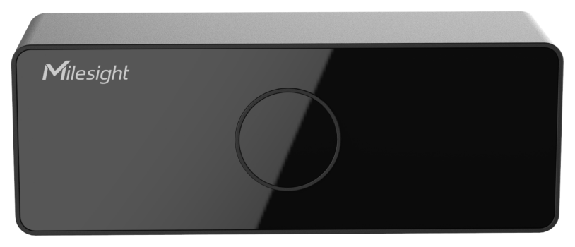

# 3D ToF People Counting Sensor - VS132



For more detailed information, please visit [Milesight Official Website](https://www.milesight.com)

## Payload

```
+-------------------------------------------------------+
|           DEVICE UPLINK / DOWNLINK PAYLOAD            |
+---------------------------+---------------------------+
|          DATA 1           |          DATA 2           |
+--------+--------+---------+--------+--------+---------+
|   ID   |  TYPE  |  DATA   |   ID   |  TYPE  |  DATA   |
+--------+--------+---------+--------+--------+---------+
| 1 Byte | 1 Byte | N Bytes | 1 Byte | 1 Byte | N Bytes |
|--------+--------+---------+--------+--------+---------+
```

### Attribute

|    CHANNEL    |  ID  | TYPE | LENGTH | DESCRIPTION                                                                                       |
| :-----------: | :--: | :--: | :----: | ------------------------------------------------------------------------------------------------ |
|     IPSO      | 0xFF | 0x01 |   1    | ipso_version(1B)                                                                                 |
|   Hardware    | 0xFF | 0x09 |   2    | hardware_version(2B)<br/>hardware_version, e.g. 0110 -> v1.1                                     |
|   Firmware    | 0xFF | 0x0A |   2    | firmware_version(2B)<br/>firmware_version, e.g. 0110 -> v1.10                                    |
|      TSL      | 0xFF | 0xFF |   2    | tsl_version(2B)                                                                                  |
| Serial Number | 0xFF | 0x16 |   2    | sn(8B)                                                                                           |
| LoRaWAN Class | 0xFF | 0x0F |   1    | lorawan_class(1B)<br/>lorawan_class, values: (0: Class A, 1: Class B, 2: Class C, 3: Class CtoB) |
|  Reset Event  | 0xFF | 0xFE |   1    | reset_event(1B)                                                                                  |
| Device Status | 0xFF | 0x0B |   1    | device_status(1B)                                                                                |

### Telemetry

|     CHANNEL      |  ID  | TYPE | LENGTH | DESCRIPTION                                        |
| :--------------: | :--: | :--: | :----: | -------------------------------------------------- |
| Protocol Version | 0xFF | 0x01 |   1    | protocol_version(1B)                               |
|  Serial Number   | 0xFF | 0x16 |   8    | sn(8B)                                             |
| Hardware Version | 0xFF | 0x09 |   2    | hardware_version(2B)                               |
| Firmware Version | 0xFF | 0x1F |   4    | firmware_version(4B)                               |
|     Total IN     | 0x03 | 0xD2 |   4    | total_counter_in(4B)                               |
|    Total OUT     | 0x04 | 0xD2 |   4    | total_counter_out(4B)                              |
|  Period IN/OUT   | 0x05 | 0xCC |   4    | periodic_counter_in(2B) + periodic_counter_out(2B) |

## Example

```json
// FF0101 FF166614C39694870000 FF090102 FF1F84010001 03D2BE000000 04D231010000 05CC00000000
{
    "protocol_version": 1,
    "sn": "6614c39694870000",
    "hardware_version": "1.2",
    "firmware_version": "132.1.0.1",
    "total_counter_in": 190,
    "total_counter_out": 305,
    "periodic_counter_in": 0,
    "periodic_counter_out": 0
}
```
