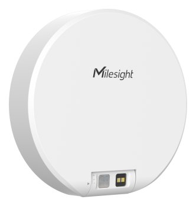

# Bathroom Occupancy Sensor - VS330



For more detailed information, please visit [Milesight Official Website](https://www.milesight.com/iot/product/lorawan-sensor/vs330)

## Payload

```
+-------------------------------------------------------+
|           DEVICE UPLINK / DOWNLINK PAYLOAD            |
+---------------------------+---------------------------+
|          DATA 1           |          DATA 2           |
+--------+--------+---------+--------+--------+---------+
|   ID   |  TYPE  |  DATA   |   ID   |  TYPE  |  DATA   |
+--------+--------+---------+--------+--------+---------+
| 1 Byte | 1 Byte | N Bytes | 1 Byte | 1 Byte | N Bytes |
|--------+--------+---------+--------+--------+---------+
```

### Attribute

|    CHANNEL    |  ID  | TYPE | LENGTH | DESCRIPTION                                                                                       |
| :-----------: | :--: | :--: | :----: | ------------------------------------------------------------------------------------------------ |
|     IPSO      | 0xFF | 0x01 |   1    | ipso_version(1B)                                                                                 |
|   Hardware    | 0xFF | 0x09 |   2    | hardware_version(2B)<br/>hardware_version, e.g. 0110 -> v1.1                                     |
|   Firmware    | 0xFF | 0x0A |   2    | firmware_version(2B)<br/>firmware_version, e.g. 0110 -> v1.10                                    |
|      TSL      | 0xFF | 0xFF |   2    | tsl_version(2B)                                                                                  |
| Serial Number | 0xFF | 0x16 |   2    | sn(8B)                                                                                           |
| LoRaWAN Class | 0xFF | 0x0F |   1    | lorawan_class(1B)<br/>lorawan_class, values: (0: Class A, 1: Class B, 2: Class C, 3: Class CtoB) |
|  Reset Event  | 0xFF | 0xFE |   1    | reset_event(1B)                                                                                  |
| Device Status | 0xFF | 0x0B |   1    | device_status(1B)                                                                                |

### Telemetry

|   CHANNEL   |  ID  | TYPE | LENGTH | DESCRIPTION                                                                    |
| :---------: | :--: | :--: | :----: | ------------------------------------------------------------------------------ |
|   Battery   | 0x01 | 0x75 |   1    | battery(1B)<br/>battery, unit: %                                               |
|  Distance   | 0x02 | 0x82 |   2    | distance(2B)<br/>distance, unit: mm                                            |
|  Occupancy  | 0x03 | 0x8E |   1    | occupancy(1B)<br/>occupancy, values: (0: vacant, 1: occupied)                  |
| Calibration | 0x04 | 0x8E |   1    | calibration_status(1B)<br/>calibration_status, values: (0: failed, 1: success) |
| PIR Status  | 0x05 | 0x8E |   1    | pir_status(1B)<br/>values: (0: idle, 1: triggered, 2: delayed_triggered)       |
| TOF Status  | 0x06 | 0x8E |   1    | tof_status(1B)<br/>values: (0/1/7: valid, others: invalid)                      |
| Standardization | 0x06 | 0x82 | 2 | standardization(2B)<br/>standardization, unit: mm                               |
|   Signal    | 0x07 | 0x82 |   2    | signal(2B)                                                                       |
| Body Height | 0x08 | 0x82 |   2    | body_height(2B)<br/>body_height, unit: mm                                       |

### Downlink Commands

|       CHANNEL        |  ID  | TYPE | LENGTH | DESCRIPTION                                                                                                  |
| :------------------: | :--: | :--: | :----: | ------------------------------------------------------------------------------------------------------------ |
|        Reboot        | 0xFF | 0x10 |   1    | reboot(1B)<br/>values: (0: no, 1: yes)                                                                      |
| Collection Interval  | 0xFF | 0x02 |   2    | collection_interval(2B)<br/>unit: second, range: [1, 10]                                                    |
|   Report Interval    | 0xFF | 0x03 |   2    | report_interval(2B)<br/>unit: second, range: [60, 64800]                                                    |
| Human Exist Height   | 0xFF | 0x70 |   2    | human_exist_height(2B)<br/>unit: mm, range: [1, 300]                                                        |
|     Test Enable      | 0xFF | 0x71 |   1    | test_enable(1B)<br/>values: (0: disable, 1: enable)                                                         |
|    Test Duration     | 0xFF | 0x72 |   2    | test_duration(2B)<br/>unit: min, range: [1, 30]                                                             |
|   Back Test Config   | 0xFF | 0x7A |   3    | back_test_config(3B)<br/>enable(1B): (0: disable, 1: enable), distance(2B): unit mm, range: [40, 3500]    |
|   Debug ROI Config   | 0xFF | 0x73 |   1    | debug_roi_config(1B)<br/>high 4 bits: debug_enable, low 4 bits: roi input value (roi range [4, 16], input = roi - 1) |
|   Standardization    | 0xFF | 0x76 |   2    | standardization(2B)<br/>unit: mm                                                                             |

## Example

```json
// 017562 02820F00 038E01 048E01 058E01 068E00 06821000 07821000 08821000

{
    "battery": 98,
    "distance": 15,
    "occupancy": "occupied",
    "calibration_status": "success",
    "pir_status": "triggered",
    "tof_status": "valid",
    "standardization": 16,
    "signal": 16,
    "body_height": 16
}
```
