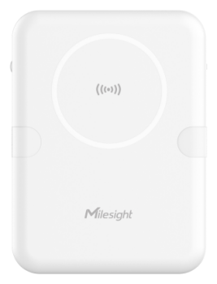

# Radar Fall Detection Sensor - VS373



For more detailed information, please visit [Milesight Official Website](https://www.milesight.com/iot/product/lorawan-sensor/vs373)

## Payload

```
+-------------------------------------------------------+
|           DEVICE UPLINK / DOWNLINK PAYLOAD            |
+---------------------------+---------------------------+
|          DATA 1           |          DATA 2           |
+--------+--------+---------+--------+--------+---------+
|   ID   |  TYPE  |  DATA   |   ID   |  TYPE  |  DATA   |
+--------+--------+---------+--------+--------+---------+
| 1 Byte | 1 Byte | N Bytes | 1 Byte | 1 Byte | N Bytes |
|--------+--------+---------+--------+--------+---------+
```

### Attribute

|    CHANNEL    |  ID  | TYPE | LENGTH | DESCRIPTION                                                                                       |
| :-----------: | :--: | :--: | :----: | ------------------------------------------------------------------------------------------------ |
|     IPSO      | 0xFF | 0x01 |   1    | ipso_version(1B)                                                                                 |
|   Hardware    | 0xFF | 0x09 |   2    | hardware_version(2B)<br/>hardware_version, e.g. 0110 -> v1.1                                     |
|   Firmware    | 0xFF | 0x0A |   2    | firmware_version(2B)<br/>firmware_version, e.g. 0110 -> v1.10                                    |
|      TSL      | 0xFF | 0xFF |   2    | tsl_version(2B)                                                                                  |
| Serial Number | 0xFF | 0x16 |   2    | sn(8B)                                                                                           |
| LoRaWAN Class | 0xFF | 0x0F |   1    | lorawan_class(1B)<br/>lorawan_class, values: (0: Class A, 1: Class B, 2: Class C, 3: Class CtoB) |
|  Reset Event  | 0xFF | 0xFE |   1    | reset_event(1B)                                                                                  |
| Device Status | 0xFF | 0x0B |   1    | device_status(1B)                                                                                |

### Telemetry

| CHANNEL                |  ID  | TYPE | LENGTH | DESCRIPTION                                                                                                                                                                                                                                                         |
| :--------------------- | :--: | :--: | :----: | :------------------------------------------------------------------------------------------------------------------------------------------------------------------------------------------------------------------------------------------------------------------ |
| Room Detection         | 0x03 | 0xF8 |   6    | detection_status(1B) + target_status(1B) + use_time_now(2B) + use_time_today(2B) <br/>detection_status, values: (0: normal, 1: vacant, 2: in bed, 3: out of bed, 4: fall) <br/>target_status, values: (0: normal, 1: motionless, 2: abnormal)                       |
| Region Detection       | 0x04 | 0xF9 |   4    | region_1_occupancy(1B) + region_2_occupancy(1B) + region_3_occupancy(1B) + region_4_occupancy(1B)<br/>region_1_occupancy, values: (0: occupied, 1: vacant)                                                                                                          |
| Region Out of Bed Time | 0x05 | 0xFA |   8    | region_1_out_of_bed_time(2B) + region_2_out_of_bed_time(2B) + region_3_out_of_bed_time(2B) + region_4_out_of_bed_time(2B)<br/>region_1_out_of_bed_time, unit: second                                                                                                |
| Alarm Event            | 0x06 | 0xFB |   5    | alarm_id(2B) + alarm_type(1B) + alarm_status(1B) + alarm_region_id(1B) <br/>alarm_type, values: (0: normal, 1: motionless, 2: dwell, 3: out of bed, 4: occupied, 5: vacant) <br/>alarm_status, values: (0: alarm triggered, 1: alarm deactivated, 2: alarm ignored) |
| Historical Data        | 0x20 | 0xCE |   9    | timestamp(4B) + alarm_id(2B) + alarm_type(1B) + alarm_status(1B) + alarm_region_id(1B)                                                                                                                                                                              |

# Sample

```json

```
