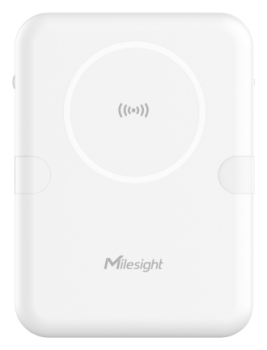

# Radar Fall Detection Sensor - VS373



For more detailed information, please visit [Milesight Official Website](https://www.milesight.com/iot/product/lorawan-sensor/vs373)

## Payload

```
+-------------------------------------------------------+
|           DEVICE UPLINK / DOWNLINK PAYLOAD            |
+---------------------------+---------------------------+
|          DATA 1           |          DATA 2           |
+--------+--------+---------+--------+--------+---------+
|   ID   |  TYPE  |  DATA   |   ID   |  TYPE  |  DATA   |
+--------+--------+---------+--------+--------+---------+
| 1 Byte | 1 Byte | N Bytes | 1 Byte | 1 Byte | N Bytes |
|--------+--------+---------+--------+--------+---------+
```

### Attribute

|    CHANNEL    |  ID  | TYPE | LENGTH | DESCRIPTION                                                                                       |
| :-----------: | :--: | :--: | :----: | ------------------------------------------------------------------------------------------------ |
|     IPSO      | 0xFF | 0x01 |   1    | ipso_version(1B)                                                                                 |
|   Hardware    | 0xFF | 0x09 |   2    | hardware_version(2B)<br/>hardware_version, e.g. 0110 -> v1.1                                     |
|   Firmware    | 0xFF | 0x0A |   2    | firmware_version(2B)<br/>firmware_version, e.g. 0110 -> v1.10                                    |
|      TSL      | 0xFF | 0xFF |   2    | tsl_version(2B)                                                                                  |
| Serial Number | 0xFF | 0x16 |   2    | sn(8B)                                                                                           |
| LoRaWAN Class | 0xFF | 0x0F |   1    | lorawan_class(1B)<br/>lorawan_class, values: (0: Class A, 1: Class B, 2: Class C, 3: Class CtoB) |
|  Reset Event  | 0xFF | 0xFE |   1    | reset_event(1B)                                                                                  |
| Device Status | 0xFF | 0x0B |   1    | device_status(1B)                                                                                |

### Telemetry

| CHANNEL                |  ID  | TYPE | LENGTH | DESCRIPTION                                                                                                                                                                                                                                                         |
| :--------------------- | :--: | :--: | :----: | :------------------------------------------------------------------------------------------------------------------------------------------------------------------------------------------------------------------------------------------------------------------ |
| Room Detection         | 0x03 | 0xF8 |   6    | detection_status(1B) + target_status(1B) + use_time_now(2B) + use_time_today(2B) <br/>detection_status, values: (0: normal, 1: vacant, 2: in bed, 3: out of bed, 4: fall) <br/>target_status, values: (0: normal, 1: motionless, 2: abnormal)                       |
| Region Detection       | 0x04 | 0xF9 |   4    | region_1_occupancy(1B) + region_2_occupancy(1B) + region_3_occupancy(1B) + region_4_occupancy(1B)<br/>region_1_occupancy, values: (0: occupied, 1: vacant)                                                                                                          |
| Region Out of Bed Time | 0x05 | 0xFA |   8    | region_1_out_of_bed_time(2B) + region_2_out_of_bed_time(2B) + region_3_out_of_bed_time(2B) + region_4_out_of_bed_time(2B)<br/>region_1_out_of_bed_time, unit: second                                                                                                |
| Alarm Event            | 0x06 | 0xFB |   5    | alarm_id(2B) + alarm_type(1B) + alarm_status(1B) + alarm_region_id(1B) <br/>alarm_id: 0-9999 for fall, dwell, out of bed, and lying; other alarms use 0xFFFF <br/>alarm_type, values: (0: fall, 1: human in place, 2: dwell, 3: out of bed, 4: occupied, 5: vacant, 6: bradypnea, 7: tachypnea, 8: lying) <br/>alarm_status, values: (1: alarm_triggered, 2: alarm_deactivated, 3: alarm_ignored, 4: status_report) <br/>alarm_region_id: used for out of bed, bradypnea, and tachypnea; others are 0xFF |
| Historical Data        | 0x20 | 0xCE |   9    | timestamp(4B) + alarm_id(2B) + alarm_type(1B) + alarm_status(1B) + alarm_region_id(1B)                                                                                                                                                                              |

# Sample

Display copy uses `Fall Alarm`, `Dwell Alarm`, `Out of Bed Alarm`, and `Lying Alarm`; `Human in Place`, `Occupied`, `Vacant`, `Bradypnea`, and `Tachypnea` do not append `Alarm`.

Real-time alarm events are exposed as top-level alarm objects instead of an `events` array. Output keys are `fall_alarm`, `human_in_place`, `dwell_alarm`, `out_of_bed_alarm`, `occupied`, `vacant`, `bradypnea`, `tachypnea`, and `lying_alarm`.

```json
{
    "fall_alarm": {
        "alarm_id": "1, 2, 3",
        "alarm_status": "1, 1, 2"
    }
}
```

Repeated real-time alarms of the same type append `alarm_id` and `alarm_status` in arrival order using the raw protocol values. `out_of_bed_alarm`, `bradypnea`, and `tachypnea` also append `region_id` as a comma-separated string. Historical alarms still use the `history` array.

```json
{
    "out_of_bed_alarm": {
        "alarm_id": "4, 5, 6",
        "alarm_status": "1, 2, 1",
        "region_id": "1, 2, 3"
    },
    "history": [
        {
            "timestamp": 1710000000,
            "alarm_id": 10,
            "alarm_type": "out_of_bed",
            "alarm_status": "alarm_triggered",
            "region_id": 1
        }
    ]
}
```
