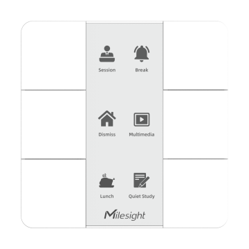
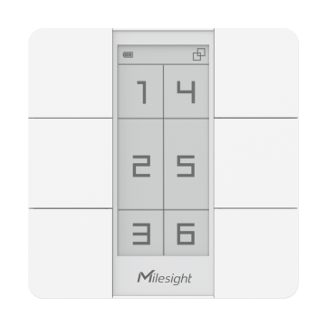

# Smart Scene Panel - Milesight IoT

The payload decoder function is applicable to WS136 / WS156.

For more detailed information, please visit [milesight official website](https://www.milesight-iot.com).

|        WS136        |        WS156        |
| :-----------------: | :-----------------: |
|  |  |

## Payload Definition

|   CHANNEL    |  ID  | TYPE | LENGTH | DESCRIPTION                                                                                                                                                                                                                            |
| :----------: | :--: | :--: | :----: | -------------------------------------------------------------------------------------------------------------------------------------------------------------------------------------------------------------------------------------- |
|   Battery    | 0x01 | 0x75 |   1    | battery(1B)<br/>battery, unit: %                                                                                                                                                                                                       |
| Button Press | 0xFF | 0x34 |   1    | id(1B) + button_id_mode(1B) + button_id_event(1B)<br/>mode: values: (0: short_press, 1: short_press+double_press, 2: short_press+long_press, 3: short_press+double_press+long_press)<br/>event, values: (1: short_press, 2: double_press, 3: long_press) |

## Example

```json
// 017510 FF2E01
{
    "battery": 16,
    "press": "short"
}
```
