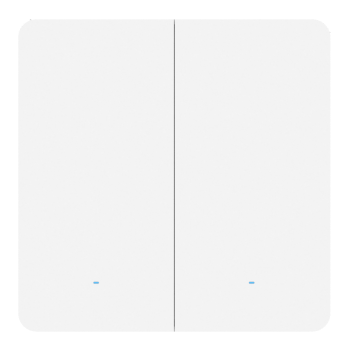

# Smart Wall Switch - WS502



For more detailed information, please visit [Milesight Official Website](https://www.milesight.com/iot/)

## Payload

```
+-------------------------------------------------------+
|           DEVICE UPLINK / DOWNLINK PAYLOAD            |
+---------------------------+---------------------------+
|          DATA 1           |          DATA 2           |
+--------+--------+---------+--------+--------+---------+
|   ID   |  TYPE  |  DATA   |   ID   |  TYPE  |  DATA   |
+--------+--------+---------+--------+--------+---------+
| 1 Byte | 1 Byte | N Bytes | 1 Byte | 1 Byte | N Bytes |
|--------+--------+---------+--------+--------+---------+
```

### Attribute

|    CHANNEL    |  ID  | TYPE | LENGTH | DESCRIPTION                                                                                      |
| :-----------: | :--: | :--: | :----: | ------------------------------------------------------------------------------------------------ |
|     IPSO      | 0xFF | 0x01 |   1    | ipso_version(1B)                                                                                 |
|   Hardware    | 0xFF | 0x09 |   2    | hardware_version(2B)<br/>hardware_version, e.g. 0110 -> v1.1                                     |
|   Firmware    | 0xFF | 0x0A |   2    | firmware_version(2B)<br/>firmware_version, e.g. 0110 -> v1.10                                    |
|      TSL      | 0xFF | 0xFF |   2    | tsl_version(2B)                                                                                  |
| Serial Number | 0xFF | 0x16 |   8    | sn(8B)                                                                                           |
| LoRaWAN Class | 0xFF | 0x0F |   1    | lorawan_class(1B)<br/>lorawan_class, values: (1: Class B, 2: Class C)                            |
|  Reset Event  | 0xFF | 0xFE |   1    | reset_event(1B)                                                                                  |
| Device Status | 0xFF | 0x0B |   1    | device_status(1B)                                                                                |

### Telemetry

|    CHANNEL               |  ID  | TYPE | LENGTH | DESCRIPTION                                                                                                                            |
| :----------------------: | :--: | :--: | :----: | -------------------------------------------------------------------------------------------------------------------------------------- |
| Reporting Interval       | 0xFF | 0x03 |   2    | reporting_interval(2B)                                                                                                                 |
| Reboot                   | 0xFF | 0x10 |   1    | Reboot device                                                                                                                          |
| Button Lock Config       | 0xFF | 0x25 |   2    | enable(1B)<br/>enable, values(0: disable, 1: enable)                                                                                   |
| Report Status            | 0xFF | 0x28 |   1    | report_status(1B)                                                                                                                      |
| Switch Control           | 0xFF | 0x29 |   1    | status_1(0..1)+status_2(1..2)<br/>status_1,status_2, values(0: off, 1: on)                                                             |
| Report Attribute         | 0xFF | 0x2C |   1    | report_attribute(1B)                                                                                                                   |
| LED Mode                 | 0xFF | 0x2F |   1    | led_mode(1B)<br/>led_mode, values(0: disable, 1: Enable (relay closed indicator off))                                                  |
| Button Reset Config      | 0xFF | 0x5E |   1    | button_reset_config(1B)<br/>button_reset_config, values(0: disable, 1: enable)                                                         |
| Power Consumption Enable | 0xFF | 0x26 |   1    | power_consumption_enable(1B)<br/>power_consumption_enable, values(0: disable, 1: enable)                                               |
| Power Consumption Clear  | 0xFF | 0x27 |   1    | power_consumption_clear(1B)                                                                                                            |
| Overcurrent Alarm Config | 0xFF | 0x24 |   2    | enable(1B)+threshold(1B)<br/>enable, values(0: disable, 1: enable)<br/>threshold, range[1, 10], unit: A                                |
| Overcurrent Protection   | 0xFF | 0x30 |   2    | enable(1B)+threshold(1B)<br/>enable, values(0: disable, 1: enable)<br/>threshold, range[1, 10], unit: A                                |
| High Current Config      | 0xFF | 0x8D |   1    | highcurrent_config(1B)<br/>highcurrent_config, values(0: disable, 1: enable)                                                           |
| Power Switch Mode        | 0xFF | 0x67 |   1    | power_switch_mode(1B)<br/>power_switch_mode, values(0: off, 1: on, 2: keep)                                                            |
| Time Synchronize         | 0xFF | 0x4A |   1    | time_synchronize(1B)                                                                                                                   |
| D2D Enable               | 0xFF | 0xC7 |   1    | master_enable(0..1)+agent_enable(1..2)+master_enable_change(4..5)+agent_enable_change(5..6)<br/>master_enable, values(0: disable, 1: enable)<br/>agent_enable, values(0: disable, 1: enable)<br/>master_enable_change, values(0: no, 1: yes)<br/>agent_enable_change, values(0: no, 1: yes)                                                |
| D2D Agent Settings       | 0xFF | 0x83 |   5    | d2d_agent_id(1B)+d2d_agent_enable(1B)+d2d_agent_command(2B)+d2d_agent_action(1B)<br/>d2d_agent_id, range[0, 15]<br/>d2d_agent_enable, values(0: disable, 1: enable)<br/>d2d_agent_action.switch_object, values(1: switch1, 2: switch2, 3: switch1, switch2)<br/>d2d_agent_action.switch_status, values(0: off, 1: on, 2: reversal)                  |
| Time Zone                | 0xFF | 0xBD |   2    | time_zone(2B)                                                                                                                          |
| Schedule Settings        | 0xF9 | 0x64 |   7    | channel(1B), range[1, 16]<br/>enable(0..4), values(1: enable, 2: disable), use_config(4..8), values(0, no, 1: yes)<br/>read: bits, (bit1: monday, bit2: tuesday, bit3: wednesday, bit4: thursday, bit5: friday, bit6: saturday, bit7: sunday)<br/>execut_hour(1B)<br/>execut_min(1B)<br/>switch_1_state(0..2),switch_2_state(2..4), values(0: keep, 1: on, 2: off, 3: reversal)<br/>lock_state(1B), values(0: keep, 1: lock, 2: unlock)                                                                                                                       |
| Get Local Rule           | 0xF9 | 0x65 |   1    | task_id(1B), range[1, 16] & 255                                                                                                        |
| Anti Flash Mode          | 0xF9 | 0xAA |   1    | enable(0..1), values(0: disable, 1: enable)                                                                                            |
| Load Power               | 0xF9 | 0xAB |   6    | power_1(2B),power_2(2B), range[0, 1100]                                                                                                |
| LoRaWAN Class Config     | 0xF9 | 0xA4 |   8    | timestamp(4B)+continue(2B)+class_mode(1B)<br/>class_mode, values(1: CLASS_B, 2: CLASS_C)                                               |
| D2D Controller Settings  | 0xF9 | 0xB8 |   5    | keyid(1B)+key_contrl_enable(1B)+uplink(1B)+contrl_cmd(2B)<br/>keyid, values(0: key1, 1: key2)<br/>key_contrl_enable, values(0: disable, 1: enable)<br/>uplink.lora_enable(0..1), values(0: disable, 1: enable), uplink.key_enable(1..2), values(0: disable, 1: enable)                                                                           |
| Daylight Saving Time     | 0xF9 | 0x72 |   9    | daylight_saving_time_offset(0..6)+daylight_saving_time_enable(6..7)+start_month(1B)+start_week_num(0..3)+start_week_day(4..7)+start_hour_min(2B)+end_month(1B)+end_week_num(0..3)+end_week_day(4..7)+end_hour_min(2B)<br/>daylight_saving_time_offset, range[1, 120]<br/>daylight_saving_time_enable, values(0: disable, 1: enable)<br/>start_month,end_month, values(1: Jan., 2: Feb., 3: Mar., 4: Apr., 5: May, 6: Jun., 7: Jul., 8: Aug. 9: Sep., 10: Oct., 11: Nov., 12: Dec.)<br/>start_week_num,end_week_num, values(1: 1st, 2: 2nd, 3: 3rd, 4: 4th, 5: last)<br/>start_week_day,end_week_day, values(1：Mon., 2：Tues., 3：Wed., 4：Thurs., 5：Fri., 6：Sat., 7：Sun.)<br/>start_hour_min,end_hour_min, range[0, 1440]                                                        |

### Status Definition

| bits |  7  |        6        |        5        |        4        |  3  |    2     |    1     |    0     |
| :--: | :-: | :-------------: | :-------------: | :-------------: | :-: | :------: | :------: | :------: |
|      |  -  | switch_3_change | switch_2_change | switch_1_change |  -  | switch_3 | switch_2 | switch_1 |

## Example

```json
// Reporting Interval (FF033C00)
{
    "reporting_interval": 60
}

// Reboot (FF10FF)
{
    "reboot": "yes"
}

// Button Lock Config (FF250080)
{
    "button_lock_config": {
        "enable": "enable"
    }
}

// Report Status (FF28FF)
{
    "report_status": "yes"
}

// Switch Control (FF2932)
{
    "switch_control": {
        "status_1": "off",
        "status_2": "on"
    }
}

// Report Attribute (FF2CFF)
{
    "report_attribute": "yes"
}

// LED Mode (FF2F00)
{
    "led_mode":"disable"
}

// Button Reset Config (FF5E01)
{
    "button_reset_config": "enable"
}

// Power Consumption Enable (FF2601)
{
    "power_consumption_enable": "enable"
}

// Power Consumption Clear (FF2701)
{
    "power_consumption_clear": "yes"
}

// Overcurrent Alarm (FF24010A)
{
    "overcurrent_alarm_config": {
        "enable": "enable",
        "threshold": 10
    }
}

// Overcurrent Protection (FF300101)
{
    "overcurrent_protection": {
        "enable": "enable",
        "threshold": 1
    }
}

// High Current Config (FF8D01)
{
    "highcurrent_config": "enable"
}

// Schedule Settings (F96401117F01010502)
{
    "schedule_settings": [
        {
            "channel": 1,
            "enable": "enable",
            "execut_hour": 1,
            "execut_min": 1,
            "friday": "enable",
            "lock_state": "unlock",
            "monday": "enable",
            "saturday": "enable",
            "sunday": "enable",
            "switch_1_state": "on",
            "switch_2_state": "on",
            "thursday": "enable",
            "tuesday": "enable",
            "use_config": "yes",
            "wednesday": "enable"
        }
    ]
}

// D2D Agent Settings (FF830101DDCC30)
{
    "d2d_agent_settings_array": [
        {
            "d2d_agent_action": {
                "switch_object": "switch1, switch2",
                "switch_status": "off"
            },
            "d2d_agent_command": "ccdd",
            "d2d_agent_enable": "enable",
            "d2d_agent_id": 1
        }
    ]
}

// Get Local Rule (F96501)
{
    "get_local_rule": {
        "task_id": 1
    }
}

// Anti Flash Mode (F9AA01)
{
    "anti_flash_mode": {
        "enable": "enable"
    }
}

// Load Power (F9AB580158010000)
{
    "load_power": {
        "power_1": 344,
        "power_2": 344
    }
}

// LoRaWAN Class Config(F9A40000000000000100)
{
    "lorawan_class_cfg": {
        "timestamp": 0,
        "continue": 0,
        "class_mode": "CLASS_B"
    }
}

// D2D Controller Settings (F9B80101023412)
{
    "key2_d2d_controller_settings": {
        "key_contrl_enable": "enable",
        "uplink":{
            "lora_enable":"enable",
            "key_enable":"enable"
        },
        "contrl_cmd": "1234"
    }
}

// Daylight Saving Time (F9726F011126020111FF00)
{
    "daylight_saving_time": {
        "daylight_saving_time_enable": "disable",
        "end_month": 1,
        "end_hour_min": 255,
        "end_week_day": 1,
        "end_week_num": 1,
        "daylight_saving_time_offset": 111,
        "start_month": 1,
        "start_hour_min": 550,
        "start_week_day": 1,
        "start_week_num": 1
    }
}
```
