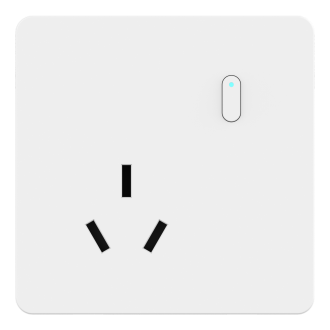

# WS513 Sensor

For more detailed information, please visit [Milesight Official Website](https://www.milesight.com/iot/product/lorawan-sensor/ws51x)

## Payload Definition

### Attribute

| CHANNEL |  ID  | TYPE | LENGTH | READ/WRITE | DEFAULT | RANGE | ENUM |
| :------ | :--: | :--: | :----: | :--------: | :-----: | :---: | :--: |
| Device Status | 0xFF | 0x0B | 2 | r |  |  |  |
| IPSO | 0xFF | 0x01 | 2 | r |  |  |  |
| SN | 0xFF | 0x08 | 7 | r |  |  |  |
| SN | 0xFF | 0x16 | 9 | r |  |  |  |
| Hardware Version | 0xFF | 0x09 | 3 | r |  |  |  |
| Firmware Version | 0xFF | 0x0A | 3 | r |  |  |  |
| LoRaWAN Work Mode | 0xFF | 0x0F | 2 | r |  |  | 2:class_c |
| Voltage | 0x03 | 0x74 | 3 | r |  |  |  |
| Electric Power | 0x04 | 0x80 | 5 | r |  |  |  |
| Power Factor | 0x05 | 0x81 | 2 | r |  | 0 - 100 |  |
| Power Consumption | 0x06 | 0x83 | 5 | r |  |  |  |
| Current Rating | 0x07 | 0xC9 | 3 | r |  |  |  |
| Temperature | 0x09 | 0x67 | 3 | r |  | -40 - 125 |  |
| Socket Status  | 0x08 | 0x70 | 2 | r |  |  |  |
| Socket Switch Status | 0x08 | 0x70 | 2 | r |  |  | 0：off 1：on |
| Reporting Interval | 0xFF | 0x8E | 4 | rw |  |  |  |
| Reporting Interval | 0xFF | 0x8E | 3 | rw | 20 | 1 - 1440 |  |
| Power Consumption Enable | 0xFF | 0x26 | 2 | rw | 1 |  | 0：disable 1：enable |
| LED Indicator | 0xFF | 0x2F | 3 | rw | 1 |  | 0：disable 1：enable |
| When Power is Restored | 0xFF | 0x67 | 2 | rw | 2 |  | 2：Return to Previous Working State 0：Turn to Off 1：Turn to On |
| Bluetooth Connection Name | 0xF9 | 0xCA | 33 | rw |  |  |  |
| Button Lock  | 0xF9 | 0x69 | 2 | rw |  |  |  |
| On/Off Lock  | 0xF9 | 0x69 | 2 | rw | 0 |  | 0：Disable 1：Enable |
| Reset Lock | 0xF9 | 0x69 | 2 | rw | 0 |  | 0：Disable 1：Enable |
| Overcurrent Alarm | 0xFF | 0x24 | 3 | rw |  |  |  |
| Overcurrent Alarm Enable | 0xFF | 0x24 | 2 | rw | 1 |  | 0：disable 1：enable |
| Overcurrent Alarm Value | 0xFF | 0x24 | 2 | rw | 16 | 1 - 16 |  |
| Overcurrent Protection | 0xFF | 0x30 | 3 | rw |  |  |  |
| Overcurrent Protection Enable | 0xFF | 0x30 | 2 | rw | 1 |  | 0：disable 1：enable |
| Overcurrent Protection Value | 0xFF | 0x30 | 2 | rw | 16 | 1 - 16 |  |
| Highcurrent Protection | 0xFF | 0x8D | 2 | rw |  |  |  |
| Highcurrent Protection Enable | 0xFF | 0x8D | 2 | rw | 1 |  | 0：disable 1：enable |
| Temperature Threshold Settings | 0xF9 | 0x0B | 8 | rw |  |  |  |
| Threshold Condition | 0xF9 | 0x0B | 2 | rw | 0 |  | 0：disable 1:condition: x<A 2:condition: x>B 3:condition: A<x<B 4:condition: x<A or x>B |
| Value A | 0xF9 | 0x0B | 3 | rw | 0 | -40 - 125 |  |
| Value B | 0xF9 | 0x0B | 3 | rw | 0 | -40 - 125 |  |
| Threshold Enable | 0xF9 | 0x0B | 2 | rw | 0 |  | 0: Disable 1: Enable |
| Threshold Settings | 0xF9 | 0xB6 | 6 | rw |  |  |  |
| Alarm Reporting Interval | 0xF9 | 0xB6 | 3 | rw | 5 | 1 - 1440 |  |
| Alarm Reporting Times | 0xF9 | 0xB6 | 3 | rw | 1 | 1 - 1000 |  |
| Alarm Dismiss Report Enable | 0xF9 | 0xB6 | 2 | rw | 0 |  | 0: Disable 1: Enable |
| Temperature Calibration Settings | 0xFF | 0xAB | 4 | rw |  |  |  |
| Calibration Enable | 0xFF | 0xAB | 2 | rw | 0 |  | 0：disable 1：enable |
| Calibration Value | 0xFF | 0xAB | 3 | rw | 0 | -165 - 165 |  |
| Schedule Settings | 0xF9 | 0x64 | 8 | rw |  |  |  |
| Schedule Settings | 0xF9 | 0x64 | 8 | rw |  |  |  |
| Schedule ID | 0xF9 | 0x64 | 2 | rw | 1 |  | 1:1 2:2 3:3 4:4 5:5 6:6 7:7 8:8 9:9 10:10 11:11 12:12 13:13 14:14 15:15 16:16 |
| Enable | 0xF9 | 0x64 | 2 | rw | 0 |  | 0:Not config 1:Enable 2:Disable |
| Mon. | 0xF9 | 0x64 | 2 | rw | 0 |  | 0: Disable 1: Enable |
| Tues. | 0xF9 | 0x64 | 2 | rw | 0 |  | 0: Disable 1: Enable |
| Wed. | 0xF9 | 0x64 | 2 | rw | 0 |  | 0: Disable 1: Enable |
| Thur. | 0xF9 | 0x64 | 2 | rw | 0 |  | 0: Disable 1: Enable |
| Fri. | 0xF9 | 0x64 | 2 | rw | 0 |  | 0: Disable 1: Enable |
| Sat. | 0xF9 | 0x64 | 2 | rw | 0 |  | 0: Disable 1: Enable |
| Sun. | 0xF9 | 0x64 | 2 | rw | 0 |  | 0: Disable 1: Enable |
| Execut Hour | 0xF9 | 0x64 | 2 | rw | 0 | 0 - 23 |  |
| Execut Minute | 0xF9 | 0x64 | 2 | rw | 0 | 0 - 59 |  |
| Button | 0xF9 | 0x64 | 2 | rw | 1 |  | 1:On 2:Off 3:Inverse 0:Keep |
| Lock Status | 0xF9 | 0x64 | 2 | rw | 1 |  | 1:Lock 2:Unlock 0:Keep |
| Time Zone | 0xFF | 0xBD | 3 | rw | 0 |  | -720：UTC-12(IDLW) -660：UTC-11(SST) -600：UTC-10(HST) -570：UTC-9:30(MIT) -540：UTC-9(AKST) -480：UTC-8(PST) -420：UTC-7(MST) -360：UTC-6(CST) -300：UTC-5(EST) -240：UTC-4(AST) -210：UTC-3:30(NST) -180：UTC-3(BRT) -120：UTC-2(FNT) -60：UTC-1(CVT) 0：UTC(WET) 60：UTC+1(CET) 120：UTC+2(EET) 180：UTC+3(MSK) 210：UTC+3:30(IRST) 240：UTC+4(GST) 270：UTC+4:30(AFT) 300：UTC+5(PKT) 330：UTC+5:30(IST) 345：UTC+5:45(NPT) 360：UTC+6(BHT) 390：UTC+6:30(MMT) 420：UTC+7(ICT) 480：UTC+8(CT/CST) 540：UTC+9(JST) 570：UTC+9:30(ACST) 600：UTC+10(AEST) 630：UTC+10:30(LHST) 660：UTC+11(VUT) 720：UTC+12(NZST) 765：UTC+12:45(CHAST) 780：UTC+13(PHOT) 840：UTC+14(LINT) |
| Daylight Saving Time | 0xF9 | 0x72 | 10 | rw |  |  |  |
| Enable | 0xF9 | 0x72 | 2 | rw | 0 |  | 0：Disable 1：Enable |
| Month | 0xF9 | 0x72 | 2 | rw | 1 |  | 1:Jan. 2:Feb. 3:Mar. 4:Apr. 5:May 6:Jun. 7:Jul. 8:Aug. 9:Sep. 10:Oct. 11:Nov. 12:Dec. |
| Number of Week | 0xF9 | 0x72 | 2 | rw | 1 |  | 1:1st 2: 2nd 3: 3rd 4: 4th 5: last |
| Week | 0xF9 | 0x72 | 2 | rw | 7 |  | 1：Mon. 2：Tues. 3：Wed. 4：Thurs. 5：Fri. 6：Sat. 7：Sun. |
| Time | 0xF9 | 0x72 | 3 | rw | 0 |  | 0：00:00 60：01:00 120：02:00 180：03:00 240：04:00 300：05:00 360：06:00 420：07:00 480：08:00 540：09:00 600：10:00 660：11:00 720：12:00 780：13:00 840：14:00 900：15:00 960：16:00 1020：17:00 1080：18:00 1140：19:00 1200：20:00 1260：21:00 1320：22:00 1380：23:00 |
| Month | 0xF9 | 0x72 | 2 | rw | 1 |  | 1:Jan. 2:Feb. 3:Mar. 4:Apr. 5:May 6:Jun. 7:Jul. 8:Aug. 9:Sep. 10:Oct. 11:Nov. 12:Dec. |
| Number of Week | 0xF9 | 0x72 | 2 | rw | 1 |  | 1:1st 2: 2nd 3: 3rd 4: 4th 5: last |
| Week | 0xF9 | 0x72 | 2 | rw | 7 |  | 1：Mon. 2：Tues. 3：Wed. 4：Thurs. 5：Fri. 6：Sat. 7：Sun. |
| Time | 0xF9 | 0x72 | 3 | rw | 0 |  | 0：00:00 60：01:00 120：02:00 180：03:00 240：04:00 300：05:00 360：06:00 420：07:00 480：08:00 540：09:00 600：10:00 660：11:00 720：12:00 780：13:00 840：14:00 900：15:00 960：16:00 1020：17:00 1080：18:00 1140：19:00 1200：20:00 1260：21:00 1320：22:00 1380：23:00 |
| DST Bias | 0xF9 | 0x72 | 2 | rw | 60 | 1 - 120 |  |
| D2D Settings | 0xFF | 0xC7 | 2 | rw |  |  |  |
| D2D Agent Enable | 0xFF | 0xC7 | 2 | rw | 0 |  | 0：disable 1：enable |
| D2D Agent Settings Array | 0xFF | 0x83 | 6 | rw |  |  |  |
| D2D Agent Settings | 0xFF | 0x83 | 6 | rw |  |  |  |
| Number | 0xFF | 0x83 | 2 | rw | 0 | 0 - 15 |  |
| Enable | 0xFF | 0x83 | 2 | rw | 0 |  | 0：disable 1：enable |
| Control Command | 0xFF | 0x83 | 3 | rw | 0000 |  |  |
| Action Status | 0xFF | 0x83 | 2 | rw | 1 |  | 1:On 0:Off 2:Inverse |

### Event

| CHANNEL |  ID  | TYPE | LENGTH | READ/WRITE | DEFAULT | RANGE | ENUM |
| :------ | :--: | :--: | :----: | :--------: | :-----: | :---: | :--: |
| Temperature Threshold Alarm | 0x89 | 0x67 | 4 | r |  |  |  |
| Over Current Alarm | 0x87 | 0xC9 | 4 | r |  |  |  |
| Device Abnormal Alarm | 0x88 | 0x29 | 2 | r |  |  |  |
| Voltage Collect Error | 0xB3 | 0x74 | 2 | r |  |  |  |
| Electric Power Collect Error | 0xB4 | 0x80 | 2 | r |  |  |  |
| Power Factor Collect Error | 0xB5 | 0x81 | 2 | r |  |  |  |
| Power Consumption Collect Error | 0xB6 | 0x83 | 2 | r |  |  |  |
| Current Collect Error | 0xB7 | 0xC9 | 2 | r |  |  |  |

### Service

| CHANNEL |  ID  | TYPE | LENGTH | READ/WRITE | DEFAULT | RANGE | ENUM |
| :------ | :--: | :--: | :----: | :--------: | :-----: | :---: | :--: |
| Temperature | 0x89 | 0x67 | 3 | r |  |  |  |
| Alarm Type | 0x89 | 0x67 | 2 | r |  |  | 0: temperature alarm release 1: temperature alarm 2: overheat alarm |
| Current | 0x87 | 0xC9 | 3 | r |  |  |  |
| Status | 0x87 | 0xC9 | 2 | r |  |  | 1：Overcurrent alarm 0:Overcurrent alarm release |
| Status | 0x88 | 0x29 | 2 | r |  |  | 1：Abnormal |
| Type | 0xB3 | 0x74 | 2 | r |  |  | 1：Collect_error |
| Type | 0xB4 | 0x80 | 2 | r |  |  | 1：Collect_error |
| Type | 0xB5 | 0x81 | 2 | r |  |  | 1：Collect_error |
| Type | 0xB6 | 0x83 | 2 | r |  |  | 1：Collect_error |
| Type | 0xB7 | 0xC9 | 2 | r |  |  | 1：Collect_error |
| Get Schedule | 0xF9 | 0x65 | 2 | w |  |  |  |
| Schedule ID | 0xF9 | 0x65 | 2 | w | 1 |  | 1:1 2:2 3:3 4:4 5:5 6:6 7:7 8:8 9:9 10:10 11:11 12:12 13:13 14:14 15:15 16:16 255:All schedules |
| Socket Status | 0xFF | 0x29 | 2 | w |  |  |  |
| Socket Switch Status | 0xFF | 0x29 | 2 | w | 0 |  | 0：off 1：on |
| Socket Status Inverse | 0xFF | 0xA5 | 2 | w |  |  |  |
| Query Device Status | 0xFF | 0x28 | 2 | w |  |  |  |
| Clear Power Consumption | 0xFF | 0x27 | 2 | w |  |  |  |
| Reboot | 0xFF | 0x10 | 2 | w |  |  |  |

