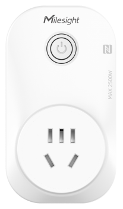

# Smart Portable Socket - WS525

|       WS525(CN)        |
| :--------------------: |
|  |

For more detailed information, please visit [Milesight Official Website](https://www.milesight.com/iot/product/lorawan-sensor/ws523)

## Payload

```
+-------------------------------------------------------+
|           DEVICE UPLINK / DOWNLINK PAYLOAD            |
+---------------------------+---------------------------+
|          DATA 1           |          DATA 2           |
+--------+--------+---------+--------+--------+---------+
|   ID   |  TYPE  |  DATA   |   ID   |  TYPE  |  DATA   |
+--------+--------+---------+--------+--------+---------+
| 1 Byte | 1 Byte | N Bytes | 1 Byte | 1 Byte | N Bytes |
|--------+--------+---------+--------+--------+---------+
```

### Attribute

|    CHANNEL    |  ID  | TYPE | LENGTH | DESCRIPTION                                                                                       |
| :-----------: | :--: | :--: | :----: | ------------------------------------------------------------------------------------------------ |
|     IPSO      | 0xFF | 0x01 |   1    | ipso_version(1B)                                                                                 |
|   Hardware    | 0xFF | 0x09 |   2    | hardware_version(2B)<br/>hardware_version, e.g. 0110 -> v1.1                                     |
|   Firmware    | 0xFF | 0x0A |   2    | firmware_version(2B)<br/>firmware_version, e.g. 0110 -> v1.10                                    |
|      TSL      | 0xFF | 0xFF |   2    | tsl_version(2B)                                                                                  |
| Serial Number | 0xFF | 0x16 |   2    | sn(8B)                                                                                           |
| LoRaWAN Class | 0xFF | 0x0F |   1    | lorawan_class(1B)<br/>lorawan_class, values: (0: Class A, 1: Class B, 2: Class C, 3: Class CtoB) |
|  Reset Event  | 0xFF | 0xFE |   1    | reset_event(1B)                                                                                  |
| Device Status | 0xFF | 0x0B |   1    | device_status(1B)                                                                                |

### Telemetry

|      CHANNEL      |  ID  | TYPE | LENGTH | DESCRIPTION                                                           |
| :---------------: | :--: | :--: | :----: | --------------------------------------------------------------------- |
|      Voltage      | 0x03 | 0x74 |   2    | voltage(2B)<br/>voltage, read: uint16/10                              |
|   Active Power    | 0x04 | 0x80 |   4    | active_power(4B)<br/>active_power, read: uint32, unit: W              |
|   Power Factor    | 0x05 | 0x81 |   1    | power_factor(1B)<br/>power_factor, read: uint8                        |
| Power Consumption | 0x06 | 0x83 |   4    | power_consumption(4B)<br/>power_consumption, read: uint32, unit: W\*h |
|      Current      | 0x07 | 0xC9 |   2    | current(2B)<br/>current, read: uint16, unit: mA                       |
|   Socket Status   | 0x08 | 0x70 |   1    | socket_status(1B)<br/>socket_status, values: (0: off, 1: on)          |

## Example

```json
// 087001 05812C 07C94A00 03743009 068309660000 048007000000
{
    "active_power": 7,
    "current": 74,
    "power_consumption": 26121,
    "power_factor": 44,
    "socket_status": "on",
    "voltage": 235.2
}
```
