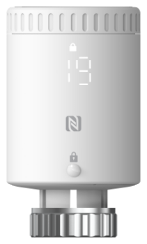

# Smart Radiator Thermostat - WT101



For more detailed information, please visit [Milesight Official Website](https://www.milesight.com/iot/product/lorawan-sensor/wt101)

## Payload

```
+-------------------------------------------------------+
|           DEVICE UPLINK / DOWNLINK PAYLOAD            |
+---------------------------+---------------------------+
|          DATA 1           |          DATA 2           |
+--------+--------+---------+--------+--------+---------+
|   ID   |  TYPE  |  DATA   |   ID   |  TYPE  |  DATA   |
+--------+--------+---------+--------+--------+---------+
| 1 Byte | 1 Byte | N Bytes | 1 Byte | 1 Byte | N Bytes |
|--------+--------+---------+--------+--------+---------+
```

### Attribute

|    CHANNEL    |  ID  | TYPE | LENGTH | DESCRIPTION                                                                                       |
| :-----------: | :--: | :--: | :----: | ------------------------------------------------------------------------------------------------ |
|     IPSO      | 0xFF | 0x01 |   1    | ipso_version(1B)                                                                                 |
|   Hardware    | 0xFF | 0x09 |   2    | hardware_version(2B)<br/>hardware_version, e.g. 0110 -> v1.1                                     |
|   Firmware    | 0xFF | 0x0A |   2    | firmware_version(2B)<br/>firmware_version, e.g. 0110 -> v1.10                                    |
|      TSL      | 0xFF | 0xFF |   2    | tsl_version(2B)                                                                                  |
| Serial Number | 0xFF | 0x16 |   2    | sn(8B)                                                                                           |
| LoRaWAN Class | 0xFF | 0x0F |   1    | lorawan_class(1B)<br/>lorawan_class, values: (0: Class A, 1: Class B, 2: Class C, 3: Class CtoB) |
|  Reset Event  | 0xFF | 0xFE |   1    | reset_event(1B)                                                                                  |
| Device Status | 0xFF | 0x0B |   1    | device_status(1B)                                                                                |

### Telemetry

| CHANNEL                         |  ID  | TYPE | LENGTH | DESCRIPTION                                                                                                                                                                                        |
| :------------------------------ | :--: | :--: | :----: | :------------------------------------------------------------------------------------------------------------------------------------------------------------------------------------------------- |
| Battery                         | 0x01 | 0x75 |   1    | battery(1B)<br/>battery, read: uint8, unit：%                                                                                                                                                      |
| Ambient Temperature             | 0x03 | 0x67 |   2    | temperature(2B)<br/>temperature, read: int16/10, unit: °C                                                                                                                                          |
| Target Temperature              | 0x04 | 0x67 |   2    | target_temperature(2B)<br/>target_temperature, read: int16/10, unit: °C                                                                                                                            |
| Valve Opening                   | 0x05 | 0x92 |   1    | valve_opening(1B)<br/>valve_opening, read: uint8, unit: %                                                                                                                                          |
| Installation Status             | 0x06 | 0x00 |   1    | tamper_status(1B)<br/>tamper_status, read: uint8, values: (0: installed, 1: uninstalled)                                                                                                           |
| Open Window Detection           | 0x07 | 0x00 |   1    | window_detection(1B)<br/>window_detection, read: uint8, values: (0: normal, 1: open)                                                                                                               |
| Motor Stroke Calibration Status | 0x08 | 0xE5 |   1    | motor_calibration_result(1B)<br/>motor_calibration_result, read: uint8, values: (0: success, 1: fail: out of range, 2: fail: uninstalled, 3: calibration cleared, 4: temperature control disabled) |
| Motor Stroke                    | 0x09 | 0x90 |   2    | motor_stroke(2B)<br/>motor_stroke, read: uint16                                                                                                                                                    |
| Freeze Protection               | 0x0A | 0x00 |   1    | freeze_protection(1B)<br/>freeze_protection, read: uint8, values: (0: normal, 1: triggered)                                                                                                        |
| Motor Position                  | 0x0B | 0x90 |   2    | motor_position(2B)<br/>motor_position, read: uint16                                                                                                                                                |

## Sample

```json
// 017561 04672C01 03670A01 059264 09900000 0B900000
{
    "battery": 97,
    "temperature": 26.6,
    "target_temperature": 30,
    "valve_opening": 100,
    "motor_position": 0,
    "motor_stroke": 0
}

// 08E50009900802
{
    "motor_stroke": 520,
    "motor_calibration_result": "success"
}

// 060000
{
    "install_status": "installed"
}

// 070001
{
    "window_detection": "open"
}

// 08E501
{
    "motor_calibration_result": "fail: out of range"
}

// 0A0001
{
    "freeze_protection": "triggered"
}
```
