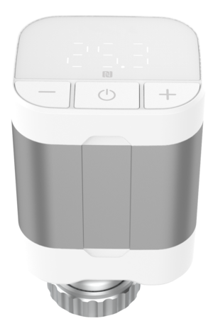

# WT102 Sensor

For more detailed information, please visit [Milesight Official Website](https://www.milesight.com/iot/product/lorawan-sensor/wt102)

## Payload Definition

### Attribute

| CHANNEL |  ID  | LENGTH | READ/WRITE | DEFAULT | RANGE | ENUM |
| :------ | :--: | :----: | :--------: | :-----: | :---: | :--: |
| LoRaWAN  Settings | 0xCF | 1 | rw |  |  |  |
| LoRaWAN Comand | 0xCF | 2 | rw |  |  |  |
| LoRaWAN Version | 0xCF | 2 | rw | 2 |  | 1：1.0.2 2：1.0.3 3：1.0.3 4：1.0.4 |
| TSL Version | 0xDF | 3 | r |  |  |  |
| Product Name | 0xDE | 33 | rw |  |  |  |
| PN | 0xDD | 33 | rw |  |  |  |
| SN | 0xDB | 9 | r |  |  |  |
| Product Version | 0xDA | 9 | r |  |  |  |
| Hardware Version | 0xDA | 3 | r |  |  |  |
| Firmware Version | 0xDA | 7 | r |  |  |  |
| OEM ID | 0xD9 | 3 | rw |  |  |  |
| Device Status | 0xC8 | 2 | rw | 1 |  | 0：Off 1：On |
| Product Region | 0xD8 | 17 | r |  |  |  |
| Battery | 0x00 | 2 | r |  | 0 - 100 |  |
| Temperature | 0x01 | 3 | r |  | -20 - 60 |  |
| Motor Stroke | 0x02 | 3 | r |  | 0 - 3028 |  |
| Motor Position | 0x03 | 3 | r |  | 0 - 3028 |  |
| Current Valve Opening | 0x04 | 2 | r |  | 0 - 100 |  |
| Target Temperature | 0x06 | 3 | r |  | 5 - 35 |  |
| Target Valve Opening | 0x07 | 2 | r |  | 0 - 100 |  |
| Random key | 0xC9 | 2 | rw | 0 |  | 0：Disable 1：Enable |
| Auto-P | 0xC4 | 2 | rw | 1 |  | 0：Disable 1：Enable |
| Temperature Unit | 0x60 | 2 | rw | 0 |  | 0：℃ 1：℉ |
| Ambient Temperature Source Setting | 0x61 | 1 | rw |  |  |  |
| Ambient Temperature Source | 0x61 | 2 | rw | 0 |  | 0：Internal NTC 1：External NTC 2：LoRa Receive |
| External NTC Receive Temperature | 0x61 | 4 | rw |  |  |  |
| Timeout | 0x61 | 3 | rw | 30 | 1 - 1440 |  |
| External NTC Dropout Settings | 0x61 | 2 | rw | 2 |  | 0: Maintaining State Control 1: Close the Valve 2: Switch to Internal NTC Control |
| LoRa Receive Temperature | 0x61 | 4 | rw |  |  |  |
| Timeout | 0x61 | 3 | rw | 30 | 1 - 1440 |  |
| LoRa Receive Dropout Settings | 0x61 | 2 | rw | 2 |  | 0: Maintaining State Control 1: Close the Valve 2: Switch to Internal NTC Control |
| Ambient Temperature Display Enable | 0x62 | 2 | rw | 1 |  | 0：Disable 1：Enable |
| Heating Period Configuration | 0x63 | 1 | rw |  |  |  |
| Sub-command | 0x63 | 2 | rw | 0 |  |  |
| Heating Date | 0x63 | 5 | rw |  |  |  |
| Heating Start Month | 0x63 | 2 | rw | 1 | 1 - 12 |  |
| Heating Start Day | 0x63 | 2 | rw | 1 | 1 - 31 |  |
| Heating End Month | 0x63 | 2 | rw | 12 | 1 - 12 |  |
| Heating End Day | 0x63 | 2 | rw | 31 | 1 - 31 |  |
| Heating Period Reporting Interval | 0x63 | 4 | rw |  |  |  |
| Heating Period Reporting Interval Unit | 0x63 | 2 | rw | 1 |  | 0：second 1：min |
| Heating Period Reporting Interval | 0x63 | 3 | rw | 600 | 10 - 64800 |  |
| Heating Period Reporting Interval | 0x63 | 3 | rw | 10 | 1 - 1440 |  |
| Non-heating Period Reporting Interval | 0x63 | 4 | rw |  |  |  |
| Non-heating Period Reporting Interval Unit | 0x63 | 2 | rw | 1 |  | 0：second 1：min |
| Non-heating Period Reporting Interval | 0x63 | 3 | rw | 64800 | 10 - 64800 |  |
| Non-heating Period Reporting Interval | 0x63 | 3 | rw | 1440 | 1 - 1440 |  |
| Non-heating Period Valve Status | 0x63 | 2 | rw | 1 |  | 0：Fully Close 1：Fully Open |
| Temperature Control | 0x65 | 1 | rw |  |  |  |
| Sub-command | 0x65 | 2 | rw | 0 |  |  |
| Temperature Control Enable | 0x65 | 2 | rw | 1 |  | 0：Disable 1：Enable |
| Target Temperature Resolution | 0x65 | 2 | rw | 0 |  | 0：0.5 1：1 |
| Under-temperature Side Deadband | 0x65 | 3 | rw | 0.1 | 0.1 - 5 |  |
| Over-temperature Side Deadband | 0x65 | 3 | rw | 0.1 | 0.1 - 5 |  |
| Minimum of Target Temperature Adjustment Range | 0x65 | 3 | rw | 5 | 5 - 35 |  |
| Maximum of Target Temperature Adjustment Range | 0x65 | 3 | rw | 35 | 5 - 35 |  |
| Temperature Control Mode Settings | 0x65 | 1 | rw |  |  |  |
| Temperature Control Mode | 0x65 | 2 | rw | 0 |  | 0：Automatic Temperature Control 1：Valve Opening Control 2：Integrated Control |
| Automatic Temperature Control | 0x65 | 3 | rw |  |  |  |
| Target Temperature | 0x65 | 3 | rw | 19 | 5 - 35 |  |
| Valve Opening Control | 0x65 | 2 | rw |  |  |  |
| Target Valve Opening | 0x65 | 2 | rw | 50 | 0 - 100 |  |
| Integrated Control | 0x65 | 3 | rw |  |  |  |
| Target Temperature | 0x65 | 3 | rw | 19 | 5 - 35 |  |
| Open Window Detection | 0x66 | 7 | rw |  |  |  |
| Enable | 0x66 | 2 | rw | 0 |  | 0：Disable 1：Enable |
| Rate of Temperature Fall | 0x66 | 3 | rw | 3 | 2 - 10 |  |
| Open Window Valve Status | 0x66 | 2 | rw | 0 |  | 0：Remains Unchanged 1：Close the Valve |
| Stop Temperature Control | 0x66 | 3 | rw | 30 | 1 - 1440 |  |
| Auto-Away | 0x67 | 1 | rw |  |  |  |
| Enable | 0x67 | 2 | rw | 0 |  | 0：Disable 1：Enable |
| Start Time | 0x67 | 3 | rw | 0 | 0 - 1439 |  |
| End Time | 0x67 | 3 | rw | 0 | 0 - 1439 |  |
| Sun. | 0x67 | 2 | rw | 0 |  | 0：Disable 1：Enable |
| Mon. | 0x67 | 2 | rw | 0 |  | 0：Disable 1：Enable |
| Tues. | 0x67 | 2 | rw | 0 |  | 0：Disable 1：Enable |
| Wed. | 0x67 | 2 | rw | 0 |  | 0：Disable 1：Enable |
| Thur. | 0x67 | 2 | rw | 0 |  | 0：Disable 1：Enable |
| Fri. | 0x67 | 2 | rw | 0 |  | 0：Disable 1：Enable |
| Sat. | 0x67 | 2 | rw | 0 |  | 0：Disable 1：Enable |
| Reserved | 0x67 | 2 | rw |  |  |  |
| Energy Saving Settings | 0x67 | 2 | rw |  |  |  |
| Energy Saving Settings | 0x67 | 2 | rw | 0 |  | 0：Energy Saving Temperature 1：Energy Saving Valve Opening |
| Energy Saving Temperature | 0x67 | 3 | rw | 19 | 5 - 35 |  |
| Energy Saving Valve Opening | 0x67 | 2 | rw | 50 | 0 - 100 |  |
| Freeze Protection | 0x68 | 4 | rw |  |  |  |
| Enable | 0x68 | 2 | rw | 1 |  | 0：Disable 1：Enable |
| Freeze Temperature | 0x68 | 3 | rw | 3 | 1 - 5 |  |
| Forced Heating Enable | 0x69 | 2 | rw | 1 |  | 0：Disable 1：Enable |
| Child Lock | 0x6A | 3 | rw |  |  |  |
| Enable | 0x6A | 2 | rw | 0 |  | 0：Disable 1：Enable |
| Power On/Off | 0x6A | 2 | rw | 0 |  | 0：Disable 1：Enable |
| + /- | 0x6A | 2 | rw | 0 |  | 0：Disable 1：Enable |
| Reserved | 0x6A | 2 | rw |  |  |  |
| Effective Stroke | 0x6B | 2 | rw | 100 | 0 - 100 |  |
| Temperature Calibration Settings | 0x6C | 4 | rw |  |  |  |
| Enable | 0x6C | 2 | rw | 0 |  | 0：Disable 1：Enable |
| Calibration Value | 0x6C | 3 | rw | 0 | -60 - 60 |  |
| Temperature Threshold Alarm | 0x6D | 7 | rw |  |  |  |
| Enable | 0x6D | 2 | rw | 0 |  | 0：Disable 1：Enable |
| Alarm Mode | 0x6D | 2 | rw | 0 |  | 0:Disable 1:Condition: x<A 2:Condition: x>B 4:Condition: x<A or x>B |
| ​Low Temperature Threshold | 0x6D | 3 | rw | 0 | -20 - 60 |  |
| High Temperature Threshold | 0x6D | 3 | rw | 0 | -20 - 60 |  |
| Schedule Settings | 0x6E | 1 | rw |  |  |  |
| Schedule Settings | 0x6E | 1 | rw |  |  |  |
| Schedule ID | 0x6E | 2 | rw | 0 | 0 - 15 |  |
| Sub-command | 0x6E | 2 | rw | 0 |  |  |
| Schedule Enable | 0x6E | 2 | rw | 0 |  | 0：Disable 1：Enable |
| Time | 0x6E | 3 | rw | 0 |  |  |
| Schedule Repeat Day | 0x6E | 2 | rw |  |  |  |
| Sun. | 0x6E | 2 | rw | 0 |  | 0：Disable 1：Enable |
| Mon. | 0x6E | 2 | rw | 0 |  | 0：Disable 1：Enable |
| Tues. | 0x6E | 2 | rw | 0 |  | 0：Disable 1：Enable |
| Wed. | 0x6E | 2 | rw | 0 |  | 0：Disable 1：Enable |
| Thur. | 0x6E | 2 | rw | 0 |  | 0：Disable 1：Enable |
| Fri. | 0x6E | 2 | rw | 0 |  | 0：Disable 1：Enable |
| Sat. | 0x6E | 2 | rw | 0 |  | 0：Disable 1：Enable |
| Reserved | 0x6E | 2 | rw |  |  |  |
| Temperature Control Mode | 0x6E | 2 | rw | 0 |  | 0：Automatic Temperature Control 1：Valve Opening Control 2：Integrated Control |
| Target Temperature | 0x6E | 3 | rw | 19 | 5 - 35 |  |
| Target Valve Opening | 0x6E | 2 | rw | 50 | 0 - 100 |  |
| Preheating Enable | 0x6E | 2 | rw | 0 |  | 0：Disable 1：Enable |
| Preheating Mode | 0x6E | 2 | rw | 0 |  | 0：Auto 1：Manual |
| Manual Preheating Time | 0x6E | 3 | rw | 10 | 1 - 1440 |  |
| Reporting Interval | 0x6E | 3 | rw | 10 | 1 - 1440 |  |
| Local Modification Report | 0x6F | 2 | rw | 0 |  | 0：Disable 1：Enable |
| Motor Controllable Distance | 0x70 | 4 | rw |  |  |  |
| Motor Controllable Distance Enable | 0x70 | 2 | rw | 0 |  | 0：Disable 1：Enable |
| Motor Controllable Distance | 0x70 | 3 | rw | 666 | 0 - 666 |  |
| Time Zone | 0xC7 | 3 | rw | 0 |  | -720：UTC-12(IDLW) -660：UTC-11(SST) -600：UTC-10(HST) -570：UTC-9:30(MIT) -540：UTC-9(AKST) -480：UTC-8(PST) -420：UTC-7(MST) -360：UTC-6(CST) -300：UTC-5(EST) -240：UTC-4(AST) -210：UTC-3:30(NST) -180：UTC-3(BRT) -120：UTC-2(FNT) -60：UTC-1(CVT) 0：UTC(WET) 60：UTC+1(CET) 120：UTC+2(EET) 180：UTC+3(MSK) 210：UTC+3:30(IRST) 240：UTC+4(GST) 270：UTC+4:30(AFT) 300：UTC+5(PKT) 330：UTC+5:30(IST) 345：UTC+5:45(NPT) 360：UTC+6(BHT) 390：UTC+6:30(MMT) 420：UTC+7(ICT) 480：UTC+8(CT/CST) 540：UTC+9(JST) 570：UTC+9:30(ACST) 600：UTC+10(AEST) 630：UTC+10:30(LHST) 660：UTC+11(VUT) 720：UTC+12(NZST) 765：UTC+12:45(CHAST) 780：UTC+13(PHOT) 840：UTC+14(LINT) |
| Daylight Saving Time | 0xC6 | M | rw |  |  |  |
| Enable | 0xC6 | 2 | rw | 0 |  | 0：Disable 1：Enable |
| DST Bias | 0xC6 | 2 | rw | 60 | 1 - 120 |  |
| Month | 0xC6 | 2 | rw | 1 |  | 1:Jan. 2:Feb. 3:Mar. 4:Apr. 5:May 6:Jun. 7:Jul. 8:Aug. 9:Sep. 10:Oct. 11:Nov. 12:Dec. |
| Number of Week | 0xC6 | 2 | rw | 1 |  | 1:1st 2: 2nd 3: 3rd 4: 4th 5: last |
| Week | 0xC6 | 2 | rw | 7 |  | 1：Mon. 2：Tues. 3：Wed. 4：Thurs. 5：Fri. 6：Sat. 7：Sun. |
| Time | 0xC6 | 3 | rw | 0 |  | 0：00:00 60：01:00 120：02:00 180：03:00 240：04:00 300：05:00 360：06:00 420：07:00 480：08:00 540：09:00 600：10:00 660：11:00 720：12:00 780：13:00 840：14:00 900：15:00 960：16:00 1020：17:00 1080：18:00 1140：19:00 1200：20:00 1260：21:00 1320：22:00 1380：23:00 |
| Month | 0xC6 | 2 | rw | 1 |  | 1:Jan. 2:Feb. 3:Mar. 4:Apr. 5:May 6:Jun. 7:Jul. 8:Aug. 9:Sep. 10:Oct. 11:Nov. 12:Dec. |
| Number of Week | 0xC6 | 2 | rw | 1 |  | 1:1st 2: 2nd 3: 3rd 4: 4th 5: last |
| Week | 0xC6 | 2 | rw | 7 |  | 1：Mon. 2：Tues. 3：Wed. 4：Thurs. 5：Fri. 6：Sat. 7：Sun. |
| Time | 0xC6 | 3 | rw | 0 |  | 0：00:00 60：01:00 120：02:00 180：03:00 240：04:00 300：05:00 360：06:00 420：07:00 480：08:00 540：09:00 600：10:00 660：11:00 720：12:00 780：13:00 840：14:00 900：15:00 960：16:00 1020：17:00 1080：18:00 1140：19:00 1200：20:00 1260：21:00 1320：22:00 1380：23:00 |
| Data Storage Settings | 0xC5 | 1 | rw |  |  |  |
| Sub-command | 0xC5 | 2 | rw | 0 |  |  |
| Data Storage Enable | 0xC5 | 2 | rw | 0 |  | 0：Disable 1：Enable |
| Data Retransmission Enable | 0xC5 | 2 | rw | 0 |  | 0：Disable 1：Enable |
| Data Retransmission Interval | 0xC5 | 3 | rw | 600 | 30 - 1200 |  |
| Data Retrieval Interval | 0xC5 | 3 | rw | 60 | 30 - 1200 |  |

### Event

| CHANNEL |  ID  | LENGTH | READ/WRITE | DEFAULT | RANGE | ENUM |
| :------ | :--: | :----: | :--------: | :-----: | :---: | :--: |
| Sequence Number Check Response | 0xFF | 2 | r |  |  |  |
| Order Check Response | 0xFE | 2 | r |  |  |  |
| Command Response | 0xEF | 1 | r |  |  |  |
| Request to Push All Configurations | 0xEE | 1 | r |  |  |  |
| Historical Data | 0xED | 6 | r |  |  |  |
| Motor Calibration Result | 0x05 | 2 | r |  |  |  |
| Battery Low Alarm | 0x08 | 2 | r |  |  |  |
| Temperature  Alarm | 0x09 | 1 | r |  |  |  |
| Freeze Protection Alarm | 0x0A | 1 | r |  |  |  |
| Forced Heating Alarm | 0x0B | 1 | r |  |  |  |
| Auto-Away | 0x0C | 1 | r |  |  |  |
| Open Window Alarm | 0x0D | 1 | r |  |  |  |
| Periodic Reporting | 0x0E | 1 | r |  |  |  |

### Service

| CHANNEL |  ID  | LENGTH | READ/WRITE | DEFAULT | RANGE | ENUM |
| :------ | :--: | :----: | :--------: | :-----: | :---: | :--: |
| Sequence Number Check | 0xFF | 2 | w |  |  |  |
| Sequence Number | 0xFF | 2 | w | 0 | 0 - 255 |  |
| Sequence Number | 0xFF | 2 | r | 0 | 0 - 255 |  |
| Order Check | 0xFE | 2 | w |  |  |  |
| Order | 0xFE | 2 | w | 0 | 0 - 255 |  |
| Command Queries | 0xEF | 1 | w |  |  |  |
| Query Information | 0xEF | 2 | w |  |  |  |
| Command Length | 0xEF | 2 | w | 1 | 1 - 15 |  |
| The command that was queried | 0xEF | 1 | w |  |  |  |
| Answer Result | 0xEF | 2 | r | 0 |  | 0：success 1：unknow 2：error order 3：error passwd 4：error read params 5：error write params 6：error read 7：error write 8：error read apply 9：error write apply |
| Command Length | 0xEF | 2 | r | 1 | 1 - 15 |  |
| Answered Commands | 0xEF | 1 | r |  |  |  |
| Request to Query All Configurations | 0xEE | 1 | w |  |  |  |
| Historical Data Mode | 0xED | 2 | r |  |  | 0：target time 1：historical time |
| Historical Data Timestamps | 0xED | 5 | r |  |  |  |
| Motor Calibration Status | 0x05 | 2 | r |  |  | 0：Uncalibrated 1：Calibration success 2：Calibration failed out of range 3：Calibration failed temperature control disabled 4：Calibration failed uninstalled |
| Battery | 0x08 | 2 | r |  | 0 - 100 |  |
| Alarm Type | 0x09 | 2 | r |  |  |  |
| Temperature Below Alarm Released | 0x09 | 3 | r |  |  |  |
| Temperature | 0x09 | 3 | r |  | -20 - 60 |  |
| Temperature Below Alarm | 0x09 | 3 | r |  |  |  |
| Temperature | 0x09 | 3 | r |  | -20 - 60 |  |
| Temperature Above Alarm Released | 0x09 | 3 | r |  |  |  |
| Temperature | 0x09 | 3 | r |  | -20 - 60 |  |
| Temperature Above Alarm | 0x09 | 3 | r |  |  |  |
| Temperature | 0x09 | 3 | r |  | -20 - 60 |  |
| Alarm Type | 0x0A | 2 | r |  |  |  |
| Freeze Protection Released | 0x0A | 4 | r |  |  |  |
| Ambient Temperature | 0x0A | 3 | r |  | -20 - 60 |  |
| Current Valve Opening | 0x0A | 2 | r |  | 0 - 100 |  |
| Freeze Protection Trigger | 0x0A | 4 | r |  |  |  |
| Ambient Temperature | 0x0A | 3 | r |  | -20 - 60 |  |
| Current Valve Opening | 0x0A | 2 | r |  | 0 - 100 |  |
| Alarm Type | 0x0B | 2 | r |  |  |  |
| Forced Heating Exit | 0x0B | 5 | r |  |  |  |
| Ambient Temperature | 0x0B | 3 | r |  | -20 - 60 |  |
| Current Valve Opening | 0x0B | 2 | r |  | 0 - 100 |  |
| Battery | 0x0B | 2 | r |  | 0 - 100 |  |
| Forced Heating Enter | 0x0B | 5 | r |  |  |  |
| Ambient Temperature | 0x0B | 3 | r |  | -20 - 60 |  |
| Current Valve Opening | 0x0B | 2 | r |  | 0 - 100 |  |
| Battery | 0x0B | 2 | r |  | 0 - 100 |  |
| Event Type | 0x0C | 2 | r |  |  |  |
| Auto-Away Exit | 0x0C | 6 | r |  |  |  |
| Occupancy status | 0x0C | 2 | r |  |  | 0：Unoccupied 1：Occupied |
| Ambient Temperature | 0x0C | 3 | r |  | -20 - 60 |  |
| Target Temperature | 0x0C | 3 | r |  | 5 - 35 |  |
| Auto-Away Trigger | 0x0C | 6 | r |  |  |  |
| Occupancy status | 0x0C | 2 | r |  |  | 0：Unoccupied 1：Occupied |
| Ambient Temperature | 0x0C | 3 | r |  | -20 - 60 |  |
| Energy Saving Temperature | 0x0C | 3 | r |  | 5 - 35 |  |
| Auto-Away Exit | 0x0C | 5 | r |  |  |  |
| Occupancy status | 0x0C | 2 | r |  |  | 0：Unoccupied 1：Occupied |
| Ambient Temperature | 0x0C | 3 | r |  | -20 - 60 |  |
| Target Valve Opening | 0x0C | 2 | r |  | 0 - 100 |  |
| Auto-Away Trigger | 0x0C | 4 | r |  |  |  |
| Occupancy status | 0x0C | 2 | r |  |  | 0：Unoccupied 1：Occupied |
| Ambient Temperature | 0x0C | 3 | r |  | -20 - 60 |  |
| Energy Saving Valve Opening | 0x0C | 2 | r |  | 0 - 100 |  |
| Alarm Type | 0x0D | 2 | r |  |  |  |
| Open Window Release | 0x0D | 4 | r |  |  |  |
| Open Window Status | 0x0D | 2 | r |  |  | 0：Normal 1：Open |
| Ambient Temperature | 0x0D | 3 | r |  | -20 - 60 |  |
| Open Window Trigger | 0x0D | 4 | r |  |  |  |
| Open Window Status | 0x0D | 2 | r |  |  | 0：Normal 1：Open |
| Ambient Temperature | 0x0D | 3 | r |  | -20 - 60 |  |
| Reporting Type | 0x0E | 2 | r |  |  |  |
| Non-heating Period Reporting | 0x0E | 3 | r |  |  |  |
| Target Valve Opening | 0x0E | 2 | r |  | 0 - 100 |  |
| Battery | 0x0E | 2 | r |  | 0 - 100 |  |
| Heating Period Temperature Control Reporting | 0x0E | 7 | r |  |  |  |
| Ambient Temperature | 0x0E | 3 | r |  | -20 - 60 |  |
| Current Valve Opening | 0x0E | 2 | r |  | 0 - 100 |  |
| Target Temperature | 0x0E | 3 | r |  | 5 - 35 |  |
| Battery | 0x0E | 2 | r |  | 0 - 100 |  |
| Heating Period Valve Opening Control Reporting | 0x0E | 6 | r |  |  |  |
| Ambient Temperature | 0x0E | 3 | r |  | -20 - 60 |  |
| Current Valve Opening | 0x0E | 2 | r |  | 0 - 100 |  |
| Target Valve Opening | 0x0E | 2 | r |  | 0 - 100 |  |
| Battery | 0x0E | 2 | r |  | 0 - 100 |  |
| Heating Period Integrated Control Reporting | 0x0E | 8 | r |  |  |  |
| Ambient Temperature | 0x0E | 3 | r |  | -20 - 60 |  |
| Current Valve Opening | 0x0E | 2 | r |  | 0 - 100 |  |
| Target Temperature | 0x0E | 3 | r |  | 5 - 35 |  |
| Target Valve Opening | 0x0E | 2 | r |  | 0 - 100 |  |
| Battery | 0x0E | 2 | r |  | 0 - 100 |  |
| Network Reconnection | 0xB6 | 1 | w |  |  |  |
| Device Status Query | 0xB9 | 1 | w |  |  |  |
| Time Synchronize | 0xB8 | 1 | w |  |  |  |
| Time Synchronize | 0xB7 | 5 | w |  |  |  |
| Timestamp | 0xB7 | 5 | w |  |  |  |
| Data Colloction | 0xB5 | 1 | w |  |  |  |
| Clear Data | 0xBD | 1 | w |  |  |  |
| Stop Retrieval | 0xBC | 1 | w |  |  |  |
| Retrieval(Periods of Time) | 0xBB | 9 | w |  |  |  |
| Start Time | 0xBB | 5 | w |  |  |  |
| End Time | 0xBB | 5 | w |  |  |  |
| Retrieval(Point-in-Time) | 0xBA | 5 | w |  |  |  |
| Time Point | 0xBA | 5 | w |  |  |  |
| Motor Stroke And Position Query | 0x57 | 1 | w |  |  |  |
| Calibrate Motor | 0x58 | 1 | w |  |  |  |
| Target Valve Opening Setting | 0x59 | 2 | w |  |  |  |
| Target Valve Opening | 0x59 | 2 | w | 0 | 0 - 100 |  |
| Target Temperature Setting | 0x5A | 3 | w |  |  |  |
| Temperature | 0x5A | 3 | w | 0 | 5 - 35 |  |
| LoRa Receive Temperature | 0x5B | 3 | w |  |  |  |
| Temperature | 0x5B | 3 | w | 0 | -20 - 60 |  |
| Occupancy Status Setting | 0x5C | 2 | w |  |  |  |
| Occupancy Status | 0x5C | 2 | w | 0 |  | 0：Unoccupied 1：Occupied |
| Open Window Status Setting | 0x5D | 2 | w |  |  |  |
| Open Window Status | 0x5D | 2 | w | 0 |  | 0：Normal 1：Open |
| Delete Schedule | 0x5E | 2 | w |  |  |  |
| Select Schedule | 0x5E | 2 | w | 255 |  | 0：Schedule1 1：Schedule2 2：Schedule3 3：Schedule4 4：Schedule5 5：Schedule6 6：Schedule7 7：Schedule8 8：Schedule9 9：Schedule10 10：Schedule11 11：Schedule12 12：Schedule13 13：Schedule14 14：Schedule15 15：Schedule16 255：Reset All |
| Reset | 0xBF | 1 | w |  |  |  |
| Reboot | 0xBE | 1 | w |  |  |  |

