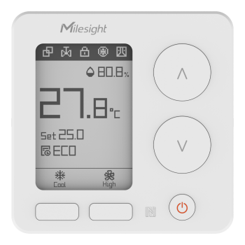

# WT303 Sensor

For more detailed information, please visit [Milesight Official Website](https://www.milesight.com/iot/product/lorawan-sensor/wt303)

## Payload Definition

### Attribute

| CHANNEL |  ID  | LENGTH | READ/WRITE | DEFAULT | RANGE | ENUM |
| :------ | :--: | :----: | :--------: | :-----: | :---: | :--: |
| LoRaWAN  Settings | 0xCF | 1 | rw |  |  |  |
| LoRaWAN Comand | 0xCF | 2 | rw |  |  |  |
| LoRaWAN Work Mode | 0xCF | 2 | rw | 0 |  | 0:ClassA 1:ClassB 2:ClassC 3:ClassC to B |
| TSL Version | 0xDF | 3 | r |  |  |  |
| SN | 0xDB | 9 | r |  |  |  |
| Product Version | 0xDA | 9 | r |  |  |  |
| Hardware Version | 0xDA | 3 | r |  |  |  |
| Firmware Version | 0xDA | 7 | r |  |  |  |
| OEM ID | 0xD9 | 3 | rw |  |  |  |
| Data Source | 0x04 | 2 | r | 0 |  | 0：Internal 1：External NTC 2：LoRaWAN Reception 3：D2D Reception |
| Temperature | 0x01 | 3 | r |  | -20 - 60 |  |
| Humidity | 0x02 | 3 | r |  | 0 - 100 |  |
| Target Temperature | 0x03 | 3 | r |  | 5 - 35 |  |
| Temperature Control Status | 0x05 | 2 | r |  |  |  |
| Temperature Control Mode | 0x05 | 2 | r | 1 |  | 0：Ventilation 1：Heat 2：Cool |
| Temperature Control Status | 0x05 | 2 | r | 0 |  | 0：Standby 1:Heat 2:Cool |
| Valve Status | 0x06 | 2 | r | 0 |  | 0：Close 100：Open |
| Fan Status | 0x07 | 2 | r |  |  |  |
| Fan Mode | 0x07 | 2 | r | 0 |  | 0: Auto 1: Low 2: Medium 3: High |
| Fan Status | 0x07 | 2 | r | 0 |  | 0：Off 1: Low 2: Medium 3: High |
| Schedule | 0x08 | 2 | r | 255 |  | 0：Schedule1 1：Schedule2 2：Schedule3 3：Schedule4 4：Schedule5 5：Schedule6 6：Schedule7 7：Schedule8 8：Schedule9 9：Schedule10 10：Schedule11 11：Schedule12 12：Schedule13 13：Schedule14 14：Schedule15 15：Schedule16 255：Not executed |
| Relay/Valve Status  | 0x10 | 5 | r |  |  |  |
| Fan Low | 0x10 | 5 | r | 0 |  | 0：Open 1：Close |
| Fan Medium | 0x10 | 5 | r | 0 |  | 0：Open 1：Close |
| Fan High | 0x10 | 5 | r | 0 |  | 0：Open 1：Close |
| Valve 1 | 0x10 | 5 | r | 0 |  | 0：Open 1：Close |
| Valve 2 | 0x10 | 5 | r | 0 |  | 0：Open 1：Close |
| Reserved | 0x10 | 5 | r |  |  |  |
| Device Status | 0xC8 | 2 | r | 1 |  | 0：Off 1：On |
| Collecting Interval | 0x60 | 1 | rw |  |  |  |
| Collecting Interval Unit | 0x60 | 2 | rw | 0 |  | 0：second 1：min |
|  Collecting Interval | 0x60 | 3 | rw | 30 | 10 - 64800 |  |
| Collecting Interval | 0x60 | 3 | rw | 1 | 1 - 1440 |  |
| Reporting Interval | 0x62 | 1 | rw |  |  |  |
| Reporting Interval Unit | 0x62 | 2 | rw | 1 |  | 0：second 1：min |
| Reporting Interval | 0x62 | 3 | rw | 600 | 10 - 64800 |  |
| Reporting Interval | 0x62 | 3 | rw | 10 | 1 - 1440 |  |
| Auto-P | 0xC4 | 2 | rw | 1 |  | 0：disable 1：enable |
| Relay/Valve Change Report | 0x90 | 2 | rw | 0 |  | 0：disable 1：enable |
| Temperature Unit | 0x63 | 2 | rw | 0 |  | 0：℃ 1：℉ |
| Temperature Data Source | 0x85 | 1 | rw |  |  |  |
| Temperature Source | 0x85 | 2 | rw | 0 |  | 0：Embedded Temperature 1：External NTC 2：LoRa Receive 3：D2D Receive |
| LoRa Receive | 0x85 | 3 | rw |  |  |  |
| Timeout | 0x85 | 2 | rw | 10 | 1 - 60 |  |
| Device Offline Settings | 0x85 | 2 | rw | 0 |  | 0: Keep Control 1: Turn Off The Control 2: Switch The Embedded Temperature |
| D2D Receive | 0x85 | 3 | rw |  |  |  |
| Timeout | 0x85 | 2 | rw | 10 | 1 - 60 |  |
| Device Offline Settings | 0x85 | 2 | rw | 0 |  | 0: Keep Control 1: Turn Off The Control 2: Switch The Embedded Temperature |
| System On/Off | 0x67 | 2 | rw | 0 |  | 0：Off 1：On |
| Mode Enable | 0x64 | 2 | rw | 7 |  | 7：Ventilation、Heat、Cool 3：Ventilation、Heat 5：Ventilation、Cool |
| Temperature Control Mode | 0x68 | 2 | rw | 1 |  | 0：Ventilation 1：Heat 2：Cool |
| Target Temperature Resolution | 0x69 | 2 | rw | 0 |  | 0：0.5 1：1 |
| Heating Target Temperature | 0x6B | 3 | rw | 17 | 5 - 35 |  |
| CoolingTarget Temperature | 0x6C | 3 | rw | 28 | 5 - 35 |  |
| Target Temperature Tolerance | 0x6A | 3 | rw | 1 | 0.1 - 5 |  |
| Heating Target Temperature Regulation Range | 0x6D | 5 | rw |  |  |  |
| Min Value | 0x6D | 3 | rw | 10 | 5 - 35 |  |
| Max Value | 0x6D | 3 | rw | 19 | 5 - 35 |  |
| Cooling Target Temperature Regulation Range | 0x6E | 5 | rw |  |  |  |
| Min Value | 0x6E | 3 | rw | 23 | 5 - 35 |  |
| Max Value | 0x6E | 3 | rw | 35 | 5 - 35 |  |
| Target Humidity Regulation Range | 0x70 | 5 | rw |  |  |  |
| Min Value | 0x70 | 3 | rw | 40 | 0 - 100 |  |
| Max Value | 0x70 | 3 | rw | 80 | 0 - 100 |  |
| Temp. Control and Dehumidify Settings | 0x6F | 4 | rw |  |  |  |
| Temp. Control and Dehumidify | 0x6F | 2 | rw | 0 |  | 0：disable 1：enable |
| Temp. Tolerance for Dehumidification
 | 0x6F | 3 | rw | 1 | 0.1 - 5 |  |
| Fan Mode | 0x72 | 2 | rw | 0 |  | 0：Auto 1：Low 2:Medium 3:High |
| Fan Delay | 0x74 | 4 | rw |  |  |  |
| Fan Delay Enable | 0x74 | 2 | rw | 0 |  | 0：disable 1：enable |
| The Duration of Delay | 0x74 | 3 | rw | 60 | 30 - 3600 |  |
| Auto Fan Speed Control Delta Settings | 0x73 | 5 | rw |  |  |  |
| ΔT1 | 0x73 | 3 | rw | 3 | 1 - 15 |  |
| ΔT2 | 0x73 | 3 | rw | 5 | 1 - 15 |  |
| Timer Switch System | 0x8C | 1 | rw |  |  |  |
| Sub-command | 0x8C | 2 | rw | 0 |  |  |
| Timer Switch Enable | 0x8C | 2 | rw | 0 |  | 0：disable 1：enable |
| On Time Setting | 0x8C | 6 | rw |  |  |  |
| Time Configuration | 0x8C | 6 | rw |  |  |  |
| Time ID | 0x8C | 2 | rw | 0 | 0 - 3 |  |
| Enable | 0x8C | 2 | rw | 0 |  | 0：disable 1：enable |
| Time | 0x8C | 3 | rw | 0 |  |  |
| Sun. | 0x8C | 2 | rw | 0 |  | 0：disable 1：enable |
| Mon. | 0x8C | 2 | rw | 0 |  | 0：disable 1：enable |
| Tues. | 0x8C | 2 | rw | 0 |  | 0：disable 1：enable |
| Wed. | 0x8C | 2 | rw | 0 |  | 0：disable 1：enable |
| Thur. | 0x8C | 2 | rw | 0 |  | 0：disable 1：enable |
| Fri. | 0x8C | 2 | rw | 0 |  | 0：disable 1：enable |
| Sat. | 0x8C | 2 | rw | 0 |  | 0：disable 1：enable |
| Reserved | 0x8C | 2 | rw |  |  |  |
| Off Time Setting | 0x8C | 6 | rw |  |  |  |
| Time Configuration | 0x8C | 6 | rw |  |  |  |
| Time ID | 0x8C | 2 | rw | 0 | 0 - 3 |  |
| Enable | 0x8C | 2 | rw | 0 |  | 0：disable 1：enable |
| Time | 0x8C | 3 | rw | 0 |  |  |
| Sun. | 0x8C | 2 | rw | 0 |  | 0：disable 1：enable |
| Mon. | 0x8C | 2 | rw | 0 |  | 0：disable 1：enable |
| Tues. | 0x8C | 2 | rw | 0 |  | 0：disable 1：enable |
| Wed. | 0x8C | 2 | rw | 0 |  | 0：disable 1：enable |
| Thur. | 0x8C | 2 | rw | 0 |  | 0：disable 1：enable |
| Fri. | 0x8C | 2 | rw | 0 |  | 0：disable 1：enable |
| Sat. | 0x8C | 2 | rw | 0 |  | 0：disable 1：enable |
| Reserved | 0x8C | 2 | rw |  |  |  |
| Smart Display | 0x65 | 2 | rw | 1 |  | 0：disable 1：enable |
| Screen Display Settings | 0x66 | 3 | rw |  |  |  |
| Screen Display | 0x66 | 2 | rw | 1 |  | 0：disable 1：enable |
| Ambient Temperature | 0x66 | 2 | rw | 1 |  | 0：disable 1：enable |
| Ambient Humidity | 0x66 | 2 | rw | 1 |  | 0：disable 1：enable |
| Target Temperature | 0x66 | 2 | rw | 1 |  | 0：disable 1：enable |
| Schedule | 0x66 | 2 | rw | 1 |  | 0：disable 1：enable |
| Region | 0x66 | 2 | rw | 1 |  | 0：disable 1：enable |
| Reserved | 0x66 | 2 | rw |  |  |  |
| Child Lock | 0x75 | 3 | rw |  |  |  |
| Child Lock Enable | 0x75 | 2 | rw | 0 |  | 0：disable 1：enable |
| System On/Off  | 0x75 | 2 | rw | 1 |  | 0：disable 1：enable |
| Temperature + /- | 0x75 | 2 | rw | 1 |  | 0：disable 1：enable |
| Fan Mode | 0x75 | 2 | rw | 1 |  | 0：disable 1：enable |
| Temperature Control Mode | 0x75 | 2 | rw | 1 |  | 0：disable 1：enable |
| Reboot&amp;Reset | 0x75 | 2 | rw | 1 |  | 0：disable 1：enable |
| Reserved | 0x75 | 2 | rw |  |  |  |
| Unlock Button Settings | 0x8D | 5 | rw |  |  |  |
| Unlock Function Enable | 0x8D | 2 | rw | 0 |  | 0：disable 1：enable |
| System On/Off  | 0x8D | 2 | rw | 0 |  | 0：disable 1：enable |
| Temperature +  | 0x8D | 2 | rw | 0 |  | 0：disable 1：enable |
| Temperature - | 0x8D | 2 | rw | 0 |  | 0：disable 1：enable |
| Fan Mode | 0x8D | 2 | rw | 0 |  | 0：disable 1：enable |
| Temperature Control Mode | 0x8D | 2 | rw | 0 |  | 0：disable 1：enable |
| Reserved | 0x8D | 2 | rw |  |  |  |
| Unlocking Time | 0x8D | 3 | rw | 30 | 1 - 3600 |  |
| Time Zone | 0xC7 | 3 | rw | 0 |  | -720：UTC-12(IDLW) -660：UTC-11(SST) -600：UTC-10(HST) -570：UTC-9:30(MIT) -540：UTC-9(AKST) -480：UTC-8(PST) -420：UTC-7(MST) -360：UTC-6(CST) -300：UTC-5(EST) -240：UTC-4(AST) -210：UTC-3:30(NST) -180：UTC-3(BRT) -120：UTC-2(FNT) -60：UTC-1(CVT) 0：UTC(WET) 60：UTC+1(CET) 120：UTC+2(EET) 180：UTC+3(MSK) 210：UTC+3:30(IRST) 240：UTC+4(GST) 270：UTC+4:30(AFT) 300：UTC+5(PKT) 330：UTC+5:30(IST) 345：UTC+5:45(NPT) 360：UTC+6(BHT) 390：UTC+6:30(MMT) 420：UTC+7(ICT) 480：UTC+8(CT/CST) 540：UTC+9(JST) 570：UTC+9:30(ACST) 600：UTC+10(AEST) 630：UTC+10:30(LHST) 660：UTC+11(VUT) 720：UTC+12(NZST) 765：UTC+12:45(CHAST) 780：UTC+13(PHOT) 840：UTC+14(LINT) |
| Daylight Saving Time | 0xC6 | M | rw |  |  |  |
| Daylight Saving Time | 0xC6 | 2 | rw | 0 |  | 0：disable 1：enable |
| DST Bias | 0xC6 | 2 | rw | 60 | 1 - 120 |  |
|  Month | 0xC6 | 2 | rw | 1 |  | 1:Jan. 2:Feb. 3:Mar. 4:Apr. 5:May 6:Jun. 7:Jul. 8:Aug. 9:Sep. 10:Oct. 11:Nov. 12:Dec. |
|  Number of Week | 0xC6 | 2 | rw | 1 |  | 1:1st 2: 2nd 3: 3rd 4: 4th 5: last |
| Week | 0xC6 | 2 | rw | 7 |  | 1：Mon. 2：Tues. 3：Wed. 4：Thurs. 5：Fri. 6：Sat. 7：Sun. |
| Time | 0xC6 | 3 | rw | 0 |  | 0：00:00 60：01:00 120：02:00 180：03:00 240：04:00 300：05:00 360：06:00 420：07:00 480：08:00 540：09:00 600：10:00 660：11:00 720：12:00 780：13:00 840：14:00 900：15:00 960：16:00 1020：17:00 1080：18:00 1140：19:00 1200：20:00 1260：21:00 1320：22:00 1380：23:00 |
|  Month | 0xC6 | 2 | rw | 1 |  | 1:Jan. 2:Feb. 3:Mar. 4:Apr. 5:May 6:Jun. 7:Jul. 8:Aug. 9:Sep. 10:Oct. 11:Nov. 12:Dec. |
|  Number of Week | 0xC6 | 2 | rw | 1 |  | 1:1st 2: 2nd 3: 3rd 4: 4th 5: last |
| Week | 0xC6 | 2 | rw | 7 |  | 1：Mon. 2：Tues. 3：Wed. 4：Thurs. 5：Fri. 6：Sat. 7：Sun. |
| Time | 0xC6 | 3 | rw | 0 |  | 0：00:00 60：01:00 120：02:00 180：03:00 240：04:00 300：05:00 360：06:00 420：07:00 480：08:00 540：09:00 600：10:00 660：11:00 720：12:00 780：13:00 840：14:00 900：15:00 960：16:00 1020：17:00 1080：18:00 1140：19:00 1200：20:00 1260：21:00 1320：22:00 1380：23:00 |
| Data Storage Settings | 0xC5 | 1 | rw |  |  |  |
| Sub-command | 0xC5 | 2 | rw | 0 |  |  |
| Data Storage Enable | 0xC5 | 2 | rw | 0 |  | 0：disable 1：enable |
| Data Retransmission Enable | 0xC5 | 2 | rw | 0 |  | 0：disable 1：enable |
| Retransmission Interval | 0xC5 | 3 | rw | 600 | 30 - 1200 |  |
| Retrieval Interval | 0xC5 | 3 | rw | 60 | 30 - 1200 |  |
| Temperature Calibration Settings | 0x79 | 4 | rw |  |  |  |
| Temperature Calibration | 0x79 | 2 | rw | 0 |  | 0：disable 1：enable |
| Calibration Value | 0x79 | 3 | rw | 0 | -80 - 80 |  |
| Humidity Calibration Settings | 0x7A | 4 | rw |  |  |  |
| Humidity Calibration | 0x7A | 2 | rw | 0 |  | 0：disable 1：enable |
| Calibration Value | 0x7A | 3 | rw | 0 | -100 - 100 |  |
| Temperature Threshold Alarm Settings | 0x76 | 7 | rw |  |  |  |
| Temperature Threshold Alarm | 0x76 | 2 | rw | 0 |  | 0：disable 1：enable |
| Threshold Mode | 0x76 | 2 | rw | 0 |  | 0:disable 1:condition: x<A 2:condition: x>B 3:condition: A≤x≤B 4:condition: x<A or x>B |
| Value A | 0x76 | 3 | rw | 0 | -20 - 60 |  |
| Value B | 0x76 | 3 | rw | 0 | -20 - 60 |  |
| Persistent High Temperature Alarm Settings | 0x77 | 5 | rw |  |  |  |
| Persistent High Temperature | 0x77 | 2 | rw | 0 |  | 0：disable 1：enable |
| Difference in Temperature | 0x77 | 3 | rw | 3 | 1 - 10 |  |
| Duration | 0x77 | 2 | rw | 5 | 0 - 60 |  |
| Persistent Low Temperature Alarm Settings | 0x78 | 5 | rw |  |  |  |
| Persistent Low Temperature | 0x78 | 2 | rw | 0 |  | 0：disable 1：enable |
| Difference in Temperature | 0x78 | 3 | rw | 3 | 1 - 10 |  |
| Duration | 0x78 | 2 | rw | 5 | 0 - 60 |  |
| Schedule Settings | 0x7B | 1 | rw |  |  |  |
| Schedule Settings | 0x7B | 1 | rw |  |  |  |
| Schedule ID | 0x7B | 2 | rw | 0 | 0 - 15 |  |
| Sub-command | 0x7B | 2 | rw | 0 |  |  |
| Schedule Enable | 0x7B | 2 | rw | 0 |  | 0：disable 1：enable |
| Name (prefix8) | 0x7B | 7 | rw |  |  |  |
| Name (suffix8) | 0x7B | 5 | rw |  |  |  |
| Schedule Content | 0x7B | 8 | rw |  |  |  |
| Fan Mode | 0x7B | 2 | rw | 0 |  | 0：Auto 1：Low 2：Medium 3：High |
| Heating Target Temperature Enable | 0x7B | 3 | rw | 0 |  | 0：disable 1：enable |
| Heating Target Temperature | 0x7B | 3 | rw | 17 | 5 - 35 |  |
| Cooling Target Temperature Enable | 0x7B | 3 | rw | 0 |  | 0：disable 1：enable |
| Cooling Target Temperature | 0x7B | 3 | rw | 26 | 5 - 35 |  |
| Temperature Control Tolerance Enable | 0x7B | 3 | rw | 0 |  | 0：disable 1：enable |
| Temperature Control Tolerance | 0x7B | 3 | rw | 2 | 0.1 - 5 |  |
| Time | 0x7B | 6 | rw |  |  |  |
| Time Configuration | 0x7B | 6 | rw |  |  |  |
| Time ID | 0x7B | 2 | rw | 0 | 0 - 15 |  |
| Enable | 0x7B | 2 | rw | 0 |  | 0：disable 1：enable |
| Time | 0x7B | 3 | rw | 0 |  |  |
| Sun. | 0x7B | 2 | rw | 0 |  | 0：disable 1：enable |
| Mon. | 0x7B | 2 | rw | 0 |  | 0：disable 1：enable |
| Tues. | 0x7B | 2 | rw | 0 |  | 0：disable 1：enable |
| Wed. | 0x7B | 2 | rw | 0 |  | 0：disable 1：enable |
| Thur. | 0x7B | 2 | rw | 0 |  | 0：disable 1：enable |
| Fri. | 0x7B | 2 | rw | 0 |  | 0：disable 1：enable |
| Sat. | 0x7B | 2 | rw | 0 |  | 0：disable 1：enable |
| Reserved | 0x7B | 2 | rw |  |  |  |
| Schedule Settings | 0x7B | 1 | rw |  |  |  |
| Schedule Settings | 0x7B | 1 | rw |  |  |  |
| Schedule ID | 0x7B | 2 | rw | 0 | 0 - 15 |  |
| Sub-command | 0x7B | 2 | rw | 0 |  |  |
| Schedule Enable | 0x7B | 2 | rw | 0 |  | 0：disable 1：enable |
| Name (prefix8) | 0x7B | 7 | rw |  |  |  |
| Name (suffix8) | 0x7B | 5 | rw |  |  |  |
| Schedule Content | 0x7B | 8 | rw |  |  |  |
| Fan Mode | 0x7B | 2 | rw | 0 |  | 0：auto 1：low 2：medium 3：high |
| Heating Target Temperature Enable | 0x7B | 3 | rw | 0 |  | 0：disable 1：enable |
| Heating Target Temperature | 0x7B | 3 | rw | 17 | 5 - 35 |  |
| Cooling Target Temperature Enable | 0x7B | 3 | rw | 0 |  | 0：disable 1：enable |
| Cooling Target Temperature | 0x7B | 3 | rw | 26 | 5 - 35 |  |
| Temperature Control Tolerance Enable | 0x7B | 3 | rw | 0 |  | 0：disable 1：enable |
| Temperature Control Tolerance | 0x7B | 3 | rw | 2 | 0.1 - 5 |  |
| Time | 0x7B | 6 | rw |  |  |  |
| Time Configuration | 0x7B | 6 | rw |  |  |  |
| Time ID | 0x7B | 2 | rw | 0 | 0 - 15 |  |
| Enable | 0x7B | 2 | rw | 0 |  | 0：disable 1：enable |
| Time | 0x7B | 3 | rw | 0 |  |  |
| Sun. | 0x7B | 2 | rw | 0 |  | 0：disable 1：enable |
| Mon. | 0x7B | 2 | rw | 0 |  | 0：disable 1：enable |
| Tues. | 0x7B | 2 | rw | 0 |  | 0：disable 1：enable |
| Wed. | 0x7B | 2 | rw | 0 |  | 0：disable 1：enable |
| Thur. | 0x7B | 2 | rw | 0 |  | 0：disable 1：enable |
| Fri. | 0x7B | 2 | rw | 0 |  | 0：disable 1：enable |
| Sat. | 0x7B | 2 | rw | 0 |  | 0：disable 1：enable |
| Reserved | 0x7B | 2 | rw |  |  |  |
| Interface Settings | 0x7C | 1 | rw |  |  |  |
| System Type | 0x7C | 2 | rw | 1 |  |  |
| Four-pipe, Two-wire Valve+Three-speeds Fan | 0x7C | 3 | rw |  |  |  |
| Cooling Valve | 0x7C | 2 | rw | 1 | 1 - 2 | 1：V1/ NO 2：V2/ NC |
| Heating Valve | 0x7C | 2 | rw | 2 | 1 - 2 | 1：V1/ NO 2：V2/ NC |
| Two-pipe, Two-wire Valve+Three-speeds Fan | 0x7C | 2 | rw |  |  |  |
| Valve | 0x7C | 2 | rw | 1 | 1 - 2 | 1：V1/ NO 2：V2/ NC |
| Two-pipe, Three-wire Valve+Three-speeds Fan | 0x7C | 3 | rw |  |  |  |
| NO | 0x7C | 2 | rw | 1 | 1 - 2 | 1：V1/ NO 2：V2/ NC |
| NC | 0x7C | 2 | rw | 2 | 1 - 2 | 1：V1/ NO 2：V2/ NC |
| Fan Stop Settings | 0x8E | 2 | rw | 1 |  | 0：disable 1：enable |
| DI Enable | 0x80 | 2 | rw | 0 |  | 0：disable 1：enable |
| DI Settings | 0x81 | 1 | rw |  |  |  |
| DI Interface | 0x81 | 2 | rw | 0 |  |  |
| Room Card | 0x81 | 1 | rw |  |  |  |
| Control Object | 0x81 | 2 | rw | 0 |  |  |
| System Control | 0x81 | 2 | rw |  |  |  |
| Insert Card | 0x81 | 2 | rw | 1 |  | 0：system off 1：system on |
| Insert Schedule | 0x81 | 3 | rw |  |  |  |
| Insert Card | 0x81 | 2 | rw | 0 |  | 0：Schedule1 1：Schedule2 2：Schedule3 3：Schedule4 4：Schedule5 5：Schedule6 6：Schedule7 7：Schedule8 255：None |
| Remove Card | 0x81 | 2 | rw | 1 |  | 0：Schedule1 1：Schedule2 2：Schedule3 3：Schedule4 4：Schedule5 5：Schedule6 6：Schedule7 7：Schedule8 255：None |
| Magnetic Contact Switch | 0x81 | 2 | rw |  |  |  |
| Sensor Type | 0x81 | 2 | rw | 0 |  | 0：NO 1：NC |
| Open Window Detection | 0x82 | 2 | rw | 0 |  | 0：disable 1：enable |
| Open Window Detection | 0x83 | 1 | rw |  |  |  |
| Detection Method | 0x83 | 2 | rw | 0 |  |  |
| Temperature Detection | 0x83 | 4 | rw |  |  |  |
| Temperature Change | 0x83 | 3 | rw | 3 | 1 - 10 |  |
| Stop Temperature Control For | 0x83 | 2 | rw | 30 | 1 - 60 |  |
| Magnetic Detection | 0x83 | 2 | rw |  |  |  |
| Duration | 0x83 | 2 | rw | 10 | 1 - 60 |  |
| Freeze Protection | 0x84 | 4 | rw |  |  |  |
| Freeze Protection | 0x84 | 2 | rw | 1 |  | 0：disable 1：enable |
| Protection Temperature | 0x84 | 3 | rw | 3 | 1 - 5 |  |
| D2D Pairing Enable | 0x86 | 2 | rw | 0 |  | 0：disable 1：enable |
| D2D Pairing Information | 0x87 | 1 | rw |  |  |  |
| D2D Pairing Information | 0x87 | 1 | rw |  |  |  |
| ID | 0x87 | 2 | rw | 0 | 0 - 4 |  |
| Type | 0x87 | 2 | rw | 0 |  |  |
| Enable | 0x87 | 2 | rw | 0 |  | 0：disable 1：enable |
| Device EUI | 0x87 | 9 | rw |  |  |  |
| Device Name (prefix8) | 0x87 | 9 | rw |  |  |  |
| Device Name (suffix8) | 0x87 | 9 | rw |  |  |  |
| D2D Controller Enable | 0x88 | 2 | rw | 0 |  | 0：disable 1：enable |
| D2D Master Control | 0x89 | 1 | rw |  |  |  |
| D2D Master Control | 0x89 | 9 | rw |  |  |  |
| Trigger Mode | 0x89 | 2 | rw | 0 |  | 0: Schedule1 1: Schedule2 2: Schedule3 3: Schedule4 4: Schedule5 5: Schedule6 6: Schedule7 7: Schedule8 16：System Off 17：System On |
| Enable | 0x89 | 2 | rw | 0 |  | 0：disable 1：enable |
| Control Command | 0x89 | 3 | rw | 0000 |  |  |
| LoRa Uplink | 0x89 | 2 | rw | 0 |  | 0：disable 1：enable |
| Enable Control Time | 0x89 | 2 | rw | 0 |  | 0：disable 1：enable |
| Control Time | 0x89 | 3 | rw | 5 | 1 - 1440 |  |
| D2D Agent Enable | 0x8A | 2 | rw | 0 |  | 0：disable 1：enable |
| D2D Controlled | 0x8B | 1 | rw |  |  |  |
| D2D Controlled | 0x8B | 1 | rw |  |  |  |
| D2D Controlled ID | 0x8B | 2 | rw | 0 | 0 - 15 |  |
| Enable | 0x8B | 2 | rw | 0 |  | 0：disable 1：enable |
| Control Command | 0x8B | 3 | rw | 0000 |  |  |
| Action Status | 0x8B | 2 | rw | 16 |  | 0：Schedule1 1：Schedule2 2：Schedule3 3：Schedule4 4：Schedule5 5：Schedule6 6：Schedule7 7：Schedule8 16：System Off 17：System On |
| Region name | 0x93 | 1 | rw |  |  |  |
| Sub-command | 0x93 | 2 | rw | 0 |  |  |
| Name (prefix7) | 0x93 | 8 | rw |  |  |  |
| Name (suffix7) | 0x93 | 8 | rw |  |  |  |

### Event

| CHANNEL |  ID  | LENGTH | READ/WRITE | DEFAULT | RANGE | ENUM |
| :------ | :--: | :----: | :--------: | :-----: | :---: | :--: |
| Order Check Response | 0xFE | 2 | r |  |  |  |
| Full Inspection Response | 0xF4 | 1 | r |  |  |  |
| Command Response | 0xEF | 1 | r |  |  |  |
| Request to Push All Configurations | 0xEE | 1 | r |  |  |  |
| Temperature  Alarm | 0x09 | 1 | r |  |  |  |
| Humidity Alarm | 0x0A | 1 | r |  |  |  |
| Target Temperature Alarm | 0x0B | 1 | r |  |  |  |

### Service

| CHANNEL |  ID  | LENGTH | READ/WRITE | DEFAULT | RANGE | ENUM |
| :------ | :--: | :----: | :--------: | :-----: | :---: | :--: |
| Order Check | 0xFE | 2 | w |  |  |  |
| Order | 0xFE | 2 | w | 0 | 0 - 255 |  |
| Order | 0xFE | 2 | r | 0 | 0 - 255 |  |
| Full Inspection Request | 0xF4 | 1 | w |  |  |  |
| Full Inspection Request Subcommand | 0xF4 | 2 | w |  |  |  |
| Full Inspection Start | 0xF4 | 1 | w |  |  |  |
| Full Inspection Control | 0xF4 | 1 | w |  |  |  |
| Control Command Length | 0xF4 | 3 | w | 0 | 0 - 65535 |  |
| Control Command Content | 0xF4 | 1 | w |  |  |  |
| Full Inspection Read | 0xF4 | 1 | w |  |  |  |
| Read Parameter Length | 0xF4 | 3 | w |  |  |  |
| Read Parameter Content | 0xF4 | 1 | w | 0 | 0 - 65535 |  |
| Full Inspection End | 0xF4 | 1 | w |  |  |  |
| Full Inspection Response Subcommand | 0xF4 | 2 | r |  |  |  |
| Full Inspection Start Response | 0xF4 | 2 | r |  |  |  |
| Full Inspection Start Response  | 0xF4 | 2 | r | 0 |  | 0：success 1：failed |
| Full Inspection Control Response | 0xF4 | 2 | r |  |  |  |
| Full Inspection Control Response  | 0xF4 | 2 | r | 0 |  | 0：success 1：failed |
| Full Inspection Read Response | 0xF4 | 1 | r |  |  |  |
| Read Response Length | 0xF4 | 3 | r | 0 | 0 - 65535 |  |
| Read Response Content | 0xF4 | 1 | r |  |  |  |
| Full Inspection End Response | 0xF4 | 2 | r |  |  |  |
| Full Inspection End Response | 0xF4 | 2 | r | 0 |  | 0：success 1：failed |
| Command Queries | 0xEF | 1 | w |  |  |  |
| Query Information | 0xEF | 2 | w |  |  |  |
| Command Length | 0xEF | 2 | w | 1 | 1 - 15 |  |
| The command that was queried | 0xEF | 1 | w |  |  |  |
| Answer Result | 0xEF | 2 | r | 0 |  | 0：success 1：unknow 2：error order 3：error passwd 4：error read params 5：error write params 6：error read 7：error write 8：error read apply 9：error write apply |
| Command Length | 0xEF | 2 | r | 1 | 1 - 15 |  |
| Answered Commands | 0xEF | 1 | r |  |  |  |
| Alarm Type | 0x09 | 2 | r |  |  |  |
| Collection Error | 0x09 | 1 | r |  |  |  |
| Exceed the Range Lower Limit | 0x09 | 1 | r |  |  |  |
| Exceed the Range Upper Limit | 0x09 | 1 | r |  |  |  |
| No Data | 0x09 | 1 | r |  |  |  |
| Temperature Below Alarm Released | 0x09 | 3 | r |  |  |  |
| Temperature | 0x09 | 3 | r |  | -20 - 60 |  |
| Temperature Below Alarm | 0x09 | 3 | r |  |  |  |
| Temperature | 0x09 | 3 | r |  | -20 - 60 |  |
| Temperature Above Alarm Released | 0x09 | 3 | r |  |  |  |
| Temperature | 0x09 | 3 | r |  | -20 - 60 |  |
| Temperature Above Alarm | 0x09 | 3 | r |  |  |  |
| Temperature | 0x09 | 3 | r |  | -20 - 60 |  |
| Temperature Between Alarm Released | 0x09 | 3 | r |  |  |  |
| Temperature | 0x09 | 3 | r |  | -20 - 60 |  |
| Temperature Between Alarm | 0x09 | 3 | r |  |  |  |
| Temperature | 0x09 | 3 | r |  | -20 - 60 |  |
| Exceed Tolerance Alarm Released | 0x09 | 3 | r |  |  |  |
| Temperature | 0x09 | 3 | r |  | -20 - 60 |  |
| Exceed Tolerance Alarm | 0x09 | 3 | r |  |  |  |
| Temperature | 0x09 | 3 | r |  | -20 - 60 |  |
| Persistent Low Temperature Alarm Released | 0x09 | 3 | r |  |  |  |
| Temperature | 0x09 | 3 | r |  | -20 - 60 |  |
| Persistent Low Temperature Alarm | 0x09 | 3 | r |  |  |  |
| Temperature | 0x09 | 3 | r |  | -20 - 60 |  |
| Persistent High Temperature Alarm Released | 0x09 | 3 | r |  |  |  |
| Temperature | 0x09 | 3 | r |  | -20 - 60 |  |
| Persistent High Temperature Alarm Released | 0x09 | 3 | r |  |  |  |
| Temperature | 0x09 | 3 | r |  | -20 - 60 |  |
| Freeze Protection Alarm Released | 0x09 | 3 | r |  |  |  |
| Temperature | 0x09 | 3 | r |  | -20 - 60 |  |
| Freeze Protection Alarm | 0x09 | 3 | r |  |  |  |
| Temperature | 0x09 | 3 | r |  | -20 - 60 |  |
| Open Window Alarm Released | 0x09 | 3 | r |  |  |  |
| Temperature | 0x09 | 3 | r |  | -20 - 60 |  |
| Open Window Alarm | 0x09 | 3 | r |  |  |  |
| Temperature | 0x09 | 3 | r |  | -20 - 60 |  |
| Alarm Type | 0x0A | 2 | r |  |  |  |
| Collection Error | 0x0A | 1 | r |  |  |  |
| Exceed the Range Lower Limit | 0x0A | 1 | r |  |  |  |
| Exceed the Range Upper Limit | 0x0A | 1 | r |  |  |  |
| No Data | 0x0A | 1 | r |  |  |  |
| Alarm Type | 0x0B | 2 | r |  |  |  |
| No Data | 0x0B | 1 | r |  |  |  |
| Query Device Status | 0xB9 | 1 | w |  |  |  |
| Time Synchronize | 0xB8 | 1 | w |  |  |  |
| Clear Data | 0xBD | 1 | w |  |  |  |
| Stop Retrieval | 0xBC | 1 | w |  |  |  |
| Retrieval(Time Period) | 0xBB | 9 | w |  |  |  |
| Start Time | 0xBB | 5 | w |  |  |  |
| End Time | 0xBB | 5 | w |  |  |  |
| Retrieval(Time Period) | 0xBA | 5 | w |  |  |  |
| Time Point | 0xBA | 5 | w |  |  |  |
| Network Reconnection | 0xB6 | 1 | w |  |  |  |
| Temperature Extend Settings | 0x5B | 3 | w |  |  |  |
| Temperature Extend Value | 0x5B | 3 | w | 0 | -20 - 60 |  |
| Humidity Extend Settings | 0x5C | 3 | w |  |  |  |
| Humidity Extend Value | 0x5C | 3 | w | 0 | 0 - 100 |  |
|  Open Window Status Control | 0x5D | 2 | w |  |  |  |
|  Open Window Status Control | 0x5D | 2 | w | 0 |  | 0：Normal 1：Open |
| Event Control | 0x5E | 2 | w |  |  |  |
| Event Control | 0x5E | 2 | w | 0 |  | 0：Schedule1 1：Schedule2 2：Schedule3 3：Schedule4 4：Schedule5 5：Schedule6 6：Schedule7 7：Schedule8 |
| Delete Schedule List | 0x5F | 2 | w |  |  |  |
| Delete Schedule | 0x5F | 2 | w | 255 |  | 0：Schedule1 1：Schedule2 2：Schedule3 3：Schedule4 4：Schedule5 5：Schedule6 6：Schedule7 7：Schedule8 255：Reset All |
| Reboot | 0xBE | 1 | w |  |  |  |

