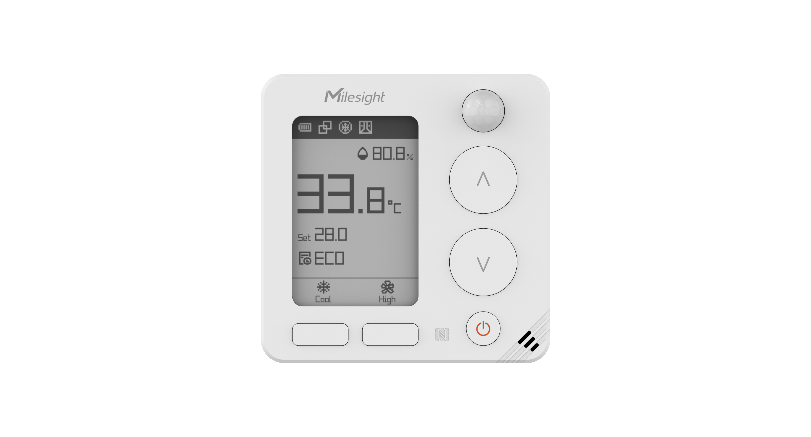

# Wireless Smart Thermostat - WT401



For more detailed information, please visit [Milesight Official Website](https://www.milesight.com/iot/product/lorawan-sensor/wt401)

## Payload

### Attribute

| CHANNEL                |  ID  | LENGTH | DESCRIPTION                                 |
| :--------------------- | :--: | :----: | :------------------------------------------ |
| TSL Version            | 0xDF |   2    | tsl_version                                 |
| Product Name           | 0xDE |   32   | custom_name                                 |
| PartNumber             | 0xDD |   32   | custom_pn                                   |
| SerialNumber           | 0xDB |   8    | sn                                          |
| Product Version        | 0xDA |   8    | hardware_version(2B) + firmware_version(6B) |
| OEM ID                 | 0xD9 |   2    | oem                                         |
| Product Frequency Band | 0xD8 |   16   | product_frequency_band                      |
| Device Request         | 0xEE |   0    | device_request                              |
| Device Status          | 0xCF |   1    | device_status                               |
| LoRaWAN Class          | 0xCF |   1    | lorawan_class                               |

### Telemetry

|   CHANNEL   |  ID  | LENGTH | DESCRIPTION                                           |
| :---------: | :--: | :----: | :---------------------------------------------------- |
| Temperature | 0x01 |   2    | temperature<br/>temperature, read: int16/10, unit: °C |

# Example

```json

```
