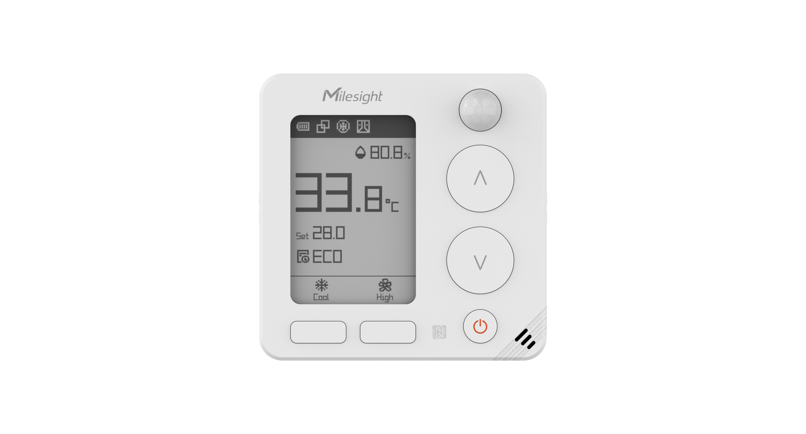

# WT401 Sensor

For more detailed information, please visit [Milesight Official Website](https://www.milesight.com/iot/product/lorawan-sensor/wt401)

## Payload Definition

### Attribute

| CHANNEL |  ID  | LENGTH | READ/WRITE | DEFAULT | RANGE | ENUM |
| :------ | :--: | :----: | :--------: | :-----: | :---: | :--: |
| LoRaWAN  Settings | 0xCF | 1 | rw |  |  |  |
| LoRaWAN Command | 0xCF | 2 | rw |  |  |  |
| LoRaWAN Work Mode | 0xCF | 2 | rw | 0 |  | 0:ClassA 1:ClassB 2:ClassC 3:ClassC to B |
| Random key | 0xC9 | 2 | rw | 0 |  | 0：disable 1：enable |
| TSL Version | 0xDF | 3 | r |  |  |  |
| Product Name | 0xDE | 33 | rw |  |  |  |
| PN | 0xDD | 33 | rw |  |  |  |
| SN | 0xDB | 9 | r |  |  |  |
| Product Version | 0xDA | 9 | r |  |  |  |
| Hardware Version | 0xDA | 3 | r |  |  |  |
| Firmware Version | 0xDA | 7 | r |  |  |  |
| OEM ID | 0xD9 | 3 | rw |  |  |  |
| Device Status | 0xC8 | 2 | rw | 1 |  | 0：Off 1：On |
| Product Region | 0xD8 | 17 | r |  |  |  |
| BLE Settings | 0xCD | 1 | rw |  |  |  |
| BLE Command | 0xCD | 2 | rw | 0 |  |  |
| Bluetooth Enable | 0xCD | 2 | rw | 0 |  | 0：disable 1：enable |
| Device Bluetooth Address | 0xCD | 8 | r |  |  |  |
| Address Type | 0xCD | 2 | r | 0 |  | 0：public 1：private |
| Bluetooth Mac Address | 0xCD | 7 | r | 24e124123456 |  |  |
| Device Bluetooth Name (prefix8) | 0xCD | 9 | rw |  |  |  |
| Device Bluetooth Name (suffix5) | 0xCD | 6 | rw |  |  |  |
| Device Bluetooth Information | 0xCD | 1 | rw |  |  |  |
| Address Type | 0xCD | 2 | rw | 0 |  | 0：public 1：private |
| Mac Address | 0xCD | 7 | rw | 24e124123456 |  |  |
| DevEUI | 0xCD | 9 | rw | 24e124123456789a |  |  |
| Name Length | 0xCD | 2 | rw | 13 | 1 - 13 |  |
| Bluetooth Name | 0xCD | 1 | rw |  |  |  |
| Paired Device Name | 0xCD | 1 | rw |  |  |  |
| Paired Device Name | 0xCD | 1 | rw |  |  |  |
| ID | 0xCD | 2 | rw | 0 |  |  |
| Name Length | 0xCD | 2 | rw | 13 | 1 - 13 |  |
| Bluetooth Name | 0xCD | 1 | rw |  |  |  |
| Paired Device | 0xCD | 1 | rw |  |  |  |
| Paired Device | 0xCD | 10 | rw |  |  |  |
| ID | 0xCD | 2 | rw | 0 |  |  |
| DevEUI | 0xCD | 9 | rw | 24e124123456789a |  |  |
| Paired Device Bluetooth Mac Address | 0xCD | 1 | rw |  |  |  |
| Paired Device Bluetooth Mac Address  | 0xCD | 9 | rw |  |  |  |
| ID | 0xCD | 2 | rw | 0 |  |  |
| Address Type | 0xCD | 2 | rw | 0 |  | 0：public 1：private |
| Bluetooth Mac Address | 0xCD | 7 | rw | 24e124123456 |  |  |
| Bluetooth Status | 0xBA | 11 | r |  |  |  |
| Bluetooth Status | 0xBA | M | r |  |  |  |
| ID | 0xBA | 2 | r | 0 |  |  |
| Bluetooth Status | 0xBA | 2 | r | 0 |  | 0: Not paired 1: Paired 2: Disconnected |
| Paired Device DevEUI | 0xBA | 9 | r | 24e124123456789a |  |  |
| Battery | 0x00 | 2 | r |  | 0 - 100 |  |
| Temperature | 0x01 | 3 | r |  | -20 - 60 |  |
| Humidity | 0x02 | 3 | r |  | 0 - 100 |  |
| Occupied Status | 0x08 | 2 | r | 0 | 0 - 2 | 0：Vacant 1：Occupied 2：Night Occupied |
| Temperature Control Mode | 0x03 | 2 | r | 0 |  | 0：heat 1：em heat 2：cool 3：auto 4：dehumidify 5：ventilation 10：off 11：none |
| Target Temperature1 | 0x06 | 3 | r |  | 5 - 35 |  |
| Target Temperature2 | 0x07 | 3 | r |  | 5 - 35 |  |
| Fan Mode | 0x04 | 2 | r | 0 |  | 0：auto 1：circulate 2：on 3：low 4：medium 5：high 10：off 11：none/keep |
| Schedule | 0x05 | 2 | r | 0 | 0 - 255 | 0:plan0 1:plan1 2:plan2 3:plan3 4:plan4 5:plan5 6:plan6 7:plan7 8:plan8 9:plan9 10:plan10 11:plan11 12:plan12 13:plan13 14:plan14 15:plan15 255:Not executed |
| Communication Mode | 0x8D | 2 | rw | 2 | 0 - 3 | 0：BLE 1：LoRa 2：BLE+LoRa 3：PowerBus+LoRa |
| Reporting Interval | 0x61 | 1 | rw |  |  |  |
| Reporting Interval Type | 0x61 | 2 | rw | 0 |  | 0：BLE 1：LoRa 2：BLE+LoRa 3：PowerBus+LoRa |
| BLE Reporting Interval | 0x61 | 1 | rw |  |  |  |
| Reporting Interval Unit | 0x61 | 2 | rw | 1 |  | 0：second 1：min |
| Reporting Interval | 0x61 | 3 | rw | 600 | 10 - 64800 |  |
| Reporting Interval | 0x61 | 3 | rw | 10 | 1 - 1440 |  |
| LoRa Reporting Interval | 0x61 | 1 | rw |  |  |  |
| Reporting Interval Unit | 0x61 | 2 | rw | 1 |  | 0：second 1：min |
| Reporting Interval | 0x61 | 3 | rw | 600 | 10 - 64800 |  |
| Reporting Interval | 0x61 | 3 | rw | 10 | 1 - 1440 |  |
| BLE_LoRa Reporting Interval | 0x61 | 1 | rw |  |  |  |
| Reporting Interval Unit | 0x61 | 2 | rw | 1 |  | 0：second 1：min |
| Reporting Interval | 0x61 | 3 | rw | 600 | 10 - 64800 |  |
| Reporting Interval | 0x61 | 3 | rw | 10 | 1 - 1440 |  |
| PowerBus_LoRa Reporting Interval | 0x61 | 1 | rw |  |  |  |
| Reporting Interval Unit | 0x61 | 2 | rw | 1 |  | 0：second 1：min |
| Reporting Interval | 0x61 | 3 | rw | 600 | 10 - 64800 |  |
| Reporting Interval | 0x61 | 3 | rw | 10 | 1 - 1440 |  |
| Communicate Interval | 0x6C | 1 | rw |  |  |  |
| Communicate Interval ID | 0x6C | 2 | rw | 0 |  | 0:BLE 1:LORA 2:BLE+LORA 3:POWERBUS+LORA |
| BLE Communicate Interval | 0x6C | 1 | rw |  |  |  |
| BLE Communicate Interval Unit | 0x6C | 2 | rw | 1 |  | 0：second 1：min |
| BLE Communicate Interval | 0x6C | 3 | rw | 600 | 10 - 1800 |  |
| BLE Communicate Interval | 0x6C | 3 | rw | 1 | 1 - 30 |  |
| LoRa Communicate Interval | 0x6C | 1 | rw |  |  |  |
| LoRa Communicate Interval Unit | 0x6C | 2 | rw | 1 |  | 0：second 1：min |
| LoRa Communicate Interval | 0x6C | 3 | rw | 600 | 10 - 1800 |  |
| LoRa Communicate Interval | 0x6C | 3 | rw | 1 | 1 - 30 |  |
| BLE_LoRa Communicate Interval | 0x6C | 1 | rw |  |  |  |
| BLE_LoRa Communicate Interval Unit | 0x6C | 2 | rw | 1 |  | 0：second 1：min |
| BLE_LoRa Communicate Interval | 0x6C | 3 | rw | 600 | 10 - 1800 |  |
| BLE_LoRa Communicate Interval | 0x6C | 3 | rw | 1 | 1 - 30 |  |
| PowerBus_LoRa Communicate Interval | 0x6C | 1 | rw |  |  |  |
| PowerBus_LoRa Communicate Interval Unit | 0x6C | 2 | rw | 1 |  | 0：second 1：min |
| PowerBus_LoRa Communicate Interval | 0x6C | 3 | rw | 600 | 10 - 1800 |  |
| PowerBus_LoRa Communicate Interval | 0x6C | 3 | rw | 1 | 1 - 30 |  |
| Collecting Interval | 0x60 | 1 | rw |  |  |  |
| Collecting Interval Unit | 0x60 | 2 | rw | 0 |  | 0：second 1：min |
|  Collecting Interval | 0x60 | 3 | rw | 30 | 1 - 3600 |  |
| Collecting Interval | 0x60 | 3 | rw | 1 | 1 - 1440 |  |
| Temperature Unit | 0x63 | 2 | rw | 0 |  | 0：℃ 1：℉ |
| Temperature &amp; Humidity Data Source | 0x7D | 2 | rw | 0 |  | 0:Embedded Data 1:Lora Data 2: UCController |
| Data Timeout | 0x7E | 2 | rw | 10 | 1 - 60 |  |
| Bluetooth Enable | 0x85 | 2 | rw | 1 |  | 0:disable 1:enable |
| Bluetooth Name | 0x8B | 33 | rw |  |  |  |
| System On/Off | 0x67 | 2 | rw | 0 |  | 0：Off 1：On |
| Temperature Control Mode Enable | 0x64 | 2 | rw |  |  |  |
| Heat | 0x64 | 2 | rw | 1 |  | 0：disable 1：enable |
| EM Heat | 0x64 | 2 | rw | 1 |  | 0：disable 1：enable |
| Cool | 0x64 | 2 | rw | 1 |  | 0：disable 1：enable |
| Auto | 0x64 | 2 | rw | 1 |  | 0：disable 1：enable |
| Dehumidify | 0x64 | 2 | rw | 1 |  | 0：disable 1：enable |
| Ventilation | 0x64 | 2 | rw | 1 |  | 0：disable 1：enable |
| Reserved | 0x64 | 2 | rw |  |  |  |
| Fan Mode Enabled | 0x88 | 2 | rw |  |  |  |
| Auto | 0x88 | 2 | rw | 1 |  | 0：disable 1：enable |
| Circulate | 0x88 | 2 | rw | 1 |  | 0：disable 1：enable |
| On | 0x88 | 2 | rw | 0 |  | 0：disable 1：enable |
| Low | 0x88 | 2 | rw | 1 |  | 0：disable 1：enable |
| Medium | 0x88 | 2 | rw | 1 |  | 0：disable 1：enable |
| High | 0x88 | 2 | rw | 1 |  | 0：disable 1：enable |
| Reserved | 0x88 | 2 | rw | 0 |  |  |
| Temperature Control Mode | 0x68 | 1 | rw |  |  |  |
| Subcmd ID | 0x68 | 2 | rw | 0 |  |  |
| Temperature Control Mode | 0x68 | 2 | rw | 0 |  | 0：heat 1：em heat 2：cool 3：auto 4：dehumidify 5：ventilation |
| Plan Temperature Control Mode Enable | 0x68 | 2 | rw | 1 |  | 0：disable 1：enable |
| Target Temperature Mode | 0x65 | 2 | rw | 0 |  | 0：single 1：dual |
| Target Temperature Resolution | 0x66 | 2 | rw | 0 |  | 0：0.5 1：1 |
| Target Temperature Settings | 0x69 | 1 | rw |  |  |  |
| Temperature Control Mode | 0x69 | 2 | rw | 0 |  |  |
| Heat Target Temperature | 0x69 | 3 | rw | 17 | 5 - 35 |  |
| EM Heat Target Temperature | 0x69 | 3 | rw | 25 | 5 - 35 |  |
| Cool Target Temperature | 0x69 | 3 | rw | 28 | 5 - 35 |  |
| Auto Target Temperature | 0x69 | 3 | rw | 23 | 5 - 35 |  |
| Auto-Heat Target Temperature | 0x69 | 3 | rw | 17 | 5 - 35 |  |
| Auto-Cool Target Temperature | 0x69 | 3 | rw | 28 | 5 - 35 |  |
| Dehumidify Target Temperature | 0x69 | 3 | rw | 17 | 5 - 35 |  |
| Ventilation Target Temperature | 0x69 | 3 | rw | 28 | 5 - 35 |  |
| DeadBand | 0x6A | 3 | rw | 5 | 1 - 10 |  |
| Target Temperature Range | 0x6B | 1 | rw |  |  |  |
| Target Temperature Range ID | 0x6B | 2 | rw | 0 |  | 0：heat 1：em heat 2：cool 3：auto |
| Heat Target Temperature Range | 0x6B | 1 | rw |  |  |  |
| Min Value | 0x6B | 3 | rw | 10 | 5 - 35 |  |
| Max Value | 0x6B | 3 | rw | 19 | 5 - 35 |  |
| EM Heat Target Temperature Range | 0x6B | 1 | rw |  |  |  |
| Min Value | 0x6B | 3 | rw | 10 | 5 - 35 |  |
| Max Value | 0x6B | 3 | rw | 27 | 5 - 35 |  |
| Cool Target Temperature Range | 0x6B | 1 | rw |  |  |  |
| Min Value | 0x6B | 3 | rw | 23 | 5 - 35 |  |
| Max Value | 0x6B | 3 | rw | 35 | 5 - 35 |  |
| Auto Target Temperature Range | 0x6B | 1 | rw |  |  |  |
| Min Value | 0x6B | 3 | rw | 10 | 5 - 35 |  |
| Max Value | 0x6B | 3 | rw | 35 | 5 - 35 |  |
| Dehumidify Target Temperature Range | 0x6B | 1 | rw |  |  |  |
| Min Value | 0x6B | 3 | rw | 10 | 5 - 35 |  |
| Max Value | 0x6B | 3 | rw | 35 | 5 - 35 |  |
| Ventilation Target Temperature Range | 0x6B | 1 | rw |  |  |  |
| Min Value | 0x6B | 3 | rw | 10 | 5 - 35 |  |
| Max Value | 0x6B | 3 | rw | 35 | 5 - 35 |  |
| Fan Mode | 0x74 | 2 | rw | 0 | 0 - 5 | 0：auto 1：circulate 2：on 3：low 4：medium 5：high |
| Occupancy Detection | 0x82 | 1 | rw |  |  |  |
| Common Cmd | 0x82 | 2 | rw | 0 |  |  |
| Occupancy Detection | 0x82 | 2 | rw | 1 | 0 - 1 | 0:disable 1:enable |
| Occupied to Vacant Delay | 0x82 | 3 | rw | 30 | 1 - 360 |  |
| Detection Mode | 0x82 | 2 | rw |  |  | 0:Immediate Trigger 1:Rule Trigger |
| Trigger Condition | 0x82 | 1 | rw |  |  |  |
| Duration | 0x82 | 2 | rw | 5 | 1 - 60 |  |
| Trigger Ratio | 0x82 | 2 | rw | 50 | 1 - 100 |  |
| Night Occupancy Settings | 0x84 | 1 | rw |  |  |  |
| Night Cmd | 0x84 | 2 | rw | 1 |  |  |
| Night Occupancy Settings | 0x84 | 2 | rw | 0 | 0 - 1 | 0:disable 1:enable |
| Night Detection Mode | 0x84 | 2 | rw | 0 |  | 0:Immediate Trigger 1:Rule Trigger |
| Trigger Condition | 0x84 | 1 | rw |  |  |  |
| Duration | 0x84 | 2 | rw | 5 | 1 - 60 |  |
| Trigger Ratio | 0x84 | 2 | rw | 50 | 1 - 100 |  |
| Nighttime | 0x84 | 1 | rw |  |  |  |
| Start Time | 0x84 | 3 | rw | 1260 | 0 - 1439 |  |
| Stop Time | 0x84 | 3 | rw | 480 | 0 - 1439 |  |
| Night Occupied Execution | 0x84 | 2 | rw | 2 |  | 0:plan0 1:plan1 2:plan2 3:plan3 4:plan4 5:plan5 6:plan6 7:plan7 8:plan8 9:plan9 10:plan10 11:plan11 12:plan12 13:plan13 14:plan14 15:plan15 255:Not executed |
| Energy-saving Setting | 0x83 | 1 | rw |  |  |  |
| Energy Cmd | 0x83 | 2 | rw | 0 |  |  |
| Energy-Saving Enable | 0x83 | 2 | rw | 1 | 0 - 1 | 0:disable 1:enable |
| Energy Saving Plan | 0x83 | 1 | rw |  |  |  |
| Occupied Execution | 0x83 | 2 | rw | 0 |  | 0:plan0 1:plan1 2:plan2 3:plan3 4:plan4 5:plan5 6:plan6 7:plan7 8:plan8 9:plan9 10:plan10 11:plan11 12:plan12 13:plan13 14:plan14 15:plan15 255:Not executed |
| Vacant Execution | 0x83 | 2 | rw | 1 |  | 0:plan0 1:plan1 2:plan2 3:plan3 4:plan4 5:plan5 6:plan6 7:plan7 8:plan8 9:plan9 10:plan10 11:plan11 12:plan12 13:plan13 14:plan14 15:plan15 255:Not executed |
| Smart Display | 0x62 | 2 | rw | 1 |  | 0：disable 1：enable |
| Backlight Enable | 0x89 | 2 | rw | 1 |  | 0:disable 1:enable |
| Screen Display Settings | 0x75 | 2 | rw |  |  |  |
| Schedule Name | 0x75 | 2 | rw | 1 |  | 0:disable 1:enable |
| Ambient Temperature | 0x75 | 2 | rw | 1 |  | 0:disable 1:enable |
| Ambient Humidity | 0x75 | 2 | rw | 1 |  | 0:disable 1:enable |
| Target Temperature | 0x75 | 2 | rw | 1 |  | 0:disable 1:enable |
| Reserved | 0x75 | 2 | rw | 0 |  |  |
| Screen Temp Mode Enable | 0x8A | 2 | rw | 1 |  | 0:disable 1:enable |
| Screen Fan Mode Enable | 0x8C | 2 | rw | 1 |  | 0:disable 1:enable |
| Button Custom Function | 0x71 | 1 | rw |  |  |  |
| ID | 0x71 | 2 | rw | 0 |  |  |
| Enable | 0x71 | 2 | rw | 0 |  | 0：disable 1：enable |
| Button1 | 0x71 | 2 | rw | 1 |  | 1：Temperature Control Mode 2：Fan Mode 3：Schedule Switch 4：Status Report 5：Filter Cleaning Reset 6：Button Event1 7：Temperature Unit Switch |
| Button2 | 0x71 | 2 | rw | 2 |  | 1：Temperature Control Mode 2：Fan Mode 3：Schedule Switch 4：Status Report 5：Filter Cleaning Reset 6：Button Event2 7：Temperature Unit Switch |
| Button3 | 0x71 | 2 | rw | 0 |  | 0：System On/Off 3：Schedule Switch 4：Status Report 5：Filter Cleaning Reset 6：Button Event3 7：Temperature Unit Switch |
| Child Lock | 0x72 | 4 | rw |  |  |  |
| Enable | 0x72 | 2 | rw | 0 |  | 0:disable 1:enable |
| Temperature + | 0x72 | 3 | rw | 0 |  | 0:disable 1:enable |
| Temperature - | 0x72 | 3 | rw | 0 |  | 0:disable 1:enable |
| System On/Off | 0x72 | 3 | rw | 0 |  | 0:disable 1:enable |
| Fan Mode | 0x72 | 3 | rw | 0 |  | 0:disable 1:enable |
| Temperature Control Mode | 0x72 | 3 | rw | 0 |  | 0:disable 1:enable |
| Reboot&amp;Reset | 0x72 | 3 | rw | 0 |  | 0:disable 1:enable |
| Power On/Off | 0x72 | 3 | rw | 0 |  | 0:disable 1:enable |
| Cancel Pairing | 0x72 | 3 | rw | 0 |  | 0:disable 1:enable |
| Schedule Switch | 0x72 | 3 | rw | 0 |  | 0:disable 1:enable |
| Status Report  | 0x72 | 3 | rw | 0 |  | 0:disable 1:enable |
| Filter Clean Reminder Release | 0x72 | 3 | rw | 0 |  | 0:disable 1:enable |
| Button Event 1  | 0x72 | 3 | rw | 0 |  | 0:disable 1:enable |
| Button Event 2  | 0x72 | 3 | rw | 0 |  | 0:disable 1:enable |
| Button Event 3  | 0x72 | 3 | rw | 0 |  | 0:disable 1:enable |
| Temperature Unit Switch | 0x72 | 3 | rw | 0 |  | 0:disable 1:enable |
| Reserved | 0x72 | 3 | rw | 0 |  |  |
| Temporary Unlock | 0x81 | 1 | rw |  |  |  |
| Temporary Unlock Enable | 0x81 | 2 | rw | 0 |  | 0：disable 1：enable |
| Temporary Unlock Time | 0x81 | 3 | rw | 30 | 1 - 3600 |  |
| Temporary Unlock Button Combination | 0x80 | 2 | rw |  |  |  |
| Button 1 | 0x80 | 2 | rw | 1 |  | 0：disable 1：enable |
| Button 2 | 0x80 | 2 | rw | 1 |  | 0：disable 1：enable |
| Button 3 | 0x80 | 2 | rw | 0 |  | 0：disable 1：enable |
| Button 4 | 0x80 | 2 | rw | 0 |  | 0：disable 1：enable |
| Button 5 | 0x80 | 2 | rw | 0 |  | 0：disable 1：enable |
| Reserved | 0x80 | 2 | rw | 0 |  |  |
| Time Zone | 0xC7 | 3 | rw | 0 | -720 - 840 | -720：UTC-12(IDLW) -660：UTC-11(SST) -600：UTC-10(HST) -570：UTC-9:30(MIT) -540：UTC-9(AKST) -480：UTC-8(PST) -420：UTC-7(MST) -360：UTC-6(CST) -300：UTC-5(EST) -240：UTC-4(AST) -210：UTC-3:30(NST) -180：UTC-3(BRT) -120：UTC-2(FNT) -60：UTC-1(CVT) 0：UTC(WET) 60：UTC+1(CET) 120：UTC+2(EET) 180：UTC+3(MSK) 210：UTC+3:30(IRST) 240：UTC+4(GST) 270：UTC+4:30(AFT) 300：UTC+5(PKT) 330：UTC+5:30(IST) 345：UTC+5:45(NPT) 360：UTC+6(BHT) 390：UTC+6:30(MMT) 420：UTC+7(ICT) 480：UTC+8(CT/CST) 540：UTC+9(JST) 570：UTC+9:30(ACST) 600：UTC+10(AEST) 630：UTC+10:30(LHST) 660：UTC+11(VUT) 720：UTC+12(NZST) 765：UTC+12:45(CHAST) 780：UTC+13(PHOT) 840：UTC+14(LINT) |
| Daylight Saving Time | 0xC6 | M | rw |  |  |  |
| Daylight Saving Time | 0xC6 | 2 | rw | 0 |  | 0：disable 1：enable |
| DST Bias | 0xC6 | 2 | rw | 60 | 1 - 120 |  |
|  Month | 0xC6 | 2 | rw | 1 | 1 - 12 | 1:Jan. 2:Feb. 3:Mar. 4:Apr. 5:May 6:Jun. 7:Jul. 8:Aug. 9:Sep. 10:Oct. 11:Nov. 12:Dec. |
|  Number of Week | 0xC6 | 2 | rw | 1 | 1 - 2 | 1:1st 2: 2nd 3: 3rd 4: 4th 5: last |
| Week | 0xC6 | 2 | rw | 1 | 1 - 7 | 1：Mon. 2：Tues. 3：Wed. 4：Thurs. 5：Fri. 6：Sat. 7：Sun. |
| Time | 0xC6 | 3 | rw | 0 | 0 - 1380 | 0：00:00 60：01:00 120：02:00 180：03:00 240：04:00 300：05:00 360：06:00 420：07:00 480：08:00 540：09:00 600：10:00 660：11:00 720：12:00 780：13:00 840：14:00 900：15:00 960：16:00 1020：17:00 1080：18:00 1140：19:00 1200：20:00 1260：21:00 1320：22:00 1380：23:00 |
|  Month | 0xC6 | 2 | rw | 1 | 1 - 12 | 1:Jan. 2:Feb. 3:Mar. 4:Apr. 5:May 6:Jun. 7:Jul. 8:Aug. 9:Sep. 10:Oct. 11:Nov. 12:Dec. |
|  Number of Week | 0xC6 | 2 | rw | 1 | 1 - 5 | 1:1st 2: 2nd 3: 3rd 4: 4th 5: last |
| Week | 0xC6 | 2 | rw | 1 | 1 - 7 | 1：Mon. 2：Tues. 3：Wed. 4：Thurs. 5：Fri. 6：Sat. 7：Sun. |
| Time | 0xC6 | 3 | rw | 0 | 0 - 1380 | 0：00:00 60：01:00 120：02:00 180：03:00 240：04:00 300：05:00 360：06:00 420：07:00 480：08:00 540：09:00 600：10:00 660：11:00 720：12:00 780：13:00 840：14:00 900：15:00 960：16:00 1020：17:00 1080：18:00 1140：19:00 1200：20:00 1260：21:00 1320：22:00 1380：23:00 |
| Temperature Calibration Settings | 0x76 | 4 | rw |  |  |  |
| Temperature Calibration | 0x76 | 2 | rw | 0 |  | 0：disable 1：enable |
| Calibration Value | 0x76 | 3 | rw | 0 | -80 - 80 |  |
| Humidity Calibration Settings | 0x77 | 4 | rw |  |  |  |
| Humidity Calibration | 0x77 | 2 | rw | 0 |  | 0：disable 1：enable |
| Calibration Value | 0x77 | 3 | rw | 0 | -100 - 100 |  |
| Schedule Settings | 0x7B | 1 | rw |  |  |  |
| Schedule Settings | 0x7B | 1 | rw |  |  |  |
| Schedule ID | 0x7B | 2 | rw | 0 | 0 - 15 |  |
| Sub-command | 0x7B | 2 | rw | 0 |  |  |
| Enable | 0x7B | 2 | rw | 0 |  | 0：disable 1：enable |
| Name | 0x7B | 7 | rw |  |  |  |
| Name | 0x7B | 5 | rw |  |  |  |
| Schedule Content | 0x7B | 8 | rw |  |  |  |
| Temperature Control Mode | 0x7B | 2 | rw | 0 |  | 0：heat 1：em heat 2：cool 3：auto |
| Heating Target Temperature | 0x7B | 3 | rw | 19 | 5 - 35 |  |
| EM Heat Target Temperature | 0x7B | 3 | rw | 25 | 5 - 35 |  |
| Cool Target Temperature | 0x7B | 3 | rw | 28 | 5 - 35 |  |
| Schedule Content | 0x7B | 8 | rw |  |  |  |
| Fan Mode | 0x7B | 2 | rw | 0 |  | 0：auto 1：circulate 2：on 3：low 4：medium 5：high |
| Auto Target Temperature | 0x7B | 3 | rw | 23 | 5 - 35 |  |
| Auto-Heat Target Temperature | 0x7B | 3 | rw | 17 | 5 - 35 |  |
| Auto-Cool Target Temperature | 0x7B | 3 | rw | 28 | 5 - 35 |  |
| System On/Off | 0x7B | 2 | rw | 1 |  | 0：system off 1：system on |
| Temperature Control Mode | 0x7B | 2 | rw | 0 |  | 0：heat 1：em heat 2：cool 3：auto 4：dehumidify 5：ventilation |
| Fan Mode | 0x7B | 2 | rw | 0 |  | 0：auto 1：circulate 2：on 3：low 4：medium 5：high |
| Heating Target Temperature | 0x7B | 3 | rw | 19 | 5 - 35 |  |
| Cool Target Temperature | 0x7B | 3 | rw | 28 | 5 - 35 |  |
| Auto Target Temperature | 0x7B | 3 | rw | 23 | 5 - 35 |  |

### Event

| CHANNEL |  ID  | LENGTH | READ/WRITE | DEFAULT | RANGE | ENUM |
| :------ | :--: | :----: | :--------: | :-----: | :---: | :--: |
| Order Check Response | 0xFE | 2 | r |  |  |  |
| Command Response | 0xEF | 1 | r |  |  |  |
| Request to Push All Configurations | 0xEE | 1 | r |  |  |  |
| Device Time | 0xB9 | M | r |  |  |  |
| Battery Status | 0xB8 | M | r |  |  |  |
| Temperature  Alarm | 0x0B | 1 | r |  |  |  |
| Humidity Alarm | 0x0C | 1 | r |  |  |  |
| Bluetooth Event | 0x09 | 1 | r |  |  |  |
| PowerBus Event | 0x0A | 1 | r |  |  |  |
| Button Report | 0x0D | 1 | r |  |  |  |
| Battery Event | 0x0F | 1 | r |  |  |  |

### Service

| CHANNEL |  ID  | LENGTH | READ/WRITE | DEFAULT | RANGE | ENUM |
| :------ | :--: | :----: | :--------: | :-----: | :---: | :--: |
| Order Check | 0xFE | 2 | w |  |  |  |
| Order | 0xFE | 2 | w | 0 | 0 - 255 |  |
| Order | 0xFE | 2 | r | 0 | 0 - 255 |  |
| Command Queries | 0xEF | 1 | w |  |  |  |
| Query Information | 0xEF | 2 | w |  |  |  |
| Command Length | 0xEF | 2 | w | 1 | 1 - 15 |  |
| Queried Command | 0xEF | 1 | w |  |  |  |
|  Response Result | 0xEF | 2 | r | 0 |  | 0：success 1：unknown 2：error order 3：error passwd 4：error read params 5：error write params 6：error read 7：error write 8：error read apply 9：error write apply |
| Command Length | 0xEF | 2 | r | 1 | 1 - 15 |  |
| Answered Commands | 0xEF | 1 | r |  |  |  |
| Request to Query All Configurations | 0xEE | 1 | w |  |  |  |
| Current Time | 0xB9 | 5 | r |  |  |  |
| Operation Time | 0xB9 | 5 | r |  |  |  |
| Power-On Time | 0xB9 | 5 | r |  |  |  |
| Battery Capacity | 0xB8 | 5 | r |  |  |  |
| Battery Drain | 0xB8 | 5 | r |  |  |  |
| Current Battery | 0xB8 | 5 | r |  |  |  |
| Battery Voltage | 0xB8 | 3 | r |  |  |  |
| Current Battery Status | 0xB8 | 3 | r |  |  |  |
| Retrieval(Periods of Time) | 0xBA | 9 | w |  |  |  |
| Start Time | 0xBA | 5 | w |  |  |  |
| End Time | 0xBA | 5 | w |  |  |  |
| Alarm Type | 0x0B | 2 | r |  |  |  |
| Collection Error | 0x0B | 1 | r |  |  |  |
| Exceed the Range Lower Limit | 0x0B | 1 | r |  |  |  |
| Exceed the Range Upper Limit | 0x0B | 1 | r |  |  |  |
| No Data | 0x0B | 1 | r |  |  |  |
| Alarm Type | 0x0C | 2 | r |  |  |  |
| Humidity  Collection Error | 0x0C | 1 | r |  |  |  |
| Humidity  Out of The Low Range | 0x0C | 1 | r |  |  |  |
| Humidity Out of The High Range | 0x0C | 1 | r |  |  |  |
| No Data | 0x0C | 1 | r |  |  |  |
| Bluetooth Event Type | 0x09 | 2 | r |  |  |  |
| None | 0x09 | 1 | r |  |  |  |
| Pairing Canceled | 0x09 | 1 | r |  |  |  |
| Disconnected | 0x09 | 1 | r |  |  |  |
| PowerBus Event Type | 0x0A | 2 | r |  |  |  |
| None | 0x0A | 1 | r |  |  |  |
| Communication Error | 0x0A | 1 | r |  |  |  |
| Event Type | 0x0D | 2 | r |  |  |  |
| Button 1 Report | 0x0D | 1 | r |  |  |  |
| Button 2 Report | 0x0D | 1 | r |  |  |  |
| Button 3 Report | 0x0D | 1 | r |  |  |  |
| Battery Event Type | 0x0F | 2 | r |  |  |  |
| Battery Recover | 0x0F | 2 | r |  |  |  |
| Reset BLE Name | 0x54 | 2 | w |  |  |  |
| System Status Control | 0x59 | 7 | w |  |  |  |
| System On/Off | 0x59 | 2 | w | 1 |  | 0：system off 1：system on |
| Temperature Control Mode | 0x59 | 2 | w | 0 |  | 0：heat 1：em heat 2：cool 3：auto 4：dehumidify 5：ventilation |
| Heat Temperature | 0x59 | 3 | w | 17 | 5 - 35 |  |
| Cool Temperature | 0x59 | 3 | w | 28 |  |  |
| External Temperature | 0x86 | 3 | rw |  | -20 - 60 |  |
| External Humidity | 0x87 | 3 | rw |  | 0 - 100 |  |
| Insert Temporary Plan | 0x5C | 2 | w |  |  |  |
| Plan ID | 0x5C | 2 | w | 0 | 0 - 15 |  |
| Fan Error Alarm | 0x55 | 2 | w |  |  |  |
| Action | 0x55 | 2 | w | 0 |  | 0：clean alarm 1：trigger alarm |
| Filter Clean Reminder Alarm | 0x5B | 2 | w |  |  |  |
| Action | 0x5B | 2 | w | 0 |  | 0：clean alarm |
| Reboot | 0xBE | 1 | w |  |  |  |
| Network Reconnection | 0xB6 | 1 | w |  |  |  |
| Delete Schedule | 0x5F | 2 | w |  |  |  |
| Delete Schedule | 0x5F | 2 | w | 255 |  | 0:plan0 1:plan1 2:plan2 3:plan3 4:plan4 5:plan5 6:plan6 7:plan7 255：All |

