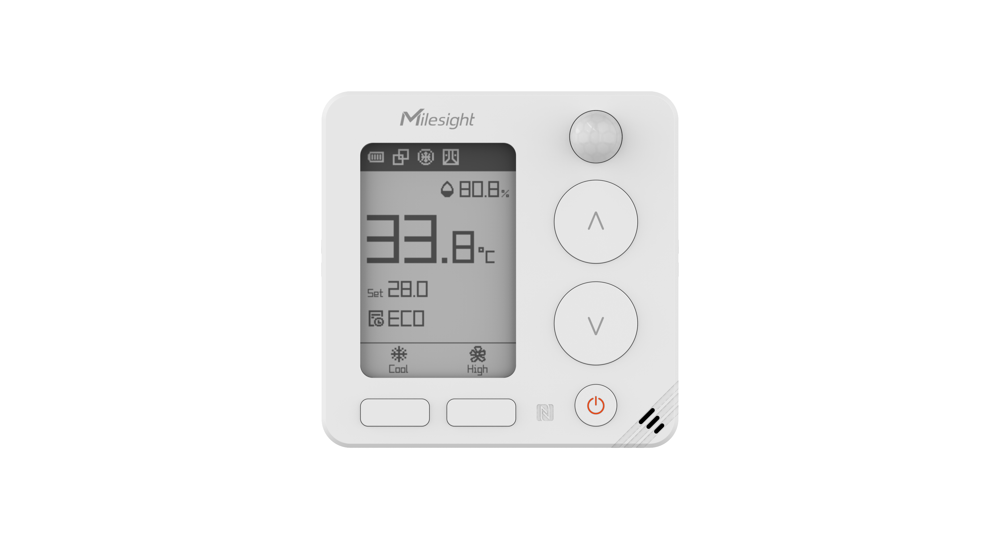

# WT401 Sensor

For more detailed information, please visit [Milesight Official Website](https://www.milesight.com/iot/product/lorawan-sensor/wt401)

## Payload Definition

### Attribute

| CHANNEL |  ID  | LENGTH | READ/WRITE | DEFAULT | RANGE | ENUM |
| :------ | :--: | :----: | :--------: | :-----: | :---: | :--: |
| LoRaWAN  Settings | 0xCF | 1 | rw |  |  |  |
| LoRaWAN Command | 0xCF | 2 | rw |  |  |  |
| LoRaWAN Work Mode | 0xCF | 2 | rw | 0 |  | 0:ClassA 1:ClassB 2:ClassC 3:ClassC to B |
| TSL Version | 0xDF | 3 | r |  |  |  |
| SN | 0xDB | 9 | r |  |  |  |
| Product Version | 0xDA | 9 | r |  |  |  |
| Hardware Version | 0xDA | 3 | r |  |  |  |
| Firmware Version | 0xDA | 7 | r |  |  |  |
| Battery | 0x00 | 2 | r |  | 0 - 100 |  |
| Temperature | 0x01 | 3 | r |  | -20 - 60 |  |
| Humidity | 0x02 | 3 | r |  | 0 - 100 |  |
| Occupied Status | 0x08 | 2 | r | 0 | 0 - 2 | 0：Vacant 1：Occupied 2：Night Occupied |
| Temperature Control Mode | 0x03 | 2 | r | 0 |  | 0：heat 1：em heat 2：cool 3：auto 4：dehumidify 5：ventilation 10：off 11：none |
| Target Temperature1 | 0x06 | 3 | r |  | 5 - 35 |  |
| Target Temperature2 | 0x07 | 3 | r |  | 5 - 35 |  |
| Fan Mode | 0x04 | 2 | r | 0 |  | 0：auto 1：circulate 2：on 3：low 4：medium 5：high 10：off 11：none/keep |
| Schedule | 0x05 | 2 | r | 0 | 0 - 255 | 0:plan0 1:plan1 2:plan2 3:plan3 4:plan4 5:plan5 6:plan6 7:plan7 8:plan8 9:plan9 10:plan10 11:plan11 12:plan12 13:plan13 14:plan14 15:plan15 255:Not executed |
| Communication Mode | 0x8D | 2 | rw | 2 | 0 - 3 | 0：BLE 1：LoRa 2：BLE+LoRa |
| Reporting Interval | 0x61 | 1 | rw |  |  |  |
| BLE_LoRa Reporting Interval | 0x61 | 1 | rw |  |  |  |
| Reporting Interval Unit | 0x61 | 2 | rw | 1 |  | 0：second 1：min |
| LoRa Reporting Interval | 0x61 | 3 | rw | 1440 | 1 - 1440 |  |
| Collecting Interval | 0x60 | 1 | rw |  |  |  |
| Collecting Interval Unit | 0x60 | 2 | rw | 0 |  | 0：second 1：min |
| Collecting Interval | 0x60 | 3 | rw | 1 | 1 - 1440 |  |
| Temperature Unit | 0x63 | 2 | rw | 0 |  | 0：℃ 1：℉ |
| Temperature &amp; Humidity Data Source | 0x7D | 2 | rw | 0 |  | 0:Embedded Data 1:Lora Data 2: UCController |
| Data Timeout | 0x7E | 2 | rw | 10 | 1 - 60 |  |
| System On/Off | 0x67 | 2 | rw | 0 |  | 0：Off 1：On |
| Temperature Control Mode | 0x68 | 1 | rw |  |  |  |
| Subcmd ID | 0x68 | 2 | rw | 0 |  |  |
| Temperature Control Mode | 0x68 | 2 | rw | 0 |  | 0：heat 1：em heat 2：cool 3：auto 4：dehumidify 5：ventilation |
| Target Temperature Mode | 0x65 | 2 | rw | 0 |  | 0：single 1：dual |
| Target Temperature Resolution | 0x66 | 2 | rw | 0 |  | 0：0.5 1：1 |
| Target Temperature Settings | 0x69 | 1 | rw |  |  |  |
| Temperature Control Mode | 0x69 | 2 | rw | 0 |  |  |
| Heat Target Temperature | 0x69 | 3 | rw | 17 | 5 - 35 |  |
| Cool Target Temperature | 0x69 | 3 | rw | 28 | 5 - 35 |  |
| Auto Target Temperature | 0x69 | 3 | rw | 23 | 5 - 35 |  |
| DeadBand | 0x6A | 3 | rw | 5 | 1 - 10 |  |
| Target Temperature Range | 0x6B | 1 | rw |  |  |  |
| Target Temperature Range ID | 0x6B | 2 | rw | 0 |  | 0：heat 1：em heat 2：cool 3：auto 4：dehumidify 5：ventilation |
| Heat Target Temperature Range | 0x6B | 1 | rw |  |  |  |
| Min Value | 0x6B | 3 | rw | 10 | 5 - 35 |  |
| Max Value | 0x6B | 3 | rw | 19 | 5 - 35 |  |
| Cool Target Temperature Range | 0x6B | 1 | rw |  |  |  |
| Min Value | 0x6B | 3 | rw | 23 | 5 - 35 |  |
| Max Value | 0x6B | 3 | rw | 35 | 5 - 35 |  |
| Auto Target Temperature Range | 0x6B | 1 | rw |  |  |  |
| Min Value | 0x6B | 3 | rw | 10 | 5 - 35 |  |
| Max Value | 0x6B | 3 | rw | 35 | 5 - 35 |  |
| Fan Mode | 0x74 | 2 | rw | 0 | 0 - 5 | 0：auto 1：circulate 2：on 3：low 4：medium 5：high |
| Occupancy Detection | 0x82 | 1 | rw |  |  |  |
| Common Cmd | 0x82 | 2 | rw | 1 |  |  |
| Occupancy Detection | 0x82 | 2 | rw | 1 | 0 - 1 | 0:disable 1:enable |
| Occupied to Vacant Delay | 0x82 | 3 | rw | 30 | 1 - 360 |  |
| Night Occupancy Settings | 0x84 | 1 | rw |  |  |  |
| Night Cmd | 0x84 | 2 | rw | 1 |  |  |
| Night Occupancy Settings | 0x84 | 2 | rw | 0 | 0 - 1 | 0:disable 1:enable |
| Nighttime | 0x84 | 1 | rw |  |  |  |
| Start Time | 0x84 | 3 | rw | 1260 | 0 - 1439 |  |
| Stop Time | 0x84 | 3 | rw | 480 | 0 - 1439 |  |
| Energy-saving Setting | 0x83 | 1 | rw |  |  |  |
| Energy Cmd | 0x83 | 2 | rw | 1 |  |  |
| Energy-Saving Enable | 0x83 | 2 | rw | 1 | 0 - 1 | 0:disable 1:enable |
| Energy Saving Plan | 0x83 | 1 | rw |  |  |  |
| Occupied Execution | 0x83 | 2 | rw | 0 |  | 0:plan0 1:plan1 2:plan2 3:plan3 4:plan4 5:plan5 6:plan6 7:plan7 8:plan8 9:plan9 10:plan10 11:plan11 12:plan12 13:plan13 14:plan14 15:plan15 255:Not executed |
| Vacant Execution | 0x83 | 2 | rw | 1 |  | 0:plan0 1:plan1 2:plan2 3:plan3 4:plan4 5:plan5 6:plan6 7:plan7 8:plan8 9:plan9 10:plan10 11:plan11 12:plan12 13:plan13 14:plan14 15:plan15 255:Not executed |
| Smart Display | 0x62 | 2 | rw | 1 |  | 0：disable 1：enable |
| Backlight Enable | 0x89 | 2 | rw | 1 |  | 0:disable 1:enable |
| Button Custom Function | 0x71 | 1 | rw |  |  |  |
| ID | 0x71 | 2 | rw | 0 |  |  |
| Enable | 0x71 | 2 | rw | 0 |  | 0：disable 1：enable |
| Button1 | 0x71 | 2 | rw | 1 |  | 1：Temperature Control Mode 2：Fan Mode 3：Schedule Switch 4：Status Report 5：Filter Cleaning Reset 6：Button Event1 7：Temperature Unit Switch |
| Button2 | 0x71 | 2 | rw | 2 |  | 1：Temperature Control Mode 2：Fan Mode 3：Schedule Switch 4：Status Report 5：Filter Cleaning Reset 6：Button Event2 7：Temperature Unit Switch |
| Button3 | 0x71 | 2 | rw | 0 |  | 0：System On/Off 3：Schedule Switch 4：Status Report 5：Filter Cleaning Reset 6：Button Event3 7：Temperature Unit Switch |
| Temporary Unlock | 0x81 | 1 | rw |  |  |  |
| Temporary Unlock Enable | 0x81 | 2 | rw | 0 |  | 0：disable 1：enable |
| Temporary Unlock Time | 0x81 | 3 | rw | 30 | 1 - 3600 |  |
| Time Zone | 0xC7 | 3 | rw | 0 | -720 - 840 | -720：UTC-12(IDLW) -660：UTC-11(SST) -600：UTC-10(HST) -570：UTC-9:30(MIT) -540：UTC-9(AKST) -480：UTC-8(PST) -420：UTC-7(MST) -360：UTC-6(CST) -300：UTC-5(EST) -240：UTC-4(AST) -210：UTC-3:30(NST) -180：UTC-3(BRT) -120：UTC-2(FNT) -60：UTC-1(CVT) 0：UTC(WET) 60：UTC+1(CET) 120：UTC+2(EET) 180：UTC+3(MSK) 210：UTC+3:30(IRST) 240：UTC+4(GST) 270：UTC+4:30(AFT) 300：UTC+5(PKT) 330：UTC+5:30(IST) 345：UTC+5:45(NPT) 360：UTC+6(BHT) 390：UTC+6:30(MMT) 420：UTC+7(ICT) 480：UTC+8(CT/CST) 540：UTC+9(JST) 570：UTC+9:30(ACST) 600：UTC+10(AEST) 630：UTC+10:30(LHST) 660：UTC+11(VUT) 720：UTC+12(NZST) 765：UTC+12:45(CHAST) 780：UTC+13(PHOT) 840：UTC+14(LINT) |

### Service

| CHANNEL |  ID  | LENGTH | READ/WRITE | DEFAULT | RANGE | ENUM |
| :------ | :--: | :----: | :--------: | :-----: | :---: | :--: |
| External Temperature | 0x86 | 3 | rw |  | -20 - 60 |  |
| External Humidity | 0x87 | 3 | rw |  | 0 - 100 |  |
| Time Synchronize | 0xB7 | 5 | w |  |  |  |
| Timestamp | 0xB7 | 5 | w |  |  |  |

